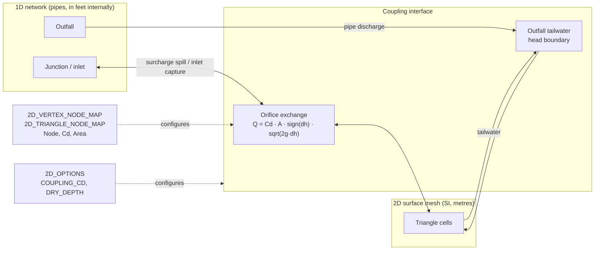
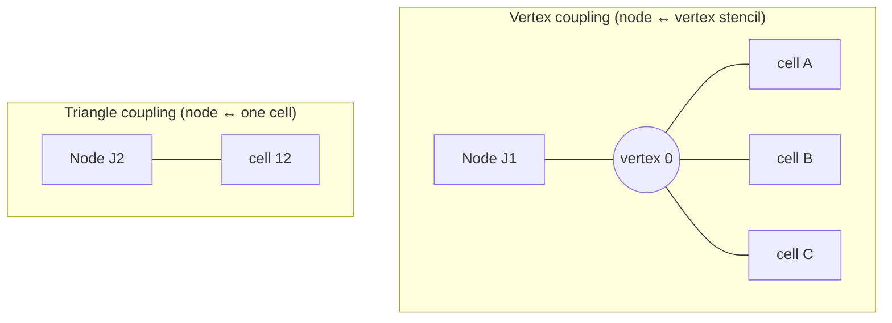
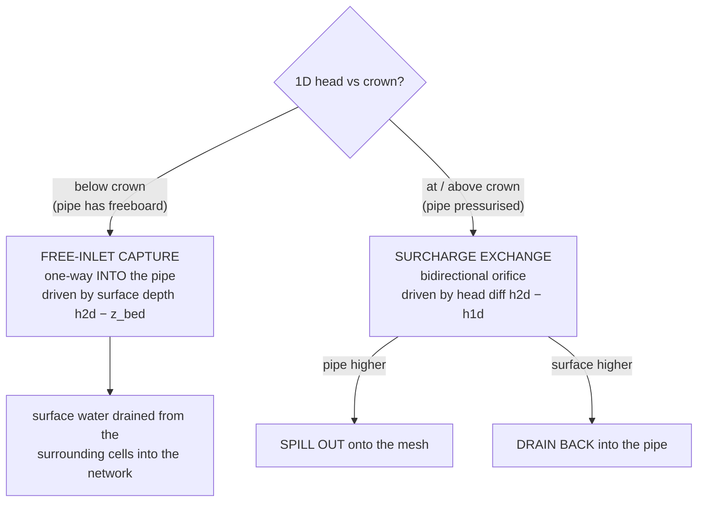
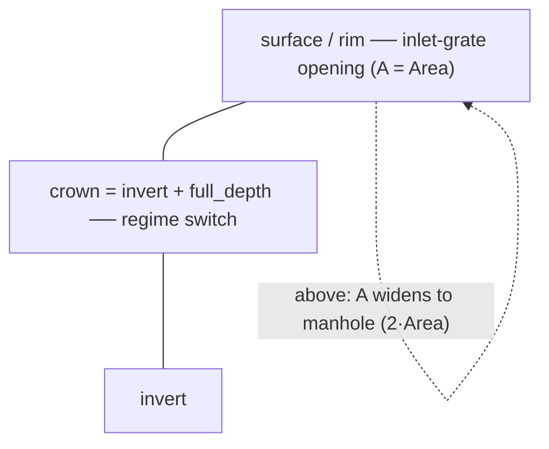
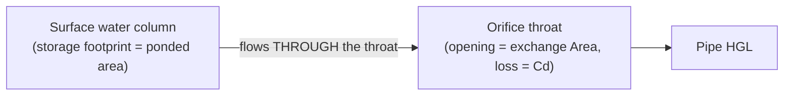

# 1D–2D Coupling Configuration

How a 1D SWMM node is connected to the 2D overland mesh, what the **discharge
coefficient (`Cd`)** and **exchange `Area`** in the coupling map do, and how that
`Area` differs from a node's classic **ponded area (`Aponded`)**.

> **Audience.** Part 1 is a conceptual guide for model builders. Part 2 is a
> reference with the exact equations and source `file:line` citations.
>
> See also: [`two_dimensional_model.md`](two_dimensional_model.md) (full `[2D_*]`
> INP grammar) and [`1D_2D_COUPLING_GATE_REVIEW.md`](1D_2D_COUPLING_GATE_REVIEW.md)
> (design review).

---

# Part 1 — Concepts

## 1. The big picture

The 1D drainage network (pipes, junctions, outfalls) and the 2D overland surface
(a triangular mesh) are separate solvers that exchange water at **coupling
points** — specific mesh vertices or triangles tied to a SWMM node. You declare
those links in the INP; the engine builds the exchange automatically.



Two coupling families behave differently:

- **Junctions / inlets** exchange through a **bidirectional orifice** (this doc's
  focus). Surface water drains in; surcharge spills out.
- **Outfalls** couple through a **prescribed tailwater head** (the 2D water
  surface becomes the outfall's downstream boundary) plus injection of the pipe's
  discharge onto the mesh. See §6.

## 2. Wiring a node to the mesh

Add the node to one of the coupling-map sections:

```
[2D_VERTEX_NODE_MAP]
;;Vertex  Node  Cd    Area
0         J1    0.65  1.0

[2D_TRIANGLE_NODE_MAP]
;;Triangle  Node  Cd    Area
12          J2    0.65  0.5
```

| Column | Meaning | Units | Default |
|--------|---------|-------|---------|
| Vertex / Triangle | Mesh vertex index/tag, or triangle index/tag, to couple | — | required |
| Node | SWMM node name the cell exchanges with | — | required |
| `Cd` | Orifice **discharge coefficient** of the connection | – | `0.65` (or `COUPLING_CD`) |
| `Area` | Effective **exchange (orifice throat) area** of the connection | m² (SI) | `1.0` |

**Vertex** coupling shares the exchange across the ring of cells around that
vertex (the *stencil*); **triangle** coupling uses the single cell. A node may be
mapped to several vertices — each becomes its own coupling point.



## 3. What `Cd` and `Area` do

When the connection carries flow, it is metered like an orifice:

$$Q = C_d \cdot A_{\text{eff}} \cdot \operatorname{sign}(\Delta h) \cdot \sqrt{2g}\,\sqrt{|\Delta h|}$$

- **`Cd`** scales the flow linearly — the head-loss coefficient of the grate /
  manhole connection. Lower `Cd` ⇒ a more throttled, lossier inlet.
- **`Area`** (`A_eff`) is the **hydraulic opening** the water passes through — the
  inlet-grate / manhole-throat area. It scales the flow but **stores no water**.
- `Δh` is the head difference (or surface depth — see §4) that drives the flow.

`A_eff` widens automatically from the configured inlet area to a manhole opening
(`2 × Area`) once the water surcharges past the rim, modelling a popped cover.

> **Picking values.** `Cd ≈ 0.6–0.65` is a typical sharp-edged orifice
> coefficient. Set `Area` to the physical inlet/grate open area (m²). They affect
> *how fast* water exchanges, never *how much* the surface stores.

## 4. The two exchange regimes

A coupled junction switches **smoothly** between two physical regimes as its 1D
head rises to the pipe **crown** (`invert + full_depth`):



- **Free-inlet capture** (pipe below crown): ponded surface water falls into the
  inlet as a free orifice driven by the **surface ponding depth alone**. The pipe
  head is below the inlet and does not oppose it. One-way (into the network).
- **Surcharge exchange** (pipe at/above crown): the inlet is submerged on the pipe
  side, so the flow is the **bidirectional** orifice on the head difference —
  spilling out when the pipe is higher, draining back when the surface is higher.

A C¹ blend across a thin band at the crown switches the driving head and the
directionality without a jump (numerical stability).



> Elevation ladder: **invert → crown (`+full_depth`) → rim/surface**. The crown is
> where the regime switches; `z_top = crown + sur_depth` (a sealed manhole cap)
> anchors the inlet→manhole area widening.

## 5. Exchange `Area` vs ponded area (`Aponded`) — the key distinction

These two parameters are often confused. They are completely different.

| | **Exchange `Area`** (coupling map) | **Ponded area `Aponded`** (`[JUNCTIONS]`) |
|---|---|---|
| Role | Orifice **throat** the water flows *through* | Surface **footprint** the water is *stored on* above the rim |
| Governs | Exchange **flow rate** (with `Cd`) | How fast the **HGL rises** above the crown (`dH = dV / Aponded`) |
| Stores water? | No | Yes (a flat pond on top of the node) |
| Units | m² (SI) | project area units (ft² / m²) |
| Where | `[2D_VERTEX_NODE_MAP]` / `[2D_TRIANGLE_NODE_MAP]` | `[JUNCTIONS]` column 6 |



### Auto-aligned ponded area for coupled nodes

For an **uncoupled** junction, `Aponded` is a user-supplied flat pond that only
acts when `ALLOW_PONDING` is on. For a **2D-coupled** junction the surface storage
*is* the 2D mesh, so the engine manages `Aponded` for you:

- It **overrides** any user `Aponded` on a coupled junction with the **footprint of
  the surrounding 2D cells** (the median-dual area, `Σ incident cell area / 3`),
  converted to internal units.
- It lets that node **pond above its crown regardless of the global
  `ALLOW_PONDING`** flag, so the 1D HGL can rise to track the overlying 2D water
  surface — which is what makes surcharge spill and inlet capture work at all.

> **Why this matters.** Earlier the coupling *zeroed* `Aponded` on coupled nodes.
> That pinned the 1D head at the crown, so junction spill could never fire and the
> surface could not drain into a non-surcharged inlet. Auto-sizing `Aponded` to
> the 2D footprint frees the HGL to rise, aligning the 1D node with the 2D surface.

> **Tradeoff (bounded).** The 1D pond and the stencil 2D cells represent the same
> near-manhole surface, so storage there is mildly double-counted; the median-dual
> share keeps that area small, and a real flood spreads onto the broader mesh
> (cells beyond the stencil), which stays single-counted. You do **not** set
> `Aponded` yourself on coupled nodes — a value in the INP is overridden (with a
> warning).

## 6. Junctions vs outfalls

| | **Junction / inlet** | **Outfall** |
|---|---|---|
| Exchange | Bidirectional orifice + free-inlet capture (§4) | Pipe discharge injected onto the mesh |
| 2D → 1D | Inlet capture / surcharge drain-back | **Tailwater head BC**: the 2D surface sets the outfall stage (only when the cell is genuinely wet; a dry surface ⇒ free discharge) |
| `Aponded` | Auto-set to 2D footprint | Not used (outfalls don't pond) |

## 7. `[2D_OPTIONS]` coupling keys

| Key | Meaning | Default |
|-----|---------|---------|
| `COUPLING_CD` | Default `Cd` when a map row omits it | `0.65` |
| `COUPLING_INTERVAL` | SWMM steps between exchanges (`0` = every step) | `0` |
| `DRY_DEPTH` | Wet/dry threshold (m); a cell shallower than this neither captures nor receives | `0.001` |

## 8. Worked example

```
[OPTIONS]
FLOW_UNITS    CMS
ALLOW_PONDING NO              ; coupled nodes still pond — the engine handles it

[JUNCTIONS]
;;Name  Elev  MaxDepth  InitDepth  SurDepth  Aponded
J1      0.0   1.0       0          0         0       ; Aponded auto-set from 2D

[2D_OPTIONS]
DRY_DEPTH     0.002
COUPLING_CD   0.7

[2D_VERTEX_NODE_MAP]
;;Vertex  Node  Cd   Area
0         J1    0.7  1.0          ; 0.7 loss, 1 m² inlet throat
```

When rain ponds on the cells around vertex 0, water with depth above `DRY_DEPTH`
is captured into `J1` (free inlet). If the pipe network surcharges `J1` past its
1 m crown, the HGL rises above the rim (over the auto-sized footprint) and spills
back onto those same cells.

---

# Part 2 — Reference

All paths are under `src/engine/`. Heads/areas/flows on the **1D** side are in
internal **feet / ft² / cfs** for every project; the **2D** solver is **SI**
(m, m², m³/s, g = 9.80665). The coupling always converts feet⇄metres
([`SolverOptions2D.hpp`](../src/engine/2d/data/SolverOptions2D.hpp), `len_*_to_*`,
`flow_*_to_*`; `area = len²`).

### Orifice flow and effective area
`2d/coupling/NodeCoupling.cpp`
- `orificeFlow` / `orificePhi` (≈30–44): `Q = Cd·A·sign(Δh)·√(2g)·φ(|Δh|)`, with
  `φ` a C¹-regularized √ below a 2 cm head (bounded sensitivity at `Δh → 0`).
- `effectiveArea` (≈47–53): `A_inlet` (= map `Area`) below `z_top`, ramping to
  `A_manhole = 2·Area` over a 5 cm band above it.

### Two-regime junction exchange
`2d/coupling/NodeCoupling.cpp` `computeCouplingExchange` (≈218–388):
- `crown = (invert_elev + full_depth)·len_1d_to_2d`; `z_top = crown + sur_depth·…`.
- Surcharge fraction `s` = Hermite smoothstep over a 5 cm band below the crown.
- Blended driver `Δh = (1−s)·max(0, h_2d − z_2d) + s·(h_2d − h_1d)`: surface depth
  (free inlet, one-way) below the crown → head difference (bidirectional) above.
- Source-side wet/dry `wetRamp` on `DRY_DEPTH` suppresses dry-cell exchange and
  kills spurious inflow from a dry low-spot vertex.
- Node-capacity and 2D-cell-volume caps throttle 2D→1D drainage conservatively.
- `scatterCouplingFlux` (≈55–121) distributes the exchange across the vertex
  stencil weighted by upwind HGL slope (conservative; geometric fallback on flat
  surfaces); a sink is drawn from the surrounding cells.

### Coupling map parsing and options
`2d/input/SectionHandlers2D.cpp` — `[2D_VERTEX_NODE_MAP]` / `[2D_TRIANGLE_NODE_MAP]`
(`Cd` default 0.65, `Area` default 1.0 m²), `COUPLING_CD`, `COUPLING_INTERVAL`.
`2d/data/SolverOptions2D.hpp` — `coupling_cd`, `coupling_interval`, `dry_depth`.

### Auto-aligned ponded area and the coupled-node pond exception
- `2d/SurfaceRouter2D.cpp` (≈264–320): overrides `nodes.ponded_area` on coupled
  non-outfall nodes with the median-dual footprint (`Σ stencil tri_area / 3`,
  converted by `len_2d_to_1d²`); sets `ctx.coupled_node[ni] = 1`.
- `hydraulics/DynamicWave.cpp`: `initNodeStates` (≈856) and `setNodeDepth` (≈2238)
  treat a `coupled_node` as pond-capable regardless of `ALLOW_PONDING`, so the HGL
  rises above the crown over `ponded_area` instead of being capped.

### Ponded-area mechanics (for contrast)
- `data/NodeData.hpp` `ponded_area`; `hydraulics/Node.cpp` `getPondedArea`
  (returns `ponded_area` only when flooded above the rim).
- Legacy `Aponded` is a flat pond that raises the head by `excess_volume /
  ponded_area`; gated by the `[OPTIONS] ALLOW_PONDING` flag for uncoupled nodes.

### Outfall coupling
`2d/coupling/NodeCoupling.cpp` `updateOutfallBoundaries` / `transferOutfallDischarges`;
`hydraulics/Outfall.cpp` `setAllOutfallDepths` (tailwater head BC with a wet/dry
ramp so a dry surface yields free discharge).
