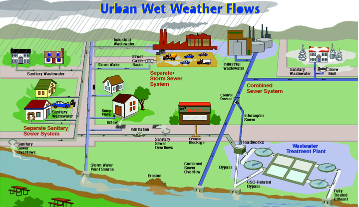

@page engine_manual OpenSWMM Engine Manual

OpenSWMM Engine Manual
=====================================

See @ref authors for the full list of authors and contributors.

## DISCLAIMER {#engine_manual_disclaimer}

This software is provided on an "as is" basis and the user assumes responsibility for its use. Although a reasonable effort has been made to assure that the results obtained are correct, the authors are not responsible and assume no liability whatsoever for any results or any use made of the results obtained from these programs, nor for any damages or litigation that result from the use of these programs for any purpose.

## ABSTRACT {#engine_manual_abstract}

The Storm Water Management Model (SWMM) is a dynamic rainfall-runoff simulation model used for single event or long-term (continuous) simulation of runoff quantity and quality from primarily urban areas. The runoff component of SWMM operates on a collection of subcatchment areas that receive precipitation and generate runoff and pollutant loads. The routing portion of SWMM transports this runoff through a system of pipes, channels, storage/treatment devices, pumps, and regulators. SWMM tracks the quantity and quality of runoff generated within each subcatchment, and the flow rate, flow depth, and quality of water in each pipe and channel during a simulation period comprised of multiple time steps.

This manual documents the OpenSWMM **computational engine**: the objects a model is built from, the format of the input file it reads, the files it reads and writes, the reports it produces, the programmatic C and Python interfaces, and the error and warning messages it emits. Detailed descriptions of the theory and numerical methods are in the separate reference manuals; the graphical application is documented separately (see below).

## FOREWORD {#engine_manual_foreward}

OpenSWMM is the next generation of the EPA Storm Water Management Model, maintained and advanced as a community-driven open source project. It builds on the foundational work of EPA's SWMM, which was first released in 1971 and has undergone several major upgrades since then. OpenSWMM preserves the rich legacy of SWMM while advancing the codebase with modern architecture, improved modularity, enhanced performance, and support for model coupling through the HydroCouple framework.

SWMM is used throughout the world for planning, analysis, and design related to stormwater runoff, combined and sanitary sewers, and other drainage systems. It can be used to evaluate gray infrastructure stormwater control strategies, such as pipes and storm drains, and is a useful tool for creating cost-effective green/gray hybrid stormwater control solutions.

*Figure 1-1 Urban wet weather flows*

## ACKNOWLEDGEMENTS {#engine_manual_acknowledgements}

OpenSWMM builds on the original EPA Storm Water Management Model (SWMM), developed by the U.S. Environmental Protection Agency, Office of Research and Development. The original user's manual and SWMM 5 software were created by **Lewis A. Rossman**, Environmental Scientist Emeritus at the U.S. EPA. His extraordinary contribution to the field of stormwater modeling is gratefully acknowledged.

The original SWMM documentation was reviewed by Michelle Simon, Katherine Ratliff, and Anne Mikelonis, all of the U.S. EPA, by Robert Dickinson (Innovyze), Mitch Heineman (CDM Smith), Mike Gregory (CHI), and Nandana Perera (CHI).

See @ref authors for the complete list of authors and contributors.

## USING THE GRAPHICAL APPLICATION {#engine_manual_gui}

This manual does not describe a user interface. The OpenSWMM graphical
application, **SWMMVis**, has its own manual covering the map canvas, layers and
coordinate reference systems, every editor and dialog, running simulations,
plots and result animation, 2D meshing, and a set of tutorials:

<https://www.hydrocouple.org/openswmm.gui/>

Two tables that used to live in this manual now live there, because they are
values typed into an editor rather than engine behaviour: the parameter tables
(units, soil characteristics, curve numbers, Manning's *n*, culvert codes and
standard pipe sizes) are @ref manual_reference_tables, and the per-object
property dictionaries are @ref manual_property_index. The numbered messages this
engine emits are also catalogued there, alongside the API codes the application
shows next to them, as @ref manual_error_codes.

@tableofcontents

## Manual Contents

- @subpage engine_manual_ch1_conceptual_model — CHAPTER 1 - The Conceptual Model
- @subpage engine_manual_ch2_input_file — CHAPTER 2 - Input File Reference
- @subpage engine_manual_ch3_files — CHAPTER 3 - Files and Command-Line Operation
- @subpage engine_manual_ch4_reports — CHAPTER 4 - Status Report; Summary Tables and Output
- @subpage engine_manual_ch5_api — CHAPTER 5 - Programmatic C API; Python Bindings and Plugins
- @subpage engine_manual_appendix_a_messages — APPENDIX A - Error and Warning Messages

## WHERE THE OLD CHAPTERS WENT {#engine_manual_provenance}

This manual replaces the former *OpenSWMM User Manual*, which mixed engine
reference material with instructions for the retired Delphi user interface. The
interface chapters are superseded by the SWMMVis manual linked above; the engine
chapters were kept and renumbered. Anyone holding a citation to the old numbering
can find its destination here.

| Former chapter | Now |
|---|---|
| Ch. 1 – Introduction | this page |
| Ch. 2 – Quick Start Tutorial | @ref tutorial_site_drainage |
| Ch. 3 – SWMM's Conceptual Model | @ref engine_manual_ch1_conceptual_model |
| Ch. 4 – SWMM's Main Window | @ref manual_interface |
| Ch. 5 – Working with Projects | @ref manual_projects |
| Ch. 6 – Working with Objects | @ref manual_map_editing |
| Ch. 7 – Working with the Map | @ref manual_map_navigation and @ref manual_layers |
| Ch. 8 – Running a Simulation | @ref manual_running and @ref manual_simulation_options |
| Ch. 9 – Viewing Results | @ref engine_manual_ch4_reports (report content); @ref manual_results and @ref manual_tabular_results |
| Ch. 10 – Printing and Copying | @ref manual_map_navigation |
| Ch. 11 – Files Used by SWMM | @ref engine_manual_ch3_files |
| Ch. 12 – Using Add-In Tools | retired; superseded by the plugin system |
| Ch. 13 – Programmatic C API | @ref engine_manual_ch5_api |
| App. A – Useful Tables | @ref manual_reference_tables |
| App. B – Visual Object Properties | @ref manual_property_index |
| App. C – Specialized Property Editors | @ref manual_hydrology; @ref manual_hydraulics; @ref manual_water_quality |
| App. D – Command Line SWMM | @ref engine_manual_ch2_input_file (format) and @ref engine_manual_ch3_files (command line) |
| App. E – Error and Warning Messages | @ref engine_manual_appendix_a_messages |
