@page quality_reference_manual OpenSWMM Water Quality Reference Manual

OpenSWMM Water Quality Reference Manual
=======================================

See @ref authors for the full list of authors and contributors.

## DISCLAIMER

This software is provided on an "as is" basis and the user assumes responsibility for its use. Although a reasonable effort has been made to assure that the results obtained are correct, the authors are not responsible and assume no liability whatsoever for any results or any use made of the results obtained from these programs, nor for any damages or litigation that result from the use of these programs for any purpose.

## ACKNOWLEDGEMENTS

This reference manual was originally prepared by **Lewis A. Rossman**, Environmental Scientist Emeritus, U.S. Environmental Protection Agency, Office of Research and Development, National Risk Management Research Laboratory. His foundational work on the SWMM water quality model and its documentation is gratefully acknowledged.

See @ref authors for the complete list of authors and contributors.

@tableofcontents

## Abstract

SWMM is a dynamic rainfall-runoff simulation model used for single event
or long-term (continuous) simulation of runoff quantity and quality from
primarily urban areas. This document describes the water quality modeling
capabilities of SWMM. It covers the simulation of pollutant buildup on
land surfaces, their washoff during storm events, transport through the
drainage system, and treatment by various control practices. The manual
also describes how to model Low Impact Development (LID) controls for
managing stormwater runoff quality.

## Acronyms and Abbreviations

**BMP** - Best Management Practice

**CSO** - Combined Sewer Overflow

**EPA** - Environmental Protection Agency

**LID** - Low Impact Development

**NPDES** - National Pollutant Discharge Elimination System

**SWMM** - Storm Water Management Model

**TSS** - Total Suspended Solids

**TKN** - Total Kjeldahl Nitrogen

**TP** - Total Phosphorus

**BOD** - Biochemical Oxygen Demand

**COD** - Chemical Oxygen Demand

**TDS** - Total Dissolved Solids

**TOC** - Total Organic Carbon

**VSS** - Volatile Suspended Solids

**FSS** - Fixed Suspended Solids

## List of Figures

Figure 1-1. SWMM's Object Model

Figure 1-2. SWMM's Process Models

Figure 1-3. Simulation Process Overview

Figure 2-1. Pollutant Sources in Urban Areas

Figure 2-2. Pollutant Buildup on Land Surfaces

Figure 2-3. Pollutant Washoff During Storm Events

Figure 3-1. Street Cleaning Effectiveness

Figure 4-1. Pollutant Transport in Drainage System

Figure 5-1. Treatment Processes

Figure 6-1. LID Control Types

Figure 6-2. LID Control Performance

## List of Tables

Table 1-1. SWMM Object Types

Table 2-1. Pollutant Types

Table 2-2. Land Use Categories

Table 3-1. Buildup Parameters

Table 4-1. Washoff Parameters

Table 5-1. Treatment Parameters

Table 6-1. LID Control Parameters

## Chapter 1: Overview

\_\_\_\_\_\_\_\_\_\_\_\_\_\_\_\_\_\_\_\_\_\_\_\_\_\_\_\_\_\_\_\_\_\_\_\_\_\_\_\_\_\_\_\_\_\_\_\_\_\_\_\_\_\_\_\_\_\_\_\_\_\_\_\_\_\_\_\_\_\_\_\_\_\_\_\_\_\_

### 1.1 Introduction

Urban runoff quantity and quality constitute problems of both a
historical and current nature. Cities have long assumed the
responsibility of control of stormwater flooding and treatment of point
sources (e.g., municipal sewage) of wastewater. Since the 1960s, the
severe pollution potential of urban nonpoint sources, principally
combined sewer overflows and stormwater discharges, has been recognized,
both through field observation and federal legislation. The advent of
modern computers has led to the development of complex, sophisticated
tools for analysis of both quantity and quality pollution problems in
urban areas and elsewhere (Singh, 1995). The EPA Storm Water Management
Model, SWMM, first developed in 1969-71, was one of the first such
models. It has been continually maintained and updated and is perhaps
the best known and most widely used of the available urban runoff
quantity/quality models (Huber and Roesner, 2013).

SWMM is a dynamic rainfall-runoff simulation model used for single event
or long-term (continuous) simulation of runoff quantity and quality from
primarily urban areas. The runoff component of SWMM operates on a
collection of subcatchment areas that receive precipitation and generate
runoff and pollutant loads. The routing portion of SWMM transports this
runoff through a system of pipes, channels, storage/treatment devices,
pumps, and regulators. SWMM tracks the quantity and quality of runoff
generated within each subcatchment, and the flow rate, flow depth, and
quality of water in each pipe and channel during a simulation period
comprised of multiple time steps.

Table 1-1 summarizes the development history of SWMM. The current
edition, Version 5, is a complete re-write of the previous releases. The
reference manual for this edition of SWMM is comprised of three volumes.
Volume I describes SWMM's hydrologic models, Volume II its hydraulic
models, and Volume III its water quality and low impact development
models. These manuals complement the SWMM 5 User's Manual (US EPA,
2010), which explains how to run the program, and the SWMM 5
Applications Manual (US EPA, 2009) which presents a number of worked-out
examples. The procedures described in this reference manual are based on
earlier descriptions included in the original SWMM documentation
(Metcalf and Eddy et al., 1971a, 1971b, 1971c, 1971d), intermediate
reports (Huber et al., 1975; Heaney et al., 1975; Huber et al., 1981b),
plus new material. This information supersedes the Version 4.0
documentation (Huber and Dickinson, 1988; Roesner et al., 1988) and
includes descriptions of some newer procedures implemented since 1988.
More information on current documentation and the general status of the
EPA Storm Water Management Model as well as the full program and its
source code is available on the EPA SWMM web site:.
<http://www2.epa.gov/water-research/storm-water-management-model-swmm>.

**Table 1‑1 Development history of SWMM**

| **Version** | **Year** | **Contributors** | **Comments** |
|-------------|----------|------------------|--------------|
| SWMM I | 1971 | Metcalf & Eddy, Inc. Water Resources Engineers University of Florida | First version of SWMM; written in FORTRAN, its focus was CSO modeling; Few of its methods are still used today. |
| SWMM II | 1975 | University of Florida | First widely distributed version of SWMM. |
| SWMM 3 | 1981 | University of Florida Camp Dresser & McKee | Full dynamic wave flow routine, Green-Ampt infiltration, snow melt, and continuous simulation added. |
| SWMM 3.3 | 1983 | US EPA | First PC version of SWMM. |
| SWMM 4 | 1988 | Oregon State University Camp Dresser & McKee | Groundwater, RDII, irregular channel cross-sections and other refinements added over a series of updates throughout the 1990's. |
| SWMM 5 | 2005 | US EPA CDM-Smith | Complete re-write of the SWMM engine in C; graphical user interface added; improved algorithms and new features (e.g., LID modeling) added. |

### 1.2 SWMM's Object Model

Figure 1-1 depicts the elements included in a typical urban drainage
system. SWMM conceptualizes this system as a series of water and
material flows between several major environmental compartments. These
compartments include:

<figure>
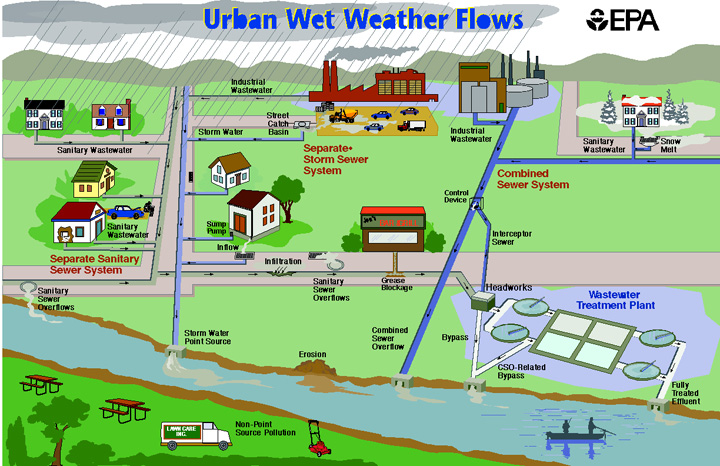
<figcaption>
<strong>Figure 1‑1 Elements of a typical urban
drainage system</strong>
</figcaption>
</figure>

- The Atmosphere compartment, which generates precipitation and deposits
  pollutants onto the Land Surface compartment.

- The Land Surface compartment receives precipitation from the
  Atmosphere compartment in the form of rain or snow. It sends outflow
  in the forms of 1) evaporation back to the Atmosphere compartment, 2)
  infiltration into the Sub-Surface compartment and 3) surface runoff
  and pollutant loadings on to the Conveyance compartment.

- The Sub-Surface compartment receives infiltration from the Land
  Surface compartment and transfers a portion of this inflow to the
  Conveyance compartment as lateral groundwater flow.

- The Conveyance compartment contains a network of elements (channels,
  pipes, pumps, and regulators) and storage/treatment units that convey
  water to outfalls or to treatment facilities. Inflows to this
  compartment can come from surface runoff, groundwater flow, sanitary
  dry weather flow, or from user-defined time series.

Not all compartments need appear in a particular SWMM model. For
example, one could model just the Conveyance compartment, using
pre-defined hydrographs and pollutographs as inputs. As illustrated in
Figure 1-1, SWMM can be used to model any combination of stormwater
collection systems, both separate and combined sanitary sewer systems,
as well as natural catchment and river channel systems.

Figure 1-2 shows how SWMM conceptualizes the physical elements of the
actual system depicted in Figure 1-1 with a standard set of modeling
objects. The principal objects used to model the rainfall/runoff process
are Rain Gages and Subcatchments. Snowmelt is modeled with Snow Pack
objects placed on top of subcatchments while Aquifer objects placed
below subcatchments are used to model groundwater flow. The conveyance
portion of the drainage system is modeled with a network of Nodes and
Links. Nodes are points that represent simple junctions, flow dividers,
storage units, or outfalls. Links connect nodes to one another with
conduits (pipes and channels), pumps, or flow regulators (orifices,
weirs, or outlets). Land Use and Pollutant objects are used to describe
water quality. Finally, a group of data objects that includes Curves,
Time Series, Time Patterns, and Control Rules, are used to characterize
the inflows and operating behavior of the various physical objects in a
SWMM model. Table 1-2 provides a summary of the various objects used in
SWMM. Their properties and functions will be described in more detail
throughout the course of this manual.

<figure>
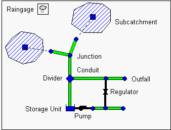
<figcaption>
<strong>Figure 1‑2 SWMM's conceptual model of a
stormwater drainage system</strong>
</figcaption>
</figure>

**Table 1‑2 SWMM's modeling objects**

| **Category** | **Object Type** | **Description** |
|--------------|-----------------|-----------------|
| **Hydrology** | Rain Gage | Source of precipitation data to one or more subcatchments. |
| | Subcatchment | A land parcel that receives precipitation associated with a rain gage and generates runoff that flows into a drainage system node or to another subcatchment. |
| | Aquifer | A subsurface area that receives infiltration from the subcatchment above it and exchanges groundwater flow with a conveyance system node. |
| | Snow Pack | Accumulated snow that covers a subcatchment. |
| | Unit Hydrograph | A response function that describes the amount of sewer inflow/infiltration generated over time per unit of instantaneous rainfall. |
| **Hydraulics** | Junction | A point in the conveyance system where conduits connect to one another with negligible storage volume (e.g., manholes, pipe fittings, or stream junctions). |
| | Outfall | An end point of the conveyance system where water is discharged to a receptor (such as a receiving stream or treatment plant) with known water surface elevation. |
| | Divider | A point in the conveyance system where the inflow splits into two outflow conduits according to a known relationship. |
| | Storage Unit | A pond, lake, impoundment, or chamber that provides water storage. |
| | Conduit | A channel or pipe that conveys water from one conveyance system node to another. |
| | Pump | A device that raises the hydraulic head of water. |
| | Regulator | A weir, orifice or outlet used to direct and regulate flow between two nodes of the conveyance system. |

**Table 1-2 SWMM's modeling objects (continued)**

| **Category** | **Object Type** | **Description** |
|--------------|-----------------|-----------------|
| **Water Quality** | Pollutant | A contaminant that can build up and be washed off of the land surface or be introduced directly into the conveyance system. |
| | Land Use | A classification used to characterize the functions that describe pollutant buildup and washoff. |
| **Treatment** | LID Control | A low impact development control, such as a bio-retention cell, porous pavement, or vegetative swale, used to reduce surface runoff through enhanced infiltration. |
| | Treatment Function | A user-defined function that describes how pollutant concentrations are reduced at a conveyance system node as a function of certain variables, such as concentration, flow rate, water depth, etc. |
| **Data Object** | Curve | A tabular function that defines the relationship between two quantities (e.g., flow rate and hydraulic head for a pump, surface area and depth for a storage node, etc.). |
| | Time Series | A tabular function that describes how a quantity varies with time (e.g., rainfall, outfall surface elevation, etc.). |
| | Time Pattern | A set of factors that repeats over a period of time (e.g., diurnal hourly pattern, weekly daily pattern, etc.). |
| | Control Rules | IF-THEN-ELSE statements that determine when specific control actions are taken (e.g., turn a pump on or off when the flow depth at a given node is above or below a certain value). |

### 1.3 SWMM's Process Models

Figure 1-3 depicts the processes that SWMM models using the objects
described previously and how they are tied to one another. The
hydrological processes depicted in this diagram include:

<figure>
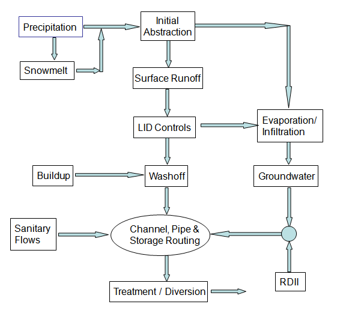
<figcaption>
<strong>Figure 1‑3 Processes modeled by
SWMM</strong>
</figcaption>
</figure>

- time-varying precipitation

- snow accumulation and melting

- rainfall interception from depression storage (initial abstraction)

- evaporation of standing surface water

- infiltration of rainfall into unsaturated soil layers

- percolation of infiltrated water into groundwater layers

- interflow between groundwater and the drainage system

- nonlinear reservoir routing of overland flow

- infiltration and evaporation of rainfall/runoff captured by Low Impact
  Development controls.

The hydraulic processes occurring within SWMM's conveyance compartment
include:

- external inflow of surface runoff, groundwater interflow,
  rainfall-dependent infiltration/inflow, dry weather sanitary flow, and
  user-defined inflows

- unsteady, non-uniform flow routing through any configuration of open
  channels, pipes and storage units

- various possible flow regimes such as backwater, surcharging, reverse
  flow, and surface ponding

- flow regulation via pumps, weirs, and orifices including time- and
  state-dependent control rules that govern their operation.

Regarding water quality, the following processes can be modeled for any
number of user-defined water quality constituents:

- dry-weather pollutant buildup over different land uses

- pollutant washoff from specific land uses during storm events

- direct contribution of rainfall deposition

- reduction in dry-weather buildup due to street cleaning

- reduction in washoff loads due to BMPs

- entry of dry weather sanitary flows and user-specified external
  inflows at any point in the drainage system

- routing of water quality constituents through the drainage system

- reduction in constituent concentration through treatment in storage
  units or by natural processes in pipes and channels.

The numerical procedures that SWMM uses to model the water quality
processes listed above as well as Low Impact Development practices are
discussed in detail in subsequent chapters of this volume. SWMM's
hydrologic and hydraulic processes are described in volumes I and II of
this manual.

### 1.4 Simulation Process Overview

SWMM is a distributed discrete time simulation model. It computes new
values of its state variables over a sequence of time steps, where at
each time step the system is subjected to a new set of external inputs.
As its state variables are updated, other output variables of interest
are computed and reported. This process is represented mathematically
with the following general set of equations that are solved at each time
step as the simulation unfolds:

$$X_{t} = f(X_{t - 1},I_{t},P)$$                             
(1-1)
$$Y_{t} = g(X_{t},P)$$                                       
(1-2)

where
  *Xt*   =   a vector of state variables at time *t*,

  *Yt*   =   a vector of output variables at time *t*,

  *It*   =   a vector of inputs at time *t*,

  *P*      =   a vector of constant parameters,

  *f*      =   a vector-valued state transition function,

  *g*      =   a vector-valued output transform function,

Figure 1-4 depicts the simulation process in block diagram fashion.

<figure>
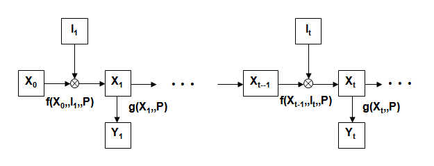
<figcaption>
<strong>Figure 1‑4 Block diagram of SWMM's state
transition process</strong>
</figcaption>
</figure>

The variables that make up the state vector *Xt* are listed in Table
1-3. This is a surprisingly small number given the comprehensive nature
of SWMM. All other quantities can be computed from these variables,
external inputs, and fixed input parameters. The meaning of some of the
less obvious state variables, such as those used for snow melt, is
discussed in other sections of this set of manuals.

**Table 1‑3 State variables used by SWMM**

| **Process** | **Variable** | **Description** | **Initial Value** |
|-------------|--------------|-----------------|-------------------|
| **Runoff** | *d* | Depth of runoff on a subcatchment surface | 0 |
| **Infiltration*** | *tp* | Equivalent time on the Horton curve | 0 |
| | *Fe* | Cumulative excess infiltration volume | 0 |
| | *Fu* | Upper zone moisture content | 0 |
| | *T* | Time until the next rainfall event | 0 |
| | *P* | Cumulative rainfall for current event | 0 |
| | *S* | Soil moisture storage capacity remaining | User supplied |
| **Groundwater** | *θu* | Unsaturated zone moisture content | User supplied |
| | *dL* | Depth of saturated zone | User supplied |
| **Snowmelt** | *wsnow* | Snow pack depth | User supplied |
| | *fw* | Snow pack free water depth | User supplied |
| | *ati* | Snow pack surface temperature | User supplied |
| | *cc* | Snow pack cold content | 0 |
| **Flow Routing** | *y* | Depth of water at a node | User supplied |
| | *q* | Flow rate in a link | User supplied |
| | *a* | Flow area in a link | Inferred from *q* |
| **Water Quality** | *tsweep* | Time since a subcatchment was last swept | User supplied |
| | *mB* | Pollutant buildup on subcatchment surface | User supplied |
| | *mP* | Pollutant mass ponded on subcatchment | 0 |
| | *cN* | Concentration of pollutant at a node | User supplied |
| | *cL* | Concentration of pollutant in a link | User supplied |

\*Only a sub-set of these variables is used, depending on the user's
choice of infiltration method.

Examples of user-supplied input variables *It* that produce changes to
these state variables include:

- meteorological conditions, such as precipitation, air temperature,
  evaporation rate and wind speed

- externally imposed inflow hydrographs and pollutographs at specific
  nodes of the conveyance system

- dry weather sanitary inflows to specific nodes of the conveyance
  system

- water surface elevations at specific outfalls of the conveyance system

- control settings for pumps and regulators.

The output vector *Yt* that SWMM computes from its updated state
variables contains such reportable quantities as:

- runoff flow rate and pollutant concentrations from each subcatchment

- snow depth, infiltration rate and evaporation losses from each
  subcatchment

- groundwater table elevation and lateral groundwater outflow for each
  subcatchment

- total lateral inflow (from runoff, groundwater flow, dry weather flow,
  etc.), water depth, and pollutant concentration for each conveyance
  system node

- overflow rate and ponded volume at each flooded node

- flow rate, velocity, depth and pollutant concentration for each
  conveyance system link.

Regarding the constant parameter vector *P,* SWMM contains over 150
different user-supplied constants and coefficients within its collection
of process models. Most of these are either physical dimensions (e.g.,
land areas, pipe diameters, invert elevations) or quantities that can be
obtained from field observation (e.g., percent impervious cover),
laboratory testing (e.g., various soil properties), or previously
published data tables (e.g., pipe roughness based on pipe material). A
smaller remaining number might require some degree of model calibration
to determine their proper values. Of course not all parameters are
required for every project (e.g., the 14 groundwater parameters for each
subcatchment are not needed if groundwater is not being modeled). The
subsequent chapters of this manual carefully define each parameter and
make suggestions on how to estimate its value.

A flowchart of the overall simulation process is shown in Figure 1-5.
The process begins by reading a description of each object and its
parameters from an input file whose format is described in the SWMM 5
Users' Manual (US EPA, 2010). Next the values of all state variables are
initialized, as is the current simulation time (T), runoff time
(Troff), and reporting time (Trpt).

<figure>
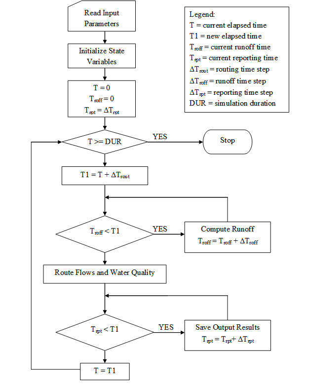
<figcaption>
<strong>Figure 1‑5 Flow chart of SWMM's simulation
procedure</strong>
</figcaption>
</figure>

The program then enters a loop that first determines the time T1 at the
end of the current routing time step (∆Trout). If the current runoff
time Troff is less than T1, then new runoff calculations are
repeatedly made and the runoff time updated until it equals or exceeds
time T1. Each set of runoff calculations accounts for any precipitation,
evaporation, snowmelt, infiltration, ground water seepage, overland
flow, and pollutant buildup and washoff that can contribute flow and
pollutant loads into the conveyance system.

Once the runoff time is current, all inflows and pollutant loads
occurring at time T are routed through the conveyance system over the
time interval from T to T1. This process updates the flow, depth and
velocity in each conduit, the water elevation at each node, the pumping
rate for each pump, and the water level and volume in each storage unit.
In addition, new values for the concentrations of all pollutants at each
node and within each conduit are computed. Next a check is made to see
if the current reporting time Trpt falls within the interval from T to
T1. If it does, then a new set of output results at time Trpt are
interpolated from the results at times T and T1 and are saved to an
output file. The reporting time is also advanced by the reporting time
step ∆Trpt. The simulation time T is then updated to T1 and the
process continues until T reaches the desired total duration. SWMM's
Windows-based user interface provides graphical tools for building the
aforementioned input file and for viewing the computed output.

### 1.5 Interpolation and Units

SWMM uses linear interpolation to obtain values for quantities at times
that fall in between times at which input time series are recorded or at
which output results are computed. The concept is illustrated in Figure
1-6 which shows how reported flow values are derived from the computed
flow values on either side of it for the typical case where the
reporting time step is larger than the routing time step. One exception
to this convention is for precipitation and infiltration rates. These
remain constant within a runoff time step and no interpolation is made
when these values are used within SWMM's runoff algorithms or for
reporting purposes. In other words, if a reporting time falls within a
runoff time step the reported rainfall intensity is the value associated
with the start of the runoff time step.

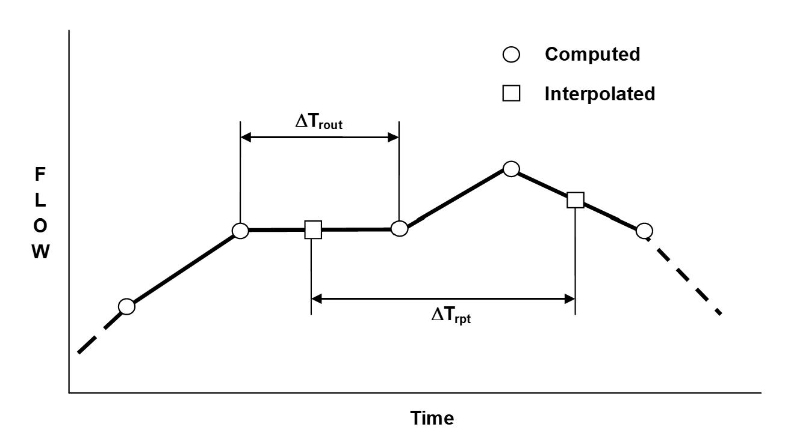

**Figure 1‑6 Interpolation of reported values from computed values**

The units of expression used by SWMM's input variables, parameters, and
output variables depend on the user's choice of flow units. If flow rate
is expressed in US customary units then so are all other quantities; if
SI metric units are used for flow rate then all other quantities use SI
metric units. Table 1-4 lists the units associated with each of SWMM's
major variables and parameters, for both US and SI systems. Internally
within the computer code all calculations are carried out using feet as
the unit of length and seconds as the unit of time.

**Table 1‑4 Units of expression used by SWMM**

| **Variable or Parameter** | **US Customary Units** | **SI Metric Units** |
|---------------------------|------------------------|---------------------|
| Area (subcatchment) | acres | hectares |
| Area (storage surface area) | square feet | square meters |
| Depression Storage | inches | millimeters |
| Depth | feet | meters |
| Elevation | feet | meters |
| Evaporation | inches/day | millimeters/day |
| Flow Rate | cubic feet/sec (cfs) gallons/min (gpm) 106 gallons/day (mgd) | cubic meters/sec (cms) liters/sec (lps) 106 liters/day (mld) |
| Hydraulic Conductivity | inches/hour | millimeters/hour |
| Hydraulic Head | feet | meters |
| Infiltration Rate | inches/hour | millimeters/hour |
| Length | feet | meters |
| Manning's n | seconds/meter1/3 | seconds/meter1/3 |
| Pollutant Buildup | mass/acre | mass/hectare |
| Pollutant Concentration | milligrams/liter (mg/L) micrograms/liter (μg/L) organism counts/liter | milligrams/liter (mg/L) micrograms/liter (μg/L) organism counts/liter |
| Rainfall Intensity | inches/hour | millimeters/hour |
| Rainfall Volume | inches | millimeters |
| Storage Volume | cubic feet | cubic meters |
| Temperature | degrees Fahrenheit | degrees Celsius |
| Velocity | feet/second | meters/second |
| Width | feet | meters |
| Wind Speed | miles/hour | kilometers/hour |

## Chapter 2 - Urban Runoff Quality

\_\_\_\_\_\_\_\_\_\_\_\_\_\_\_\_\_\_\_\_\_\_\_\_\_\_\_\_\_\_\_\_\_\_\_\_\_\_\_\_\_\_\_\_\_\_\_\_\_\_\_\_\_\_\_\_\_\_\_\_\_\_\_\_\_\_\_\_\_\_\_\_\_\_\_\_\_\_

### 2.1 Introduction

Storm water runoff from urbanized areas can contain significant
concentrations of harmful pollutants that can contribute to adverse
water quality impacts in receiving streams. Effects can include such
things as beach closures, shellfish bed closures, limits on fishing and
limits on recreational contact in waters that receive storm water
discharges.

Contaminants enter storm water from a variety of sources in the urban
landscape. The major sources include residential and commercial areas,
industrial activities, construction, streets and parking lots, and
atmospheric deposition. Contaminants commonly found in storm water
runoff and their likely sources are summarized in Table 2-1. Table 2-2
lists typical pollutant loadings from different urban land uses.

**Table 2‑1 Sources of contaminants in urban storm water runoff (US EPA, 1999)**

| **Contaminant** | **Contaminant Sources** |
|-----------------|-------------------------|
| Sediment and Floatables | Streets, lawns, driveways, roads, construction activities, atmospheric deposition, drainage channel erosion |
| Pesticides and Herbicides | Residential lawns and gardens, roadsides, utility right-of-ways, commercial and industrial landscaped areas, soil wash-off |
| Organic Materials | Residential lawns and gardens, commercial landscaping, animal wastes |
| Metals | Automobiles, bridges, atmospheric deposition, industrial areas, soil erosion, corroding metal surfaces, combustion processes |
| Oil and Grease / Hydrocarbons | Roads, driveways, parking lots, vehicle maintenance areas, gas stations, illicit dumping to storm drains |
| Bacteria and Viruses | Lawns, roads, leaky sanitary sewer lines, sanitary sewer cross-connections, animal waste, septic systems |
| Nitrogen and Phosphorus | Lawn fertilizers, atmospheric deposition, automobile exhaust, soil erosion, animal waste, detergents |

**Table 2‑2 Typical pollutant loadings from runoff by urban land use (lbs/acre-yr)**

| **Land Use** | **TSS** | **TP** | **TKN** | **NH3-N** | **NO2+NO3-N** | **BOD** | **COD** | **Pb** | **Zn** | **Cu** |
|--------------|---------|--------|---------|--------------|-------------------|---------|---------|--------|--------|--------|
| Commercial | 1000 | 1.5 | 6.7 | 1.9 | 3.1 | 62 | 420 | 2.7 | 2.1 | 0.4 |
| Parking Lot | 400 | 0.7 | 5.1 | 2 | 2.9 | 47 | 270 | 0.8 | 0.8 | 0.04 |
| HDR | 420 | 1 | 4.2 | 0.8 | 2 | 27 | 170 | 0.8 | 0.7 | 0.03 |
| MDR | 190 | 0.5 | 2.5 | 0.5 | 1.4 | 13 | 72 | 0.2 | 0.2 | 0.14 |
| LDR | 10 | 0.04 | 0.03 | 0.02 | 0.1 | NA | NA | 0.01 | 0.04 | 0.01 |
| Freeway | 880 | 0.9 | 7.9 | 1.5 | 4.2 | NA | NA | 4.5 | 2.1 | 0.37 |
| Industrial | 860 | 1.3 | 3.8 | 0.2 | 1.3 | NA | NA | 2.4 | 7.3 | 0.5 |
| Park | 3 | 0.03 | 1.5 | NA | 0.3 | NA | 2 | 0 | NA | NA |
| Construction | 6000 | 80 | NA | NA | NA | NA | NA | NA | NA | NA |

HDR: High Density Residential, MDR: Medium Density Residential, LDR: Low
Density Residential

NA: Not available; insufficient data to characterize loadings

Source: Burton and Pitt (2002).

The most comprehensive study of urban runoff was conducted by US EPA
between 1978 and 1983 as part of the National Urban Runoff Program
(NURP) (US EPA, 1983). Sampling was conducted for 28 NURP projects which
included 81 specific sites and more than 2,300 separate storm events.
NURP also examined coliform bacteria and priority pollutants at a subset
of sites. Median event mean concentrations (EMCs) for ten general NURP
pollutants for various urban land use categories are presented in Table
2-3. Fecal coliform is the most widely used indicator for the presence
of harmful pathogens. Its concentration measured in separate urban storm
sewers has varied widely, ranging between 400-50,000 MPN/100 ml.

**Table 2‑3 Median event mean concentrations for urban land uses**

| **Pollutant** | **Units** | **Residential** | | **Mixed** | | **Commercial** | | **Open/Non-Urban** | |
|---------------|-----------|-----------------|---|-----------|---|----------------|---|-------------------|---|
| | | **Median** | **COV** | **Median** | **COV** | **Median** | **COV** | **Median** | **COV** |
| BOD | mg/L | 10 | 0.41 | 7.8 | 0.52 | 9.3 | 0.31 | - | - |
| COD | mg/L | 73 | 0.55 | 65 | 0.58 | 57 | 0.39 | 40 | 0.78 |
| TSS | mg/L | 101 | 0.96 | 67 | 1.14 | 69 | 0.85 | 70 | 2.92 |
| Total Lead | μg/L | 144 | 0.75 | 114 | 1.35 | 104 | 0.68 | 30 | 1.52 |
| Total Copper | μg/L | 33 | 0.99 | 27 | 1.32 | 29 | 0.81 | - | - |
| Total Zinc | μg/L | 135 | 0.84 | 154 | 0.78 | 226 | 1.07 | 195 | 0.66 |
| Total Kjeldahl Nitrogen | μg/L | 1900 | 0.73 | 1288 | 0.50 | 1179 | 0.43 | 965 | 1.00 |
| Nitrate + Nitrite | μg/L | 736 | 0.83 | 558 | 0.67 | 572 | 0.48 | 543 | 0.91 |
| Total Phosphorus | μg/L | 383 | 0.69 | 263 | 0.75 | 201 | 0.67 | 121 | 1.66 |
| Soluble Phosphorus | μg/L | 143 | 0.46 | 56 | 0.75 | 80 | 0.71 | 26 | 2.11 |

COV: Coefficient of variation

Source: Nationwide Urban Runoff Program (US EPA 1983)

### 2.2 Pollutant Sources

SWMM can consider several different types of pollutant sources that
contribute to water quality impairment in urban catchments.

<u>Precipitation</u>

The chemical composition associated with precipitation, also known as
wet deposition, represents a direct contribution to the water quality
associated with surface runoff. Precipitation quality has been
extensively monitored and varies widely by location and time of year. It
can contain significant amounts of nitrates, nitrites, sulfates,
sulfides, and even mercury (US EPA, 1997). SWMM accounts for this source
by allowing the user to specify a constant concen­tration of con­stituents
in precipitation.

<u>Surface Runoff</u>

For most SWMM applications, surface runoff will be the primary origin of
water qual­ity constituents. Several mechanisms contribute to stormwater
runoff quality, most notably *buildup* and *washoff*. In an impervious
urban area, it is usually as­sumed that a supply of constituents builds
up on the land surface during dry weather preceding a storm. Such a
buildup may or may not be a function of time and factors such as traffic
flow, dry fallout (dry deposition) and street sweeping (James and
Boregowda, 1985). When a storm event occurs, some fraction of this
material is then washed off into the drainage system. The phys­ics of the
washoff may involve rainfall energy, as in some erosion calcula­tions, or
may be a function of bottom shear stress in the flow as in sediment
transport theory. Most often, however, washoff is treated by an
empirical equation with slight physical justification. Methods for
predicting urban runoff quality constituents are reviewed extensively by
Huber (1985, 1986), Donigian and Huber (1991), Novotny and Olem (1994),
and Donigian et al. (1995).

Erosion of "solids" from soil covering the undeveloped, pervious areas
of a subcatchment is another likely source of constituents. This can be
modeled as a separate land use category with an unlimited amount of
buildup with its own dedicated washoff equation.

<u>Dry Weather Flow</u>

Dry weather flow (DWF) is the continuous discharge of sanitary or
industrial wastewater directly into the conveyance portion of a SWMM
model, typically at junction nodes of a sanitary sewer network (refer to
Figure 1-2). Thus it is only relevant when modeling sanitary or combined
sewer systems. DWF usually follows some repeating pattern on both a
diurnal, daily, and monthly basis. SWMM allows one to define how both
the flow rate and concentration of water quality constituents vary
periodically with time at any specific node of the drainage network.
More information on dry weather source concentrations and flow patterns
is presented in section 2.5.

<u>Groundwater Flow</u>

SWMM models that contain a groundwater component can generate lateral
groundwater flow out of the saturated zone of a subcatchment's
sub-surface area into a node of the conveyance network (see Chapter 5 of
Volume I). This process is usually reserved for modeling recession
curves and base flows in the open channel portions of the drainage
network. One can assign constant concentrations to this flow for each
water quality constituent being modeled. No attempt is made to track the
transport and transformation of constituents that infiltrate from the
surface into the unsaturated groundwater zone and then percolate into
the saturated zone from which they enter the drainage network. Likewise,
the migration of constituents from other parts of the groundwater
aquifer is also ignored. Although there are many unsaturated/saturated
2-D/3-D groundwater models available that can consider such phenomena
(Bear and Cheng, 2010), their complexity precludes their use within a
general purpose urban drainage model like SWMM.

<u>Inflow/Infiltration (I/I)</u>

SWMM's hydrology module is also capable of estimating rainfall dependent
inflow and infiltration (RDII) in to sewers. These are flows due to
\"inflow\" from direct connections of downspouts, sump pumps, foundation
drains, etc. as well as \"infiltration\" of subsurface water through
cracked pipes, leaky joints, and poor manhole connections. As with
groundwater, one can assign a constant concentration to water quality
constituents associated with RDII flows. The same limitations of using a
constant concentration here as for groundwater flow applies. Because
RDII analysis is most commonly used to assess the hydraulic capacity of
sanitary sewer systems, such analyses rarely consider water quality.

<u>External Inflows</u>

SWMM's hydraulic module (see Volume II) allows one to introduce
externally imposed flows at any point in the conveyance network of
channels, pipes and sewers. These flows can have water quality
constituents associated with them. The constituent concentration of the
inflow at some point in time is given by the following expression:

Concentration at time t = (baseline value) × (baseline pattern factor) + (scale factor) × (time series value at time t)

The baseline value is some constant, the baseline pattern is either a
repeating hourly, daily, or monthly multiplier factor applied to the
baseline value, the time series value is a time varying value, and the
scale factor is a constant multiplier applied to each time series value.
All values and factors are user-supplied. Time series values can be
specified at unequal intervals of time. Interpolation is used to obtain
values at intermediate times.

The expression for constituent concentration is multiplied by the flow
rate associated with the external inflow to arrive at an external mass
inflow rate (in units of mass per time). Instead of specifying the
concentration of the external inflow one can instead use the above
expression to model a time-varying mass loading of a constituent. In
this case it is not necessary to provide an external flow rate to
introduce a pollutant into the drainage system.

To summarize, SWMM can model water quality constituents entering a
drainage system from direct precipitation, from surface runoff, from
lateral groundwater flow, from rainfall dependent inflow/infiltration,
from dry weather base flow or sanitary sewage flow, and from
user-supplied external time series flows.

### 2.3 Pollutant and Land Use Objects

#### 2.3.1 Pollutant Object

SWMM represents a water quality constituent through a **Pollutant**
object. Any number of pollutants may be defined in a SWMM model and be
included in a simulation provided that:

1.  they can be expressed as a concentration of either mass or number
    (for biological organisms) per volume of water,

2.  their masses are additive, meaning that the concentration of two
    equal volumes of water mixed together is the sum of the individual
    concentrations.

Note that these conditions would preclude naming pH as a constituent
since it is expressed as the logarithm of a concentration and the pH of
a mixture also depends in a nonlinear fashion on the alkalinity in the
volumes being mixed. Other constituents not meeting these criteria
include conductivity, turbidity, and color.

The following user-supplied properties are associated with each
pollutant object:

- Units -- either mg/L or μg/L for chemical constituents or counts/L for
  biological constituents.

- Rain Concentration -- the concentration of the constituent in direct
  precipitation.

- Groundwater Concentration -- the concentration of the constituent in
  the saturated groundwater zone associated with all subcatchments in
  which groundwater is modeled.

- Inflow/Infiltration Concentration -- the concentration of the
  constituent in any flow that enters the conveyance system (which would
  typically be a sanitary sewer system) due to rainfall dependent
  inflow/infiltration.

- Dry Weather Flow Concentration -- the average concentration of the
  constituent in any dry weather flow (typically sanitary sewage flow)
  introduced externally into the conveyance system.

- Decay Coefficient -- a first order reaction coefficient (in units of
  1/days) used to compute the rate at which the constituent decays due
  to reaction or other processes once it enters the conveyance portion
  of a SWMM model.

- Snow Only Flag -- a flag used to indicate if the constituent only
  builds up on the land surface when snow is present (such as might be
  the case for chlorides associated with street de-icing operations).

- Co-Pollutant -- the name of another pollutant whose concentration adds
  to the concentration of the current pollutant.

- Co-Fraction -- the fraction of the co-pollutant that adds to the
  concentration of the current pollutant.

Co-pollutants are useful for representing constituents that can appear
in either dissolved or solid forms (e.g., BOD, metals, phosphorus) and
may be adsorbed onto other constituents (e.g., pesticides onto "solids")
and thus be generated as a portion or fraction of such other
constituents. This co-fraction, also known as a potency factor, is
commonly used in agricultural and sediment runoff models, such as HSPF
(Bicknell et al., 1997), to relate concentrations of particulate forms
of specific constituents (such as phosphorous, BOD, heavy metals, and
organic nitrogen) to suspended solids concentrations. The co-fractions
(or potency factor) must honor the units used for the two constituents
being related. Thus a co-fraction can be greater than 1. In SWMM
co-pollutants only apply to buildup/washoff processes -- not to the
user-specified concentrations in rainwater, groundwater, sewer
inflow/infiltration (I/I), and dry weather flow.

Table 2-4 lists potency factors for suspended solids derived from wet
weather sampling for different constituents and land uses in the Detroit
Metropolitan area. Table 2-5 does the same for the Patuxent River basin
in Maryland. The differences in factors for the same constituent at the
two locations underscore how site-specific these factors can be.

#### 2.3.2 Land Use Object

Because buildup data clearly show that different rates apply to
different land uses, SWMM allows one to define different buildup and
washoff functions for each combination of pollutant and land use. SWMM's
Land Use object is used to identify a particular type of land use and to
store the buildup (and washoff) functions for each SWMM Pollutant.

**Land Uses** are categories of development activities or land surface
characteristics assigned to subcatchments. Examples of land use
activities are residential, commercial, industrial, and undeveloped.
Land surface characteristics might include rooftops, lawns, paved roads,
undisturbed soils, etc. Land uses are used solely to account for spatial
variation in pollutant buildup and washoff rates within subcatchments.

**Table 2‑4 Potency factors for the Detroit metropolitan area (mg/gram) Source: Roesner (1982).**

| **Constituent** | **Residential** | **Commercial/Industrial** | **Roads** | **Rural** |
|-----------------|-----------------|---------------------------|-----------|-----------|
| BOD5 | 34 | 45 | 10 | 18 |
| Fecal Coliformsa | 87,000 | 37,000 | 200,000 | 300,000 |
| NH4 | 0.8 | 2.4 | 0.35 | 0.45 |
| NO2 + NO3 | 1.7 | 6.4 | 0.07 | 3.5 |
| Total Organic N | 4.3 | 4.1 | 1.22 | 7.0 |
| Total P | 1.9 | 1.7 | 0.26 | 1.5 |
| PO4 | 0.24 | 0.47 | 0.20 | 2.4 |
| Oil & Grease | 25 | 80 | 100 | 13 |
| Lead | 1.8 | 1.4 | 0.41 | 0.21 |

a (organisms/100ml) / (gram/L TSS)

**Table 2‑5 Potency factors for the Patuxent River Basin (mg/gram) Source: Aqua Terra (1994).**

| **Land Use** | **NO3** | **NH4** | **PO4** | **BOD** |
|--------------|-----------|-----------|-----------|---------|
| Low Density Residential | 1.5 | 0.4 | 1.1 | 90 |
| Medium/High Density Residential | 6.0 | 2.0 | 1.6 | 180 |
| Commercial/Industrial | 10.0 | 3.2 | 2.7 | 270 |
| Forest and Wetland | 0.1-0.18 | 0.011-0.018 | 0.04-0.07 | 11-17 |
| Pasture | 3.6 | 0.4 | 0.27 | 60 |
| Idle Agricultural Land | 2.0 | 0.2 | 0.16 | 30 |

The SWMM user has many options for defining land uses and assigning them
to subcatchment areas. One approach is to assign a mix of land uses for
each subcatchment, which results in all land uses within the
subcatchment having the same pervious and impervious characteristics.
Another approach is to create subcatchments that have a single land use
classification along with a distinct set of pervious and impervious
characteristics that reflects the classification. If surface buildup and
washoff is not being modeled, such as when pollutant inflows come only
from wet deposition, dry weather sanitary flows, and external time
series flows, then there is no need to add land uses into a project.

### 2.4 Wet Deposition

There is considerable public awareness of the fact that precipitation is
by no means "pure" and does not have characteristics of distilled water.
Low pH (acid rain) is the best known parameter but many substances can
also be found in precipitation, including organics, solids, nutrients,
metals and pesticides (Novotny and Olem, 1994). Atmospheric deposition
is an important loading factor in coastal waters (NRC, 2000). Compared
to surface sources, rainfall is probably an important contributor mainly
of some nutrients in urban runoff, although it may contribute
substantially to other constituents as well. In particular, Kluesener
and Lee (1974) found ammonia levels in rainfall higher than in runoff in
a residential catchment in Madison, Wisconsin; rainfall nitrate
accounted for 20 to 90 percent of the nitrate in stormwater runoff to
Lake Wingra. Mattraw and Sherwood (1977) report similar findings for
nitrate and total nitrogen for a residential area near Fort Lauderdale,
Florida. Data from the latter study are presented in Table 2-6 in which
rainfall may be seen to be an important contributor to all nitrogen
forms, plus COD, although the instance of a higher COD value in rainfall
than in runoff is probably anomalous.

In addition to the two references first cited, Weibel et al. (1964,
1966) report concentrations of constituents in Cincinnati rainfall
(Table 2-6), and a summary is also given by Manning et al. (1977). Other
data on rainfall chemistry and loadings are given by Uttormark et al.
(1974), Betson (1978), Hendry and Brezonik (1980), Novotny and Kincaid
(1981), Randall et al. (1981), Mills et al., (1985), and Novotny and
Olem (1994). A comprehensive summary is presented by Brezonik (1975)
from which it may be seen in Table 2-6 that there is a wide range of
concentrations observed in rainfall. Again, the most important
parameters relative to urban runoff are probably the various nitrogen
forms.

The previous cited literature reflects relevant but older information
regarding precipitation chemistry. A very useful web site is
http://nadp.sws.uiuc.edu/, for the National Atmospheric Deposition
Program (NADP). Data may be downloaded from this site for hundreds of
monitoring locations across the U.S., permitting good estimates of
regional precipitation concentrations. Annual, seasonal, and time series
data and plots may be downloaded for wet and dry deposition of
parameters such as pH, nitrogen species, calcium, chloride, and whatever
else is measured at a site. A bonus for some sites is daily
precipitation data. Dry deposition values might be included with buildup
on the land surface, although other buildup factors, such as wind
erosion, traffic, etc. make it very difficult to separate causative
factors (James and Boregowda, 1985).

**Table 2‑6 Representative concentrations of constituents in rainfall**

| **Parameter** | **Ft. Lauderdalea** | **Cincinnatib** | **Lodi, NJc** | **"Typical Range"d** |
|---------------|------------------------|-------------------|-----------------|------------------------|
| **Acidity** | | | | |
| pH | | | | 3-6 |
| **Organics** | | | | |
| BOD5, mg/L | 4-22 | 16 | | 1-13 |
| COD, mg/L | 1-3 | | | 9-16 |
| TOC, mg/L | 0-2 | | | Few |
| Inorg. C, mg/L | | | | |
| **Color** | | | | |
| PCU | 5-10 | | | |
| **Solids** | | | | |
| Total Solids, mg/L | 18-24 | 13 | | |
| Suspended Solids, mg/L | 2-10 | | | |
| Turbidity, JTU | 4-7 | | | |
| **Nutrients** | | | | |
| Org. N, mg/L | 0.09-0.15 | 0.58 | | 0.05-1.0 |
| NH3-N, mg/L | 0.01-0.04 | 1.27e | | 0.05-1.0 |
| NO2-N, mg/L | 0.00-0.01 | 0.08 | | 0.2-1.5 |
| NO3-N, mg/L | 0.12-0.73 | | | 0.0-0.05 |
| Total N, mg/L | 0.29-0.84 | | | 0.02-0.15 |
| Orthophosphorus, mg/L | 0.01-0.03 | | | |
| Total P, mg/L | 0.01-0.05 | | | |
| **Pesticides** | | | | |
| μg/L | | 3-600 | | Few |
| **Heavy metals** | | | | |
| Lead, μg/L | | | 45 | 30-70 |
| Nickel, μg/L | | | 3 | |
| Copper, μg/L | | | 6 | |
| Zinc, μg/L | | | 44 | |

aRange for three storms (Mattraw and Sherwood, 1977)  
bAverage of 35 storms (Weibel et al., 1966)  
cWilbur and Hunter (1980)  
dBrezonik (1975)  
eSum of NH3-N, NO2-N, NO3-N

Constituent concentrations in precipitation are associated with a SWMM
Pollutant object. All surface runoff, including snowmelt, is assumed to
have at least this concentration, and the precipitation load is
calculated by multiplying this concentration by the runoff rate and
adding to the load already generated by other mechanisms. It may be
inappropriate to add a precipitation load to loads generated by a
calibration of buildup-washoff or rating curve parameters against
measured runoff concentrations, since the latter already reflect the sum
of all contributions, land surface and otherwise. But precipitation
loads might well be included if starting with buildup-washoff data from
other sources. They also provide another simple means for imposing a
constant concentration on any subcatchment constituent.

### 2.5 Dry Weather Flow

For most of this discussion, "dry-weather flow" (DWF), equivalent to
base flow in a natural stream, is derived from sanitary sewage or
industrial flows entering the drainage system -- usually a combined
sewer. Since SWMM can also be used to simulate sanitary sewers and
systems with cross connections, DWF might also be applied to simulations
of those systems. The estimation of DWF quantity and quality in a sewer
system can be broken into two parts: 1) estimates of average quantities,
and 2) estimates of time patterns to apply to these averages. The
discussion that follows addresses each of these aspects.

#### 2.5.1 Average Dry-Weather Flow Estimates

Like almost all SWMM input parameters, DWF hydrographs and pollutographs
are best determined through monitoring. Monitoring of inflows to a
municipal wastewater treatment plant (WWTP) is routinely performed, at
least for flow. This end-of-pipe discharge may then be apportioned back
through the sewer system on the basis of population through census tract
data, as a first approximation. Similarly, population estimates are
often used as the basis to determine DWF, on a per capita basis. These
per capita estimates vary considerably. For instance, ASCE-WPCF (1969)
report per capita data for 34 cities, as summarized in Table 2-7. Data
in this table are from the 1960s and reflect sewage discharges at that
time; modern cities tend to have less per capita water use due to
low-volume plumbing fixtures, etc. Water use itself is another surrogate
for DWF measurements, especially winter values that reflect indoor use
only (no irrigation, car washing, etc.).

Many other sources contribute to average DWF, including commercial
establishments, hospitals, municipal and institutional buildings,
apartment buildings, etc., none of which are easily represented on a per
capita basis. Environmental engineering texts, such as Metcalf & Eddy,
Inc. (2003) provide tables with data from such locations. Industries can
generate large quantities of DWF and must be evaluated individually.
Another alternative for DWF estimates is on a per area basis, but such
design curves (gallons per acre per day vs. acres) are highly
site-specific (ASCE-WPCF, 1969).

**Table 2‑7 Average daily dry weather flow in 29 cities Source: ASCE-WPCF (1969)**

| # | **City** | **Avg. Sewage Flow, gpd/cap** | # | **City** | **Avg. Sewage Flow, gpd/cap** |
|---|----------|-------------------------------|---|----------|-------------------------------|
| 1 | Baltimore, MD | 100 | 19 | Los Angeles 2, CA | 70 |
| 2 | Berkeley, CA | 60 | 20 | Greater Peoria, IL | 75 |
| 3 | Boston, MA | 140 | 21 | Milwaukee, WI | 125 |
| 4 | Cleveland, OH | 100 | 22 | Memphis, TN | 100 |
| 5 | Cranston, RI | 119 | 23 | Orlando, FL | 70 |
| 6 | Des Moines, IA | 100 | 24 | Painesville, OH | 125 |
| 7 | Grand Rapids, MI | 190 | 25 | Rapid City, SD | 121 |
| 8 | Greenville County, SC | 150 | 26 | Santa Monica, CA | 92 |
| 9 | Hagerstown, MD | 100 | 27 | St. Joseph, MO | 125 |
| 10 | Jefferson County, AL | 100 | 28 | Washington, DC | 100 |
| 11 | Johnson County-1, KS | 60 | 29 | Wyoming, MI | 82 |
| 12 | Johnson County 2, KS | 60 | | | |
| 13 | Kansas City, MO | 60 | | | |
| 14 | Lancaster County, NB | 92 | | | |
| 15 | Las Vegas, NV | 209 | | | |
| 16 | Lincoln, NB | 60 | | | |
| 17 | Little Rock, AR | 50 | | | |
| 18 | Los Angeles, CA | 85 | | | |

**Summary Statistics:**
- Average: 101
- CV*: 0.38
- Maximum: 209
- Minimum: 50
- Median: 100

\*CV = coefficient of variation = standard deviation/average

**Table 2‑8 Quality properties of untreated domestic wastewater Source: Metcalf and Eddy, Inc. (2003)**

| **Contaminant** | **Unit** | **Weak** | **Medium** | **Strong** |
|-----------------|----------|----------|------------|------------|
| **Solids, total** | mg/L | 390 | 720 | 1230 |
| Solids, total dissolved (TDS) | mg/L | 270 | 500 | 860 |
| Fixed | mg/L | 160 | 300 | 520 |
| Volatile | mg/L | 110 | 200 | 340 |
| **Solids, suspended, total (TSS)** | mg/L | 120 | 210 | 400 |
| Fixed | mg/L | 25 | 50 | 85 |
| Volatile | mg/L | 95 | 160 | 315 |
| Solids, settleable | mg/L | 5 | 10 | 20 |
| **Biochemical oxygen demand, 5-day (BOD5)** | mg/L | 110 | 190 | 350 |
| **Total organic carbon (TOC)** | mg/L | 80 | 140 | 260 |
| **Chemical oxygen demand (COD)** | mg/L | 250 | 430 | 800 |
| **Nitrogen, total as N (TN)** | mg/L | 20 | 40 | 70 |
| Organic | mg/L | 8 | 15 | 25 |
| Free ammonia (NH3) | mg/L | 12 | 25 | 45 |
| Nitrite (NO2) | mg/L | 0 | 0 | 0 |
| Nitrate (NO3) | mg/L | 0 | 0 | 0 |
| **Phosphorus, total as P (TP)** | mg/L | 4 | 7 | 12 |
| Organic | mg/L | 1 | 2 | 4 |
| Inorganic | mg/L | 3 | 5 | 10 |
| **Chlorides** | mg/L | 30 | 50 | 90 |
| **Sulfate** | mg/L | 20 | 30 | 50 |
| **Oil and Grease** | mg/L | 50 | 90 | 100 |
| **Volatile organic compounds (VOCs)** | mg/L | <100 | 100-400 | >400 |
| **Total coliform** | #/100 mL | 106-108 | 107-109 | 107-1010 |
| **Fecal coliform** | #/100 mL | 103-105 | 104-106 | 105-108 |

"Weak" is based on an approximate wastewater flow rate of 200 gpd/day
(750 L/capita-day, "medium" of 120 gpd/day (460 L/capita-day), and
"strong" of 60 gpd/day (240 L/capita-day).

Domestic wastewater quality is variable, but well documented. Typical
values are shown in Table 2-8 (Metcalf and Eddy, Inc., 2003). Estimates
are also available on a per capita basis (unit loads) of the type shown
in Table 2-9 and expanded upon in texts such as Metcalf and Eddy, Inc.
(2003). Commercial, industrial, and institutional quality is typically
stronger (higher concentrations) than domestic wastewater and should be
evaluated individually. Guidelines may be found in several sources, such
as Tchobanoglous and Burton (1991) and Metcalf and Eddy Inc. (2003).
Earlier SWMM documentation provides additional literature reviews on
these topics (Metcalf and Eddy et al., 1971a; Huber and Dickinson,
1988).

**Table 2‑9 Unit quality loads for domestic sewage, including effects of garbage grinders  Source: Haseltine (1950); Metcalf and Eddy et al. (1971a).**

| **Constituent** | **Sewage (lb/capita-day)** | **Ground Garbage (lb/capita-day)** |
|-----------------|----------------------------|-----------------------------------|
| Total solids | 0.55 | 0.15 |
| Total volatile solids | 0.32 | 0.13 |
| Suspended matter | 0.20 | 0.10 |
| BOD5 | 0.17 | 0.08 |
| Fats and greases | 0.05 | 0.03 |
| Total nitrogen | 0.04 | 0.002 |

#### 2.5.2 Temporal Variations in Dry-Weather Flow

Dry-weather flow quantity and quality varies seasonally, weekly, and
daily. SWMM provides monthly (one multiplier for each month of year),
daily (one multiplier for each day of week), hourly (one multiplier for
each hour of day), and weekend (one multiplier for each hour of weekend
days) adjustment factors to be applied to average DWF quantities.
Typical sinusoidal variations are shown in texts such as Metcalf and
Eddy Inc. (2003) and in ASCE and WPCF (1969), but these variations are
best obtained by examination of WWTP inflow hydrographs. Variations in
daily water use (surrogate for wastewater discharge) reported for nine
homes monitored in November 1964 by Tucker (1967) are shown in Table
2-10. Typical hourly variations in domestic wastewater flow and strength
given by Metcalf and Eddy, Inc. (2003) are shown in Figure 2-1 and Table
2-11.

**Table 2‑10 Autumn water use for six homes near Wheaton, MD  Source: Tucker (1967).**

| **Week** | **Sun** | **Mon** | **Tues** | **Wed** | **Thurs** | **Fri** | **Sat** | **Average** |
|----------|---------|---------|----------|---------|-----------|---------|---------|-------------|
| **Six home use, gal (10/18/64)** | 1722 | 2137 | 1941 | 1938 | 1706 | 1777 | 1762 | 1855 |
| **Ratio to avg.** | 0.928 | 1.152 | 1.047 | 1.045 | 0.920 | 0.958 | 0.950 | |
| | | | | | | | | |
| **Six home use, gal (11/1/64)** | 1774 | 1569 | 1966 | 1714 | 1663 | 1861 | 1784 | 1762 |
| **Ratio to avg.** | 1.007 | 0.891 | 1.116 | 0.973 | 0.944 | 1.056 | 1.013 | |
| | | | | | | | | |
| **Average ratios** | 0.968 | 1.021 | 1.081 | 1.009 | 0.932 | 1.007 | 0.981 | 1.000 |

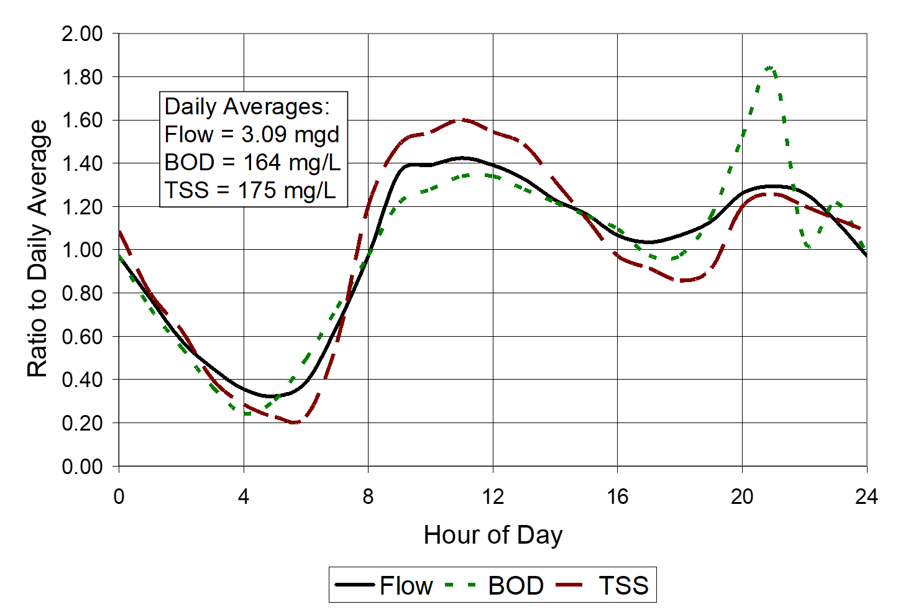

**Figure 2‑1 Hourly domestic sewage time patterns**

(Based on data from Metcalf and Eddy, Inc.(2003). Ratios are based on
indicated daily averages.)

**Table 2‑11 Typical hourly DWF correction factors Source: Metcalf and Eddy, Inc. (2003).**

| **Hour** | **Flow** | **BOD** | **TSS** | **Hour** | **Flow** | **BOD** | **TSS** |
|----------|----------|---------|---------|----------|----------|---------|---------|
| 1 | 0.78 | 0.73 | 0.80 | 13 | 1.33 | 1.28 | 1.49 |
| 2 | 0.58 | 0.55 | 0.63 | 14 | 1.23 | 1.22 | 1.31 |
| 3 | 0.45 | 0.37 | 0.40 | 15 | 1.16 | 1.16 | 1.14 |
| 4 | 0.36 | 0.24 | 0.29 | 16 | 1.07 | 1.10 | 0.97 |
| 5 | 0.32 | 0.30 | 0.23 | 17 | 1.04 | 0.97 | 0.91 |
| 6 | 0.39 | 0.49 | 0.23 | 18 | 1.07 | 0.97 | 0.86 |
| 7 | 0.65 | 0.73 | 0.57 | 19 | 1.13 | 1.16 | 0.91 |
| 8 | 0.97 | 0.97 | 1.20 | 20 | 1.26 | 1.52 | 1.20 |
| 9 | 1.36 | 1.22 | 1.49 | 21 | 1.29 | 1.83 | 1.26 |
| 10 | 1.39 | 1.28 | 1.54 | 22 | 1.26 | 1.04 | 1.20 |
| 11 | 1.42 | 1.34 | 1.60 | 23 | 1.13 | 1.22 | 1.14 |
| Noon | 1.39 | 1.34 | 1.54 | Midnight | 0.97 | 0.97 | 1.09 |
| | | | | **Average** | 1.00 | 1.00 | 1.00 |

### 2.6 Simulating Runoff Quality

Simulation of urban runoff quality is a very inexact science if it can
even be called such. Very large uncertainties arise both in the
representa­tion of the physical, chemical and biological processes and in
the acquisition of data and parameters for model algorithms. For
instance, subsequent sec­tions will discuss the concept of "buildup" of
pollutants on land surfaces and "washoff" during storm events. The true
mechanisms of buildup involve factors such as wind, traffic, atmospheric
fallout, land surface activities, erosion, street cleaning and other
imponderables. Al­though efforts have been made to include such factors
in physically-based equations (James and Boregowda, 1985), it is
unrealistic to assume that they can be represented with enough accuracy
to determine *a priori* the amount of pollutants on the surface at the
beginning of the storm. Equally naive is the idea that empirical washoff
equations truly represent the complex hydrodynamic (and chemical and
biologi­cal) processes that occur while overland flow moves in random
patterns over the land surface. The many difficulties of simulation of
urban runoff quality are discussed by Huber (1985, 1986).

Such uncertainties can be dealt with in two ways. The first option is to
collect enough calibration and verification data to be able to calibrate
the model equations used for quality simulation. Given sufficient data,
the equa­tions used in SWMM can usually be manipulated to reproduce
measured con­centra­tions and loads. This is essentially the option
discussed at length in the following sections. The second option is to
abandon the notion of de­tailed quality simulation altogether and either
use a constant concentration (event mean concentration or EMC) applied
to quantity predictions (i.e., obtain storm loads by multiplying
pre­dicted volumes by an assumed concentration) (Johansen et al., 1984)
or use a statis­tical method (Hydroscience, 1979; Driscoll and Assoc.,
1981; US EPA, 1983b; DiToro, 1984; Adams and Papa, 2000). EMC values may
be entered directly into SWMM 5. Statistical methods are based in part
upon strong evidence that storm event mean concentrations are
lognor­mally distributed (Driscoll, 1986). The statistical methods
recognize the frustrations of physically-based modeling and move
directly to a stochastic result (e.g., a frequency distri­bution of
EMCs), but they are even more de­pendent on available data than meth­ods
such as those found in SWMM. That is, statistical parameters such as
mean, median and variance must be available from other studies in order
to use the statis­tical meth­ods. Furthermore, it is harder to study the
effect of controls and catch­ment modifications using statistical
methods.

Table 4-12 on p. 4-77.The main point is that there are alternatives to
the buildup-washoff approach available in SWMM; the latter can involve
extensive effort at parameter estimation and model calibration to
produce quality predictions that may vary greatly from an unknown
"reality." But SWMM also offers simpler options, including the constant
concentration or EMC approach. Before delving into the arcane methods
incorporated in SWMM and other urban runoff quality simulation models,
the user should try to determine whether or not the effort will be worth
it in view of the uncertain­ties of the process and whether or not
simpler alternative methods might suf­fice. The discussions that follow
provide a comprehensive view of the options available in SWMM, which are
more than in almost any other comparable model, but the extent of the
discussion should not be interpreted as a guarantee of success in
applying the methods.

Although the conceptualization of the quality processes is not
diffi­cult, the reliability and credibility of quality parameter
simulation is very challenging to establish. In fact, quality
predictions by SWMM or almost any other surface runoff model are mostly
hypothetical unless local data for the catchment being simulated are
available to use for calibration and validation. If such data are
lack­ing, results may still be used to compare *relative* effects of
changes, but parameter magnitudes (i.e., actual values of pre­dicted
concentrations) will forever be in doubt. This is in marked con­trast to
quantity prediction for which reasonable estimates of hydrographs may be
made in advance of calibra­tion.

Moreover, there is disagreement in the literature as to what are the
important and appropriate physical and chemical mechanisms that should
be included in a model to generate surface runoff quality. The objective
in SWMM has been to provide flexibility in mechanisms and the
opportunity for calibration. But this places a considerable burden on
the user to obtain adequate data for model usage and to be familiar with
quality mechanisms that may apply to the catchment being studied. This
burden is all too often ig­nored, leading ultimately to model results
being discredited.

In the end then, there is no substitute for local data (rain, flow, and
concentration measurements) with which to calibrate and verify the
quality predictions. *Without such data, little reliability can be
placed in the predicted magnitudes of quality parameters.*

Early quality modeling efforts with SWMM emphasized generation of
detailed pollutographs, in which concentrations versus time were
generated for short time increments during a storm event (e.g., Metcalf
and Eddy et al., 1971b). Depending upon the application, such detail may
be entirely unnecessary because the receiving waters cannot respond to
such rapid changes in concentration or loads. Instead, only the total
storm event load is necessary for most studies of receiving water
quality. Time scales for the response of various receiving waters are
presented in Table 2-12 (Driscoll, 1979; Hydroscience, 1979).
Concentration transients occurring within a storm event are unlikely to
affect any common quality parameter within the receiving water, with the
possible exception of bacteria. Detailed temporal concentration
variations within a storm event are needed primarily when they will
affect control alternatives. For example, a storage device may need to
trap the "first flush" of pollutants, if one exists.

**Table 2‑12 Required temporal detail for receiving water analysis  Source: Driscoll (1979) and Hydroscience (1979).**

| **Type of Receiving Water** | **Key Constituents** | **Response Time** |
|----------------------------|----------------------|-------------------|
| Lakes, Bays | Nutrients | Weeks - Years |
| Estuaries | Nutrients, DO | Days - Weeks |
| Large Rivers | DO, Nitrogen | Days |
| Streams | DO, Nitrogen | Hours - Days |
| | Bacteria | Hours |
| Ponds | DO, Nutrients | Hours - Weeks |
| Beaches | Bacteria | Hours |

The significant point is that calibration and verification ordinarily
need only be performed on total storm event loads, or on event mean
concentra­tions. This is a much easier task than trying to match detailed
concentration transients within a storm event.

##  Chapter 3 - Surface Buildup

\_\_\_\_\_\_\_\_\_\_\_\_\_\_\_\_\_\_\_\_\_\_\_\_\_\_\_\_\_\_\_\_\_\_\_\_\_\_\_\_\_\_\_\_\_\_\_\_\_\_\_\_\_\_\_\_\_\_\_\_\_\_\_\_\_\_\_\_\_\_\_\_\_\_\_\_\_\_

### 3.1 Introduction

Simulation of pollutant buildup on the subcatchment surface is only
required if SWMM's Exponential option is used to describe wash off,
since that function depends on the amount of buildup present (see
Chapter 4). However, even when washoff quality is estimated using an
Event Mean Concentration (EMC) or Rating Curve option, buildup
simulation could still be useful to establish a maximum mass of
pollutant that could be removed during any given storm event.

One of the most influential of the early studies of storm­water pollution
was conducted in Chicago by the American Public Works Association
(1969). As part of this project, street surface accumulation of "dust
and dirt" (DD) (anything passing through a quarter-inch mesh screen) was
measured by sweeping with brooms and vacuum cleaners. The accumulations
were measured for differ­ent land uses and curb length, and the data were
normalized in terms of pounds of dust and dirt per dry day per 100 ft of
curb or gutter. These well known results are shown in Table 3-1 and
imply that dust and dirt buildup is a linear function of time. The dust
and dirt samples were analyzed chemically, and the fraction of sample
consisting of various constituents for each of four land uses was
de­termined, leading to the results shown in Table 3-2.

**Table 3-1 Measured dust and dirt (DD) accumulation in Chicago  Source: APWA (1969).**

| Type | Land Use | Pounds DD/dry day per 100 ft-curb |
|------|----------|-----------------------------------|
| 1    | Single Family Residential | 0.7 |
| 2    | Multi-Family Residential | 2.3 |
| 3    | Commercial | 3.3 |
| 4    | Industrial | 4.6 |
| 5    | Undeveloped or Park | 1.5 |

**Table 3-2 Milligrams of pollutant per gram of dust and dirt (parts per thousand by mass) for four Chicago land uses  Source: APWA (1969).**

| Parameter | Single Family Residential | Multi-Family Residential | Commercial | Industrial |
|-----------|---------------------------|---------------------------|------------|------------|
| BOD5 | 5.0 | 3.6 | 7.7 | 3.0 |
| COD | 40.0 | 40.0 | 39.0 | 40.0 |
| Total Coliformsa | 1.3 × 106 | 2.7 × 106 | 1.7 × 106 | 1.0 × 106 |
| Total N | 0.48 | 0.61 | 0.41 | 0.43 |
| Total PO4 (as PO4) | 0.05 | 0.05 | 0.07 | 0.03 |

aUnits for coliforms are MPN/gram.

From the values shown in Tables 3-1 and 3-2, the buildup of each
con­stituent (also linear with time) can be computed simply by
multiplying dust and dirt by the appropriate fraction. Since the APWA
study was published during the original SWMM project (1968-1971), it
represented the state of the art at the time and linear buildup was used
extensively in the development of the surface quality routines in the
original SWMM program (Metcalf and Eddy et al., 1971a, Section 11).
Ammon (1979) summarized many subsequent studies of pollutant buildup on
urban surfaces and found evidence to suggest several nonlinear buildup
relationships as alternatives to the linear one. Upper limits for
buildup are also likely. Several options for both buildup and washoff
were proposed by Ammon and incorporated into SWMM III (Huber et al.,
1981b).

Of course, the whole buildup idea essentially ignores the physics of
generation of pollutants from sources such as street pavement, vehicles,
at­mospheric fallout, vegetation, land surfaces, litter, spills,
anti-skid com­pounds and chemicals, construction, and drainage networks.
Novotny and Olem (1994) and Novotny (1995) summarize empirical
relationships for the urban street surface pollution accumulation
process. Lager et al. (1977) and James and Boregowda (1985) consider
each source in turn and give guidance on buildup rates. To summarize,
several studies and voluminous data exist from the 1960s and 1970s with
which to formu­late buildup relationships, most of which are purely
empirical and data-based, ignoring the underlying physics and chemistry
of the generation processes. Nonetheless, they represent what is
available, and modeling techniques in SWMM are designed to accommodate
them in their heuristic form.

### 3.2 Governing Equations

There is ample evidence that buildup is a nonlinear function of dry
days; Sartor and Boyd's (1972) data are most often cited as examples
(Figure 3-1). Later data from Pitt (Figure 3-2) for San Jose indicate
almost linear accumu­lation, although some of the best fit lines
indicated in the figure had very poor correlation coefficients, ranging
from 0.35 ≤ R ≤ 0.9. (The actual data points are not shown in Pitt's
figures.) Even in data collected as carefully as in the San Jose study,
the scatter (not shown in the report) is considerable. Thus, the choice
of the best functional form is not obvious.

<figure>
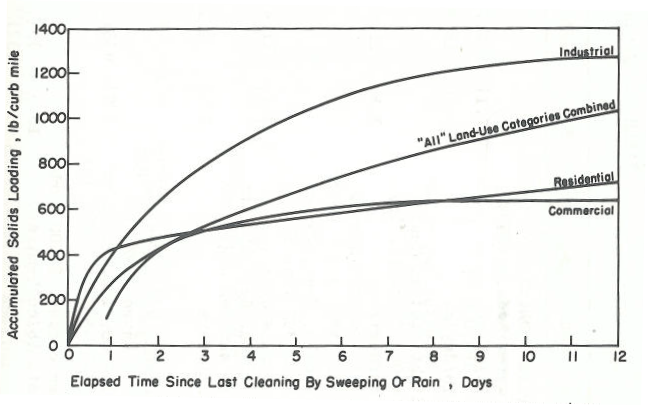
<figcaption>
<strong>Figure 3‑1 Accumulation of solids on urban
streets versus time (Sartor and Boyd, 1972)</strong>
</figcaption>
</figure>

Because buildup data clearly show that different rates apply to
different land uses, SWMM allows one to define a different buildup
function for each combination of pollutant and land use. The Pollutant
object used to describe water quality constituents was described
previously in section 2.3. SWMM's Land Use object is used to identify a
particular type of land use and to store the buildup (and washoff)
functions for each SWMM Pollutant.

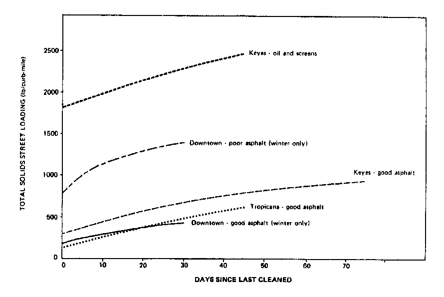

**Figure 3‑2 Buildup of street solids in San Jose (from Pitt, 1979)**

The buildup of each pollutant that accumulates over a category of land
use is described by either a mass per unit of subcatchment area or per
unit of curb length. For microbial constituents, numbers of organisms is
used instead of mass. The choice of quantity to normalize against (area
or curb length) can vary by pollutant and land use. In the discussion
that follows \[B\] will denote the units being used to express buildup.

Because there is no obviously proper functional form that describes
pollutant buildup over time, SWMM provides the user with three different
functional options for any combination of constituent and land use.
These are:

1.  power function (of which linear buildup is a special case),

2.  exponential, or

3.  saturation.

Power function buildup accumulates proportional to time raised to some
power, until a maximum limit is achieved,

$$b = Min(B_{\max},\ K_{B}t^{N_{B}})$$                     
(3-1a)

where

*b*        =   buildup, \[B\]

*t*        =   buildup time interval, days

*Bmax*   =   maximum buildup possible, \[B\]

*KB*     =   buildup rate constant, \[B\]-days-*N*^B*

*NB*     =   buildup time exponent, dimensionless

The time exponent, *NB,* should be ≤ 1 so that a decreasing rate of
buildup occurs as time increases. When *NB* is set equal to 1, a
linear buildup function is obtained.

Exponential buildup follows an exponential growth curve that approaches
a maximum limit asymptotically,

$$b = B_{\max}\left( 1 - e^{- K_{B}t} \right)$$           
(3-1b)

where the rate constant *KB* now has units of days-1.

Saturation buildup begins at a linear rate which proceeds to decline
constantly over time until a saturation value is reached,

$$b = \frac{B_{\max}t}{\left( K_{B} + t \right)}$$        
(3-1c)

where now *KB* is a half saturation constant (days to reach half of
the maximum buildup).

Table 3-3 summarizes the meaning and units of the coefficients used in
each of the buildup functions. The following expression will convert
from mass of buildup per unit of area or curb length for a specific land
use to total mass

> $$m_{B} = bNf_{LU}$$

where *mB* = mass of buildup, *b* = mass per unit of either area or
curb length, *N* = total area or curb length for the subcatchment in
question, and *fLU* = fraction of the subcatchment's area devoted to
the land use in question.

The shapes of the three functions are compared in Figure 3-3 using a
hypothetical pollutant as an example that reaches a maximum buildup of 2
kg/ac in about 14 days. The Exponential and Saturation func­tions have
clearly defined asymptotes or upper limits (2 kg/ac in this figure).
Upper limits for linear or power function buildup may be imposed if
desired. "Instantaneous buildup" may be easily achieved using the power
function with *NB* set to 0 and *KB* set equal to *Bmax*. This
would result in a constant buildup of *Bmax* which would always be
available at the beginning of any storm event.

**Table 3-3 Summary of buildup function coefficients**

| Coefficient | Power | Exponential | Saturation |
|-------------|-------|-------------|------------|
| *Bmax* | buildup limit [B] | buildup limit [B] | buildup limit [B] |
| *KB* | rate constant, [B]days-*N*^B* | rate constant, days-1 | ½ saturation constant, days |
| *NB* | time exponent | | |

<figure>
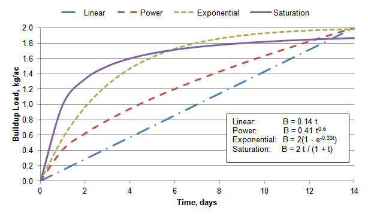
<figcaption>
<strong>Figure 3‑3 Comparison of buildup equations
for a hypothetical pollutant</strong>
</figcaption>
</figure>

It is apparent from Figure 3-3 that different options may be used to accomplish the same objective
(e.g., nonlinear buildup); the choice may well be made on the basis of
available data to which one of the functional forms has been fit. If an
asymptotic form is desired, either the exponential or saturation option
may be used depending upon ease of comprehension of the parameters. For
instance, for exponential buildup the rate constant, *KB*, is the
familiar exponential decay constant. It may be obtained from the slope
of a semi-log plot of buildup versus time. As a numerical example, if
its value were 0.33 day‑1, then it would take 7 days to reach 90
percent of the maximum buildup, as in Figure 3-3.

For saturation buildup the parameter *KB* has the interpretation of
the half saturation constant, that is, the time at which buildup is half
of the maximum (asym­ptotic) value. For instance, the *KB* of 1 day for
the saturation curve in Figure 3-3 corresponds to the time where the
buildup reaches half the maximum amount. If the asymptotic value
*Bmax* is known or estimated, K*B* may be obtained from buildup data
from the slope of a plot of *b* versus *t* × (*Bmax* - *b*).
Generally, the saturation for­mulation will rise steeply (in fact,
linearly for small *t*) and then approach the asymptote slowly.

The power function may be easily adjusted to resemble asymptotic
behav­ior, but it must always ultimately exceed the maximum value (if
used). The parameters are readily found from a log-log plot of buildup
versus time. This is a common way of analyzing data, (e.g., Miller et
al., 1978; Ammon, 1979; Smolenyak, 1979; Jewell et al., 1980; Wallace,
1980).

When applying a buildup function in dry periods in conjunction with a
washoff function in wet periods it is useful to know the number of days
*t* it takes to reach a given amount of buildup *b*. This can be found
by re-arranging Equation 3-1 as follows:

$t = \left( \frac{b}{K_{B}} \right)^{\frac{1}{N_{B}}}$ 
for power buildup 
(3-2a)                                                  

$t = \frac{- ln\left( 1 - \frac{b}{B_{\max}} \right)}{K_{B}}$     
for exponential buildup     
(3-2b)                                    

$t = \frac{bK_{B}}{\left( B_{\max} - b \right)}$ 
for saturation buildup
(3-2c)

Note that when *NB = 0* for power buildup then buildup *b* is a
constant value *Bmax* for all times *t*. Figure 3-4 shows how buildup
is adjusted between and after storm events. Assume that b*0* represents
the amount of buildup present at the start of a storm event. The event
washes off part of that buildup leaving an amount *b1* remaining.
Equation 3-2 is used to find the time *t1* associated with buildup *b1*.
If a dry period of length *∆t* occurs before the start of the next
storm, then the amount of buildup available, *b2*, is found by
evaluating the buildup function at time *t2* = *t1* + *∆t*.

<figure>
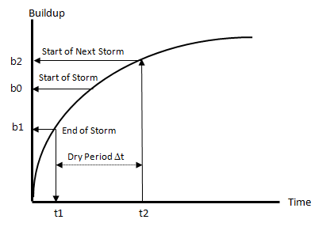
<figcaption>
<strong>Figure 3‑4 Evolution of buildup after a
storm event</strong>
</figcaption>
</figure>

### 3.3 Computational Steps

Pollutant buildup computations are a sub-procedure implemented as part
of SWMM's runoff calculations. They are made at each runoff time step
for each subcatchment immediately after surface runoff has been computed
as described in Section 3.4 of Volume I. The following constant
quantities are known for each subcatchment:

- *A* (the subcatchment area),

- *L* (the curb length of streets in the subcatchment (if used to
  normalize buildup)),

- *fLU* ( the fraction of the subcatchment's area devoted to a
  particular land use,

- *Bmax*, *KB,* and *NB* for each combination of pollutant and
  land use.

Note that a pollutant's buildup constants vary by land use, not by
subcatchment. That is, if residential land is assigned a set of buildup
constants then those constants apply to the residential portion of all
subcatchments. Also available is the buildup *mB* (in mass units) for
each pollutant on each land use in the subcatchment at the start of the
current time period. Initially at time zero, *mB* is established in
one of two ways:

1.  If the user specified an initial buildup (as mass per area) of the
    pollutant over the entire subcatchment, then the initial *mB*
    equals that buildup times the area devoted to the particular land
    use.

2.  Otherwise a user-supplied antecedent dry days value is used with
    Equation 3-1 to determine an initial buildup per area (or curb
    length) with the result multiplied by the area (or curb length)
    associated with the land use to obtain an initial mass *mB*.

The computational steps for updating the buildup of a specific
pollutant - land use combination within a subcatchment over a single
time step are:

1.  If the runoff rate is greater than 0.001 in/hr then the time step is
    assumed to belong to a wet weather event and no buildup addition
    occurs (buildup will actually be reduced according to the amount of
    washoff produced as described later in Chapter 4).

2.  If buildup for the pollutant has been designated to occur only when
    snow is present and the current snow depth is less than 0.001 inches
    then no buildup addition occurs.

3.  Convert the total mass of buildup *mB* to a normalized mass *b* by
    dividing it by $f_{LU}A$ if buildup is normalized with respect to
    area or $f_{LU}L$ if normalized with respect to curb length.

4.  Use Equation 3-2 to find the time *t* corresponding to normalized
    buildup *b*.

5.  Add the length of the current runoff time step to *t* and use this
    value in Equation 3-1 to find an updated value for *b*.

6.  Convert the new normalized buildup *b* back to total mass *mB* by
    multiplying it by the normalizing factor (either $f_{LU}A$ or
    $f_{LU}L$).

This process will produce a new set of pollutant mass buildups *mB* at
the end of the runoff time step for each land use within each
subcatchment. These buildups will then be used to compute washoff loads
(as described in Section 4) when the next wet period occurs.

### 3.4 Street Cleaning

Street cleaning is performed in most urban areas for control of solids
and trash deposited along street gutters. Although it has long been
assumed that street cleaning has a beneficial effect upon the quality of
urban runoff, until recently, few data have been available to quantify
this effect. Unless performed on a daily basis, EPA Nationwide Urban
Runoff Program (NURP) studies generally found little improvement of
runoff quality by street cleaning (EPA, 1983b). On the other hand, more
recent studies indicate that technological advances in cleaning
equipment can produce much better results (Sutherland and Jelen, 1997).

The most elaborate studies are probably those of Pitt (1979, 1985) in
which street surface loadings were carefully monitored along with runoff
quality in order to determine the effectiveness of street cleaning. In
San Jose, California Pitt (1979) found that frequent street cleaning on
smooth asphalt surfaces (once or twice per day) can remove up to 50
percent of the total solids and heavy metal yields of urban runoff.
Under more typical cleaning programs of once or twice a month, less than
5 percent of these contaminants were removed. Organics and nutrients in
the runoff cannot be effectively controlled by intensive street cleaning
-- typically much less than 10 percent removal, even for daily cleaning.
This is because the latter originate primarily in runoff and erosion
from off-street areas during storms. In Bellevue, Washington, Pitt
(1985) reached similar conclusions, with a maximum projected
effectiveness for pollutant removal from runoff of about 10 percent.

The removal effectiveness of street cleaning depends upon many factors
such as the type of sweeper, whether flushing is included, the presence
of parked cars, the quantity of total solids, the constituent being
considered, and the relative frequency of rainfall events. Obviously, if
street sweeping is performed infrequently in relation to rainfall
events, it will not be effective. Removal efficiencies for several
constituents are shown in Table 3-4 (Pitt, 1979). Clearly, efficiencies
are greater for constituents that behave as particulates.

SWMM allows pollutant buildup within a given land use area to be reduced
by street sweeping operations. This reduction is accounted for by having
the user supply the following set of parameters:

*SS1*   =   month/day of the year when street sweeping operations start

*SS2*   =   month/day of the year when street sweeping operations end

*SSI*     =   number of days between street sweeping for a given land use

*SS0*     =   number of days since the land use was last swept at the start
                of the simulation

*SSA*     =   fraction of buildup on the land use that is available for
                removal by sweeping

*SSE*     =   fraction of the available buildup of a pollutant on a given
                land use that is removed by sweeping

The availability factor, SSA, is intended to account for the fraction of
a land use's area that is actually "sweepable." A single set of *SS1*
and *SS2* values is supplied for the entire study area, *SSI*, *SS0*,
and *SSA* values are supplied for each land use category within the
study area, and an SSE value is supplied for each combination of
pollutant and land use category.

**Table 3-4 Removal efficiencies from street cleaner path for various street cleaning programs (Pitt, 1979)**

#### Vacuum Street Cleaner - 20-200 lb/curb mile total solids

| Passes | Total Solids | BOD5 | COD | KN | PO4 | Pesticides | Cd | Sr | Cu | Ni | Cr | Zn | Mn | Pb | Fe |
|--------|--------------|--------|-----|----|-------|------------|----|----|----|----|----|----|----|----|----|
| 1 pass | 31 | 24 | 16 | 26 | 8 | 33 | 23 | 27 | 30 | 37 | 34 | 34 | 37 | 40 | 40 |
| 2 passes | 45 | 35 | 22 | 37 | 12 | 50 | 34 | 35 | 45 | 54 | 53 | 52 | 56 | 59 | 59 |
| 3 passes | 53 | 41 | 27 | 45 | 14 | 59 | 40 | 48 | 52 | 63 | 60 | 59 | 65 | 70 | 68 |

#### Vacuum Street Cleaner - 200-1,000 lb/curb mile total solids

| Passes | Total Solids | BOD5 | COD | KN | PO4 | Pesticides | Cd | Sr | Cu | Ni | Cr | Zn | Mn | Pb | Fe |
|--------|--------------|--------|-----|----|-------|------------|----|----|----|----|----|----|----|----|----|
| 1 pass | 37 | 29 | 21 | 31 | 12 | 40 | 30 | 34 | 36 | 43 | 42 | 41 | 45 | 49 | 59 |
| 2 passes | 51 | 42 | 29 | 46 | 17 | 59 | 43 | 48 | 49 | 59 | 60 | 59 | 63 | 68 | 68 |
| 3 passes | 58 | 47 | 35 | 51 | 20 | 67 | 50 | 53 | 59 | 68 | 66 | 67 | 70 | 76 | 75 |

#### Vacuum Street Cleaner - 1,000-10,000 lb/curb mile total solids

| Passes | Total Solids | BOD5 | COD | KN | PO4 | Pesticides | Cd | Sr | Cu | Ni | Cr | Zn | Mn | Pb | Fe |
|--------|--------------|--------|-----|----|-------|------------|----|----|----|----|----|----|----|----|----|
| 1 pass | 48 | 38 | 33 | 43 | 20 | 57 | 45 | 44 | 49 | 55 | 53 | 55 | 58 | 62 | 63 |
| 2 passes | 60 | 50 | 42 | 54 | 25 | 72 | 57 | 55 | 63 | 70 | 68 | 69 | 72 | 79 | 77 |
| 3 passes | 63 | 52 | 44 | 57 | 26 | 75 | 60 | 58 | 66 | 73 | 72 | 73 | 76 | 83 | 82 |

#### Mechanical Street Cleaner - 180-1,800 lb/curb mile total solids

| Passes | Total Solids | BOD5 | COD | KN | PO4 | Pesticides | Cd | Sr | Cu | Ni | Cr | Zn | Mn | Pb | Fe |
|--------|--------------|--------|-----|----|-------|------------|----|----|----|----|----|----|----|----|----|
| 1 pass | 54 | 40 | 31 | 40 | 20 | 40 | 28 | 40 | 38 | 45 | 44 | 43 | 47 | 44 | 49 |
| 2 passes | 75 | 58 | 48 | 58 | 35 | 60 | 45 | 59 | 58 | 65 | 64 | 64 | 64 | 65 | 71 |
| 3 passes | 85 | 69 | 59 | 69 | 46 | 72 | 57 | 70 | 69 | 76 | 75 | 75 | 79 | 77 | 82 |

#### Other Cleaning Methods

| Method | Total Solids | Other Pollutants |
|--------|--------------|------------------|
| Flusher | 30 | (a) |
| Mechanical Street Cleaner followed by a Flusher | 80 | (b) |

(a) 15-40 percent estimated  
(b) 35-100 percent estimated  

*These removal values assume all the pollutants would lie within the cleaner path (0 to 8 ft. from the curb)*

If the date of the current time step falls within *SS1* and *SS2*
then the buildup *mB* found from the previous steps of Section 3.3
(for a specific pollutant and land use) is modified as follows:

1.  If the current rainfall is above 0.001 in/hr or there is more than
    0.05 inches of snow on the plowable impervious area of the
    subcatchment or *SSI* was set to zero then no sweeping occurs.

2.  If the time between the current date and the date when the land use
    was last swept is less than *SSI* then no sweeping occurs.

3.  Otherwise set$\ m_{B} = m_{B}(1 - SSA \bullet SSE)$ for each of the
    land uses's pollutants and set the date when the land use was last
    swept to the current date.

### 3.5 Parameter Estimates

There is no single choice of buildup function or parameter values (which
are pollutant- and land use-specific) that can be applied universally.
Although data from the literature can help determine representative
estimates there is no substitute for field data collected for the site
in question. The discussion that follows presents sources of buildup
data from studies that were made mainly in the 1970's or earlier.

The previously mentioned 1969 APWA study (APWA, 1969) was followed by
several more efforts, notably AVCO (1970) (reporting extensive data from
Tulsa, Oklahoma), Sartor and Boyd (1972) (reporting a cross section of
data from ten U.S. cities), and Shaheen (1975) (reporting data for
highways in the Washington, DC area). Pitt and Amy (1973) followed the
Sartor and Boyd (1972) study with an analysis of heavy metals on street
surfaces from the same ten cities. Later, Pitt (1979) reported on
extensive data gathered both on the street surface and in run­off for San
Jose. A drawback of the earlier studies is that it is diffi­cult to draw
conclusions from them on the relationship between street surface
ac­cumulation and stormwater concentra­tions since the two were seldom
measured si­multaneously.

Amy et al. (1974) provide a summary of data available in 1974 while
Lager et al. (1977) provide a similar summary as of 1977 without the
extensive data tabulations given by Amy et al. Perhaps the most
comprehen­sive summary of surface accumulation and pollutant fraction
data is pro­vided by Manning et al. (1977) in which the many problems and
facets of sampling and measurements are also discussed. For instance,
some data are obtained by sweeping, others by flushing; the particle
size characteristics and degree of removal from the street surface
differ for each method. Some results of Manning et al. (1977) will be
presented later. Surface ac­cumulation data may be gleaned, somewhat less
directly, from references on loading functions that include McElroy et
al. (1976), Heaney et al. (1977) and Huber et al. (1981a). Regrettably,
there seem to be no studies since the 1970s in which pollutant
accumulation has been measured directly.

Manning et al. (1977) have perhaps the best summary of linear buildup
rates; these are presented in Table 3-5. It may be noted that dust and
dirt buildup varies considerably among three different studies.
Individual constituent buildup may be taken directly from values in the
table or computed as a fraction of dust and dirt (simulated as a
pollutant) using the "Co-pollutant and Co-fraction" option described
subsequently. It is apparent that although a large number of
constituents have been sampled, little distinction can be made on the
basis of land uses for most of them.

As an example, suppose dust and dirt (DD) is to be simulated as a
co-pollutant and values are taken for commercial land use and from the
"All Data" row in Table 3-5. Since the data are given as lb ·
curb-mile-1 · day-1, linear buildup is assumed and for commercial
land use DD buildup (average for all data) is 116 lb/(curb-mile -- day).
Converting from pounds to milligrams (453,592 mg/lb) and mile to 1000-ft
(5.28 1000-ft/mi) yields *KB* = 9.97 x 106 mg/1000-ft-day in
Equation 3-1a, and of course, *NB* = 1. Constituent fractions are
available from the table. For instance, BOD5 as a fraction of DD for
commercial land use would be 7.19 mg/g (or 0.00719 as a SWMM
Co-fraction), 0.06 mg/g for total phosphorus, 0.00002 mg/g for Hg, and
36,900 MPN/g for fecal coliforms (36.9 MPN/mg as a SWMM input
co-fraction). Direct loading rates could be computed for each
constituent as an alternative. For instance, for BOD5, the linear
buildup rate would equal 9.97 x 106 · 0.00719 = 3,800 mg / (1000-ft
curb - day).

Table 4-19 on pp. 4-94, 4-95, 4-96.It must be stressed once again that
the generalized buildup data of Table 3-5 are merely informational and
*are never a substitute for local sampling* or even a calibration using
measured concentrations. They may serve as a first trial value for a
calibration, however. In this respect it is important to point out that
the concentrations and loads computed by the SWMM buildup-washoff
algorithms are usu­ally linearly proportional to buildup rates. If twice
the quantity is avail­able at the beginning of a storm, the
concentrations and loads will be usually be doubled. Calibration is
probably easiest with linear buildup parameters, but it depends on the
rate at which the limiting build­up, i.e., *Bmax*, is approached. If
the limiting value is reached during the inter­val between most storms,
then calibration using it will also have almost a linear effect on
concentrations and loads.

**Table 3-5 Nationwide data on linear dust and dirt buildup rates and on pollutant fractions (after Manning et al., 1977)**

#### Dust and Dirt Accumulation (kg/curb-km/day)

| Study | Statistic | Single Family Residential | Multi-Family Residential | Commercial | Industrial | All Data |
|-------|-----------|---------------------------|---------------------------|------------|------------|----------|
| Chicago(1) | Mean | 10 | 31 | 51 | 92 | 44 |
| | Range | 5-27 | 17-43 | 80-151 | 80-151 | 5-15 |
| | N | 60 | 93 | 126 | 55 | 334 |
| Washington(2) | Mean | — | — | 38 | — | 38 |
| | Range | — | — | 10-103 | — | 10-103 |
| | N | — | — | 22 | — | 22 |
| Multi-City(3) | Mean | 51 | 44 | 13 | 81 | 49 |
| | Range | 1-268 | 2-217 | 1-73 | 1-423 | 1-423 |
| | N | 14 | 8 | 10 | 12 | 44 |
| All Data | Mean | 17 | 32 | 47 | 90 | 45 |
| | Range | 1-268 | 2-217 | 1-103 | 1-423 | 1-423 |
| | N | 74 | 101 | 158 | 67 | 400 |
#### Pollutant Fractions

| Pollutant | Statistic | Single Family Residential | Multi-Family Residential | Commercial | Industrial | All Data |
|-----------|-----------|---------------------------|---------------------------|------------|------------|----------|
| BOD (g/kg) | Mean | 5.26 | 3.37 | 7.19 | 2.92 | 5.03 |
| | Range | 1.72-9.43 | 2.03-6.32 | 1.28-14.54 | 2.82-2.95 | 1.29-14.54 |
| | N | 59 | 93 | 102 | 56 | 292 |
| COD (g/kg) | Mean | 39.25 | 41.97 | 61.73 | 25.08 | 46.12 |
| | Range | 18.30-72.80 | 24.6-61.3 | 24.8-498.41 | 23.0-31.8 | 18.3-498.41 |
| | N | 59 | 93 | 102 | 38 | 292 |
| Total N-N (mg/kg) | Mean | 460 | 550 | 420 | 430 | 480 |
| | Range | 325-525 | 356-961 | 323-480 | 410-431 | 323-480 |
| | N | 59 | 93 | 80 | 38 | 270 |
| Kjeldahl N (mg/kg) | Mean | — | — | 640 | — | 640 |
| | Range | — | — | 230-1,790 | — | 230-1,790 |
| | N | — | — | 22 | — | 22 |
| NO3 (mg/kg) | Mean | — | — | 24 | — | 24 |
| | Range | — | — | 10-35 | — | 10-35 |
| | N | — | — | 21 | — | 21 |
| NO2-N (mg/kg) | Mean | — | — | 0 | — | 15 |
| | Range | — | — | 0 | — | 0 |
| | N | — | — | 15 | — | 15 |
| Total P (mg/kg) | Mean | — | — | 170 | — | 170 |
| | Range | — | — | 90-340 | — | 90-340 |
| | N | — | — | 21 | — | 21 |
| PO4-P (mg/kg) | Mean | 49 | 58 | 60 | 26 | 53 |
| | Range | 20-109 | 20-73 | 0-142 | 14-30 | 0-142 |
| | N | 59 | 93 | 101 | 38 | 291 |

#### Heavy Metals and Other Pollutants (mg/kg unless noted)

| Pollutant | Statistic | Single Family Residential | Multi-Family Residential | Commercial | Industrial | All Data |
|-----------|-----------|---------------------------|---------------------------|------------|------------|----------|
| Chlorides | Mean | — | — | 220 | — | 220 |
| | Range | — | — | 100-370 | — | 100-370 |
| | N | — | — | 22 | — | 22 |
| Asbestos (fibers/kg) | Mean | — | — | 126×106 | — | 126×106 |
| | Range | — | — | 0-380×106 | — | 0-380×106 |
| | N | — | — | 16 | — | 16 |
| Silver | Mean | — | — | 200 | — | 200 |
| | Range | — | — | 0-600 | — | 0-600 |
| | N | — | — | 3 | — | 3 |
| Arsenic | Mean | — | — | 0 | — | 0 |
| | Range | — | — | 0 | — | 0 |
| | N | — | — | 3 | — | 3 |
| Barium | Mean | — | — | 38 | — | 38 |
| | Range | — | — | 0-80 | — | 0-80 |
| | N | — | — | 8 | — | 8 |
| Cadmium | Mean | 3.3 | 2.7 | 2.9 | 3.6 | 3.1 |
| | Range | 0-8.8 | 0.3-6.0 | 0-9.3 | 0.3-11.0 | 0-11.0 |
| | N | 14 | 8 | 22 | 13 | 57 |
| Chromium | Mean | 200 | 180 | 140 | 240 | 180 |
| | Range | 111-325 | 75-325 | 10-430 | 159-335 | 10-430 |
| | N | 14 | 8 | 30 | 13 | 65 |
| Copper | Mean | 91 | 73 | 95 | 87 | 90 |
| | Range | 33-150 | 34-170 | 25-810 | 32-170 | 25-810 |
| | N | 14 | 8 | 30 | 13 | 65 |
| Iron | Mean | 21,280 | 18,500 | 21,580 | 22,540 | 21,220 |
| | Range | 11,000-48,000 | 11,000-25,000 | 5,000-44,000 | 14,000-43,000 | 5,000-48,000 |
| | N | 14 | 8 | 10 | 13 | 45 |
| Mercury | Mean | — | — | 0.02 | — | 0.02 |
| | Range | — | — | 0-0.1 | — | 0-0.1 |
| | N | — | — | 6 | — | 6 |
| Manganese | Mean | 450 | 340 | 380 | 430 | 410 |
| | Range | 250-700 | 230-450 | 160-540 | 240-620 | 160-700 |
| | N | 14 | 8 | 10 | 13 | 45 |
| Nickel | Mean | 38 | 18 | 94 | 44 | 62 |
| | Range | 0-120 | 0-80 | 6-170 | 1-120 | 1-170 |
| | N | 14 | 8 | 30 | 13 | 75 |
| Lead | Mean | 1,570 | 1,980 | 2,330 | 1,590 | 1,970 |
| | Range | 220-5,700 | 470-3,700 | 0-7,600 | 260-3,500 | 0-7,600 |
| | N | 14 | 8 | 29 | 13 | 64 |

#### Additional Heavy Metals and Microbial Indicators

| Pollutant | Statistic | Single Family Residential | Multi-Family Residential | Commercial | Industrial | All Data |
|-----------|-----------|---------------------------|---------------------------|------------|------------|----------|
| Antimony (mg/kg) | Mean | — | — | 54 | — | 54 |
| | Range | — | — | 50-60 | — | 50-60 |
| | N | — | — | 3 | — | 3 |
| Selenium (mg/kg) | Mean | — | — | 0 | — | 0 |
| | Range | — | — | 0 | — | 0 |
| | N | — | — | 3 | — | 3 |
| Tin (mg/kg) | Mean | — | — | 17 | — | 17 |
| | Range | — | — | 0-50 | — | 0-50 |
| | N | — | — | 3 | — | 3 |
| Strontium (mg/kg) | Mean | 32 | 18 | 17 | 13 | 21 |
| | Range | 5-110 | 12-24 | 7-38 | 0-24 | 0-110 |
| | N | 14 | 8 | 10 | 13 | 45 |
| Zinc (mg/kg) | Mean | 310 | 280 | 690 | 280 | 470 |
| | Range | 110-810 | 210-490 | 90-3,040 | 140-450 | 90-3,040 |
| | N | 14 | 8 | 30 | 13 | 65 |
| Fecal Strep (No./gram) | Geo. Mean | — | — | 370 | — | 370 |
| | Range | — | — | 44-2,420 | — | 44-2,420 |
| | N | — | — | 17 | — | 17 |
| Fecal Coli (No./gram) | Geo. Mean | 82,500 | 38,800 | 36,900 | 30,700 | 94,700 |
| | Range | 26-130,000 | 1,500-106 | 140-970,000 | 67-530,000 | 26-1,000,000 |
| | N | 65 | 96 | 84 | 42 | 287 |
| Total Coliform (No./gram) | Geo. Mean | 891,000 | 1,900,000 | 1,000,000 | 419,000 | 1,070,000 |
| | Range | 25,000-3,000,000 | 80,000-5,600,000 | 18,000-3,500,000 | 27,000-2,600,000 | 18,000-5,600,000 |
| | N | 65 | 97 | 85 | 43 | 290 |

## Chapter 4: Surface Washoff

### 4.1 Introduction

Washoff is the process of erosion or dissolving of constituents from a
subcatchment surface during a period of runoff. If the water depth is
more than a few millimeters, erosion may be described by sediment
transport theory in which the mass flow rate of sediment is proportional
to flow and bottom shear stress, and a critical shear stress can be used
to determine incipient motion of a particle resting on the bottom of a
stream channel (Graf, 1971; Vanoni, 1975). Such a mechanism might apply
over pervious areas and in street gutters and larger channels. For thin
overland flow, however, rainfall energy can also cause particle
detachment and motion. This effect is often incorporated into predictive
methods for erosion from pervious areas (Wischmeier and Smith, 1958;
Haan et al., 1994; Bicknell et al., 1997) and may also apply to washoff
from impervious surfaces, although in this latter case, the effect of a
limited supply (buildup) of the material must be considered.

### 4.2 Governing Equations

Ammon (1979) reviewed several theoretical approaches for urban runoff
washoff and concluded that although the sediment transport based theory
is attractive, it is often insufficient in practice because of lack of
data for parameter (e.g., shear stress) evaluation, sensitivity to time
step and discretization and because simpler methods usually work as well
(still with some theoretical basis) and are usually able to duplicate
observed washoff phenomena. SWMM therefore incorporates three different
choices of empirical models to represent pollutant washoff: exponential
washoff, rating curve washoff, and event mean concentration (EMC)
washoff.

#### 4.2.1 Exponential Washoff

The most oft-cited results for pollutant washoff behavior are those of
Sartor and Boyd (1972), shown in Figure 4-1, in which constituents were
flushed from streets using a sprinkler system. From the figure it would
appear that an exponential relationship could be developed to describe
washoff of the form:

$$W(t) = m_{B}(0)(1 - e^{- kt})$$                          
(4-1)

where *W* = the cumulative mass of constituent washed off at time *t*,
*mB(0)* = the initial mass of constituent on the surface at time 0,
and *k* = a coefficient.

It is clear that the coefficient, *k*, is a function of both particle
size and runoff rate. An analysis of the Sartor and Boyd (1972) data by
Ammon (1979) indicates that *k* increases with runoff rate, as would be
expected, and decreases with particle size.

<figure>
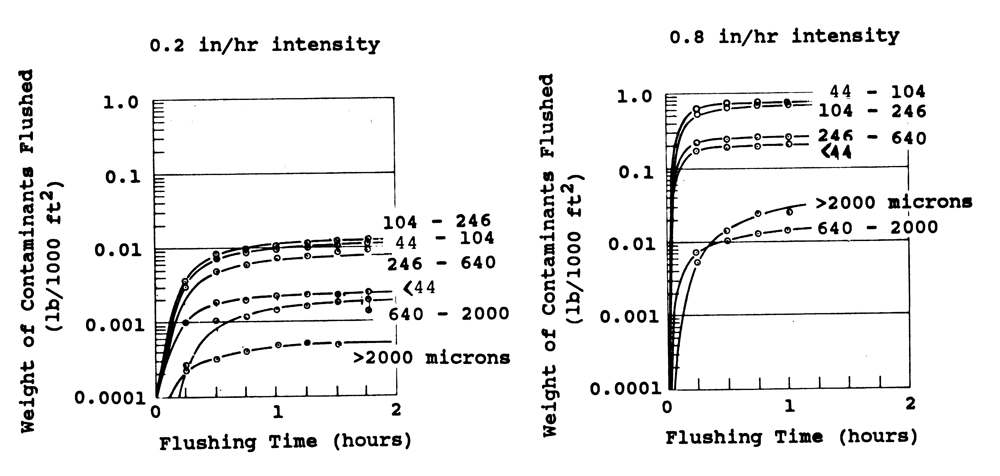
<figcaption>
<strong>Figure 4‑1 Washoff of street solids by
flushing with a sprinkler system (from Sartor and Boyd,
1972)</strong>
</figcaption>
</figure>

The Sartor and Boyd data lend credibility to the washoff assumption
included in the original SWMM release (and all versions to date) that
the rate of washoff, *w*, (e.g., mg/hr) at any time is proportional to
the remaining pollutant buildup:

$$w = \frac{dm_{B}}{dt} = - km_{B}$$                      
(4-2)

It follows then that the amount of buildup *B* remaining on the surface
after a time *t* of washoff is:

$$m_{B}(t) = m_{B}(0)e^{- kt}$$                           
(4-3)

This relation was first proposed by Mr. Allen J. Burdoin, a consultant
to Metcalf and Eddy, during the original SWMM development. The
coefficient *k* may be evaluated by assuming it is proportional to
runoff rate:

$$k = K_{W}q$$                                            
(4-4)

where *KW* = a washoff coefficient (in-1) and *q* = the runoff rate
over the subcatchment (in/hr).

Burdoin assumed that one-half inch of total runoff in one hour would
wash off 90 percent of the initial surface load, leading to the now
familiar (in SWMM modeling circles) value of *KW* of 4.6 in.-1. (The
actual time distribution of intensity does not affect the calculation of
*KW.*) To the authors' knowledge, there are no direct measurements to
validate this assumption, which is so often employed.

Sonnen (1980) estimated values for *KW* from sediment transport theory
ranging from 0.052 to 6.6 in.-1, increasing as particle diameter
decreases, rainfall intensity decreases, and as catchment area
decreases. He pointed out that 4.6 in.-1 is relatively large compared
to most of his calculated values. Although the exponential washoff
formulation of Equations 4-2 and 4-3 is not completely satisfactory as
explained below, it has been verified experimentally by Nakamura (1984a,
1984b), who also showed the dependence of the coefficient *k* on slope,
runoff rate and cumulative runoff volume.

It was found that the original exponential washoff formulation did not
adequately fit some data (Huber and Dickinson, 1988) since making *k* be
linearly dependent on runoff rate *q* always produced decreasing washoff
concentrations as a function of time. To see this, substitute (4-4) into
(4-2) and convert the mass rate *w* to a concentration by dividing by
the volumetric runoff rate *qA*, where *A* is the subcatchment area:

$$c = \frac{(\frac{dm_{B}}{dt})}{qA} = \frac{K_{W}qm_{B}}{qA} = \frac{K_{W}m_{B}}{A}$$   
(4-5)

Thus concentration *c* would decrease continually as the remaining
buildup *mB* does the same over time. To avoid this behavior, the
relationship in (4-4) was modified to be:

$$k = K_{W}q^{N_{W}}$$                                    
(4-6)

where *NW* is a washoff exponent. The resulting equation for
exponential washoff now becomes:

$$w = K_{W}q^{N_{W}}m_{B}$$                               
(4-7)

with units of mass/hour.

#### 4.2.2 Rating Curve Washoff

In natural catchments and rivers, both theory and data support the
result that load rate of sediment is proportional to flow rate raised to
a power. For instance, sediment data from streams can usually be
described by a sediment rating curve of the form

$$w = K_{W}Q^{N_{W}}$$                                    
(4-8)

where *w* is sediment loading rate (mass/sec), *Q* is flow rate (cfs),
and *KW* and *NW* are coefficients. Due to a hysteresis effect,
such relationships may vary during the passing of a flood wave, but the
functional form is evident in many rivers, e.g., Vanoni (1975), pp.
220-225, Graf (1971), pp. 234-241, and Simons and Senturk (1977), p.
602. Of particular relevance to overland flow washoff is the appearance
of similar relationships describing sediment yield from a catchment
e.g., Vanoni (1975), pp. 472-481.

Note the similarity of Equation 4-8 to the exponential washoff function
4-7. The presence of buildup *mB* in Equation 4-7 reflects the fact
that the total quantity of sediment washed off a largely impervious
urban area is likely to be limited to the amount built up during dry
weather. Natural catchments and rivers from which Equation 4-8 is
derived generally have no source limitation.

Also note that the form of the runoff rate used in the two functions is
different. Exponential washoff uses a normalized runoff rate, *q* in
(inches/hr), over the total subcatchment surface (both pervious and
impervious areas). Rating curve washoff uses the volumetric runoff rate
*Q* in cfs, over the fraction *fLU* of total subcatchment area *A* (in
acres) devoted to the land use being analyzed. That is,

$$Q = qf_{LU}A$$                                          
(4-9)

The rating curve approach may be combined with constituent buildup if
desired to limit the total mass that can be washed off. Otherwise, there
is no buildup between storms during continuous simulation, nor will
measures like street sweeping have any effect. Constituents will be
generated solely on the basis of flow rate.

If buildup is simulated when a rating curve is used, the maximum amount
that can be removed is the amount built up prior to the storm. It will
have an effect only if this limit is reached, at which time loads and
concentrations will suddenly drop to zero. They will not assume non-zero
values again until dry-weather time steps occur to allow buildup. Street
sweeping will have an effect if the buildup limit is reached.

The rating curve method is generally easiest to use when only total
runoff volumes and pollutant loads are available for calibration.

#### 4.2.3 EMC Washoff

As a part of NPDES stormwater permitting and as a result of many special
studies, there are numerous sources of local event mean concentration
(EMC) data available for stormwater. EMC values are usually measured by
laboratory analysis of flow- and time-weighted composite samples. EMCs
are often the only samples available, in order to save on laboratory
costs that would be involved in measurements of several points along the
storm hydrograph, although the latter, intra-event samples are
particularly valuable data. As a practical matter, EMCs are the most
common parameters used to estimate nonpoint water quality loads in SWMM
and in most other models. The EMC washoff function has the form:

$$w = K_{W}qf_{LU}A$$                                     
(4-10)

where now *KW* is the EMC concentration expressed in the same
volumetric units as flow rate (e.g., if the EMC is in mg/L and flow is
in cfs then *KW* = EMC × 28.3 L/ft3). As with rating curve washoff,
$qf_{LU}A$ is the fraction of the total runoff rate that applies to the
land use being analyzed. With EMC washoff all storms will have identical
within-storm washoff concentrations. Only the loading rate will vary in
direct proportion to runoff rate.

#### 4.2.4 Comparison of Models

Table 4-1 lists the units of the washoff coefficient *KW* for the
three different washoff models, assuming pollutant mass units of
milligrams. Take note that the units of washoff rate *w* are mass/hr for
exponential washoff and mass/sec for the other two functions. Also note
that the runoff rate used in the washoff equations, whether *q* or *Q*,
is based on the runoff computed for the entire subcatchment before any
internal routing between the impervious and pervious sub-areas takes
place (see Volume I for more details on internal runoff routing). The
runoff rate actually leaving the subcatchment, which is what SWMM
reports to the user, will always be a lower number when the internal
routing option is used.

**Table 4‑1 Units of the washoff coefficient *KW* for different washoff models**

| Model (Washoff Units) | US Units (flow in cfs) | SI Units (flow in cms) |
|----------------------|------------------------|------------------------|
| Exponential (mg/hr) | (in/hr)-NW hr-1 | (mm/hr)-NW hr-1 |
| Rating Curve (mg/sec) | (mg/sec) (cfs)-NW | (mg/sec) (cms)-NW |
| EMC (mg/sec) | mg/ft3 | mg/m3 |

Figure 4-2 compares the shapes of the runoff pollutgraphs for the three
different washoff functions for an initial buildup of 20 lbs of
pollutant over a one acre catchment subjected to a 2-inch, 6-hour storm
with a triangular-shaped runoff hydrograph. To make the functions
comparable, their coefficients were selected so that the storm would
remove about 45 percent of the initial buildup. The resulting
coefficient values are:

**Function**                     ***KW***              ***NW***
Exponential              0.45 (in/hr)-1.5(hr)-1          1.5

Rating Curve               850 (mg/sec)(cfs)-1.5           1.5

EMC                        20 mg/L × 28.3 L/ft3            \-

<figure>
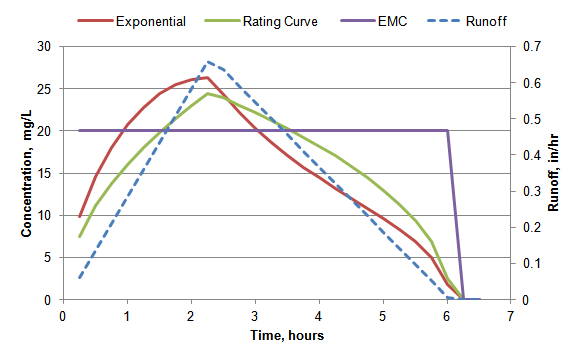
<figcaption>
<strong>Figure 4‑2 Comparison of washoff
functions</strong>
</figcaption>
</figure>

It is possible to estimate a *KW* for rating curve washoff that will
produce results roughly similar to those for exponential washoff by
multiplying the exponential *KW* by an average buildup seen over a
storm event and converting from mass/hr to mass/sec. So for this
example, assuming an average buildup of 15 lb over the event, the result
is:

> $$K_{W,\ RC} = 0.45 \times 15\ lb\  \times 454000\ (\frac{mg}{lb)\  \times (\frac{1}{3600)\ (\frac{hr}{sec) \approx 850}}}$$

The exponential *KW* value of 0.45 was selected by trial and error to
achieve the target of removing 45 percent of the initial buildup.

#### 4.2.5 Wet Deposition and Runon

In addition to the washoff of constituents deposited during dry periods,
subcatchment runoff may also contain pollutant loads contributed by
direct rainfall and by runon from upstream subcatchments. The
instantaneous loading rates from these two streams cannot simply be
added onto the loads computed from the washoff functions described
earlier because they must first be routed through the volume of water
(shallow as it may be) that ponds atop the surface of the subcatchment.
See Volume I for a description of how SWMM uses a nonlinear reservoir
model to describe surface runoff. Consistent with the way that the flow
from direct rainfall and runon is treated, these pollutant streams are
completely mixed with the current contents of the ponded water and a
mass balance is performed to find the pollutant mass from these sources
leaving the ponded surface water over the computational time step. This
mass flux is added to the mass flux computed from the washoff functions
to arrive at a total washoff amount.

Figure 4-3 depicts this two stream approach to handling washoff from
both pollutant buildup and from rainfall/runon. A mass balance for the
pollutant and volume of the washoff stream originating from the ponded
surface water that receives upstream run-on and direct deposition can be
written as:

$$\frac{d\left( V_{ponded}C_{ponded} \right)}{dt} = Q_{runon}C_{runon} + Q_{ppt}C_{ppt} - C_{ponded}\left( Q_{infil} + Q_{out} \right)$$     
(4-11)

$$\frac{dV_{ponded}}{dt} = Q_{runon} + Q_{ppt} - Q_{infil} - Q_{evap} - Q_{out}$$                                                            
(4-12)

with the variables defined as follows:

*Vponded*    =   volume of water ponded over the subcatchment (ft3)

*Cponded*    =   concentration of pollutant in the ponded water (mg/L)

*Qrunon*     =   flow rate of runon onto the subcatchment (cfs)

*Crunon*     =   concentration of pollutant in the runon stream (mg/L)

*Qppt*       =   precipitation rate (cfs)

*Cppt*       =   concentration of pollutant in precipitation (mg/L)

*Qinfil*     =   infiltration rate (cfs)

*Qevap*      =   evaporation rate (cfs)

*Qout*       =   rate of runoff leaving the subcatchment (cfs).

<figure>
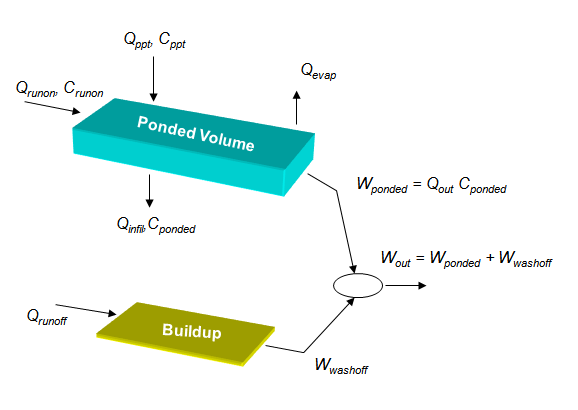
<figcaption>
<strong>Figure 4‑3 Two-stream approach to modeling
pollutant washoff</strong>
</figcaption>
</figure>

Note the following:

1.  Equations 4-11 and 4-12 are applied to the subcatchment as a whole,
    not to its separate impervious and pervious sub-areas.

2.  Precipitation, infiltration, and evaporation rates have been
    converted from their more conventional units of inches/hr to cfs by
    multiplying by the subcatchment's area.

3.  Infiltration removes a proportional amount of mass regardless of
    constituent.

4.  Evaporation removes volume but not mass causing *Cponded* to
    increase.

5.  *Qout* is the total runoff flow leaving the subcatchment. It can
    be lower than the *Qrunoff* used in the buildup washoff functions
    if internal routing between sub-areas is employed.

6.  The only unknown to solve for is *Cponded*, since all flow rates
    and volumes are known from the runoff calculations done prior to
    washoff analysis.

*Wwashoff* is the total washoff rate obtained by adding together the
washoff rates *w* computed for the buildup on each land use. The runoff
load from ponded surface storage, *Wponded*, is *Qout* *Cponded*.
The total mass flow rate of pollutant leaving the subcatchment,
*Wout*, is *Wwashoff* + *Wponded*. And finally, the concentration
of pollutant in the subcatchment's runoff is *Wout / Qout*.

Note that this scheme requires that an additional set of state variables
be kept track of over a simulation, namely the ponded mass
($m_{P} = V_{ponded}C_{ponded}$) for each pollutant in each
subcatchment.

#### 4.2.6 BMP Removal

Both washoff and ponded pollutant loads may be reduced by applying a BMP
removal factor to them. This factor is meant to reflect the effect that
some assumed best management practice (BMP) would have in removing a
surface runoff pollutant. Examples of such BMPs are vegetated swales,
overland flow, and riparian buffer strips. Typical removals for these
practices are listed in Table 4-2.

**Table 4‑2 Percent removals for vegetated swales and filter strips  Source: ASCE (2001).**

| Constituent | Vegetated Swales | Buffer Strips |
|-------------|------------------|---------------|
| Total Nitrogen | 0 -- 25 | 20 -- 60 |
| Total Phosphorus | 29 -- 45 | 20 -- 60 |
| Suspended Solids | 60 -- 83 | 20 -- 80 |
| Heavy Metals | 35 | 20 - 80 |

A different BMP removal factor can be associated with each pollutant and
category of land use. For washoff of surface buildup, they are applied
separately to the washoff rate computed for each pollutant in each land
use in a given subcatchment:

$$W_{washoff} = \sum_{j}^{}{w_{jp}(1 - R_{jp})}$$         
(4-13)

where *Wwashoff* is the total washoff rate (mass/sec) from buildup of
pollutant *p* over the subcatchment, *wjp* is the washoff rate of
pollutant *p* over land use *j* in the subcatchment*,* and *Rjp* is
the BMP removal factor for pollutant p and land use j.

For the pollutant load from rainfall/runon across the entire
subcatchment (and therefore all land uses) an area weighted average
removal factor is used:

$$R_{avg,p} = \frac{\sum_{j}^{}{R_{jp}A_{j}}}{\sum_{j}^{}A_{j}}$$   
(4-14)

where *Aj* is the area of land use *j* in the subcatchment. Thus
*Wponded* for pollutant *p* in the subcatchment becomes:

$$W_{ponded} = Q_{out}C_{ponded}(1 - R_{avg,p})$$          
(4-15)

where it is understood that *Qout* and *Cponded* refer to the
pollutant and subcatchment of interest.

### 4.3 Computational Steps

Pollutant washoff computations are a sub-procedure implemented as part
of SWMM's runoff calculations. They are made at each runoff time step
for each subcatchment immediately after surface runoff has been computed
as described in Section 3.4 of Volume I. They follow a three-stage
process that first computes the loading rate for each constituent due to
washoff of surface buildup, then adds to that the loading rate from
rainfall/runon, and finally divides the total loading rate by the runoff
flow rate to arrive at a constituent concentration in the runoff leaving
the subcatchment.

#### 4.3.1 Washoff Load from Buildup

This first phase finds the mass flow rate of each pollutant resulting
from washoff of dry deposition buildup. The following quantities are
known for each subcatchment, pollutant, and user-defined land use at the
start of the current time step of length *∆t*:

*KW,*       washoff coefficients for each pollutant -- land use *NW* combination

*Rjp*       BMP removal factor for each pollutant -- land use combination

*A*           subcatchment area (acres)

$f_{LUj}$   fraction of subcatchment area occupied by each land use *j*

*q*           runoff rate per unit area before any internal re-routing is made (in/hr)

$m_{Bjp}$   mass of buildup of each pollutant *p* on each land use area *j* of the subcatchment

The computational steps for finding the washoff rate from pollutant
buildup on a particular subcatchment at the current time step are:

1.  Initialize the washoff rate of each pollutant *p* over the entire
    subcatchment, *Wwashoff,p*, to 0.

2.  For each combination of pollutant *p* and land use *j* do the
    following:

    a.  If the runoff rate *q* is less than 0.001 in/hr or if buildup is
        being modeled and its current value is zero then the washoff
        rate *wjp* = 0.

    b.  Otherwise use the appropriate washoff function (Equation 4-7,
        4-8, or 4-10) to find the washoff rate $w_{jp}$ for each
        pollutant and land use. For rating curve and EMC functions use a
        flow rate of$\ Q = qf_{LUj}A$.

    c.  Reduce the buildup by the amount of washoff over the time step:
        $m_{Bjp} = m_{Bjp} - w_{jp}\mathrm{\Delta}t$.

    d.  Reduce the washoff rate by the BMP removal factor:
        $w_{jp} = w_{jp}(1 - R_{jp})$.

    e.  Add the washoff rate for this land use to the total rate
        *Wwashoff,p* for the subcatchment:
        $W_{washoff,p} = W_{washoff,p} + w_{jp}$.

3.  After all land uses and pollutants have been evaluated, increase the
    total washoff rate of pollutant *p* by the amount contributed by any
    co-pollutant *k*:
    $W_{washoff,p} = W_{washoff,p} + f_{pk}W_{washoff,k}$ where *fpk*
    is the co-pollutant fraction.

#### 4.3.2 Washoff Load from Rainfall/Runon

The next phase of the washoff calculations evaluates the contribution
that pollutant loads in direct rainfall and upstream runon make to the
total washoff load from a given subcatchment. The following quantities
are known for each subcatchment and pollutant at the start of the
current time step of length *∆t* seconds:

*Qppt*     precipitation rate over the subcatchment (cfs)

*Cppt*     concentration of pollutant in precipitation (mass/ft3)

*Qrunon*   rate of runon flow onto the subcatchment (cfs)

*Wrunon*   rate of mass flow of pollutant in runon to subcatchment
                    (mass/sec)

*Qout*     flow rate of runoff leaving the subcatchment (cfs)

*d1*       depth of ponded water over the subcatchment at the start of
                    the time step (ft)

*d2*       depth of ponded water over the subcatchment at the end of
                    the time step (ft)

*mP*       mass of ponded pollutant over the subcatchment at the start
                    of the time step

*Ravg*     area averaged BMP removal factor for the pollutant

*A*          area of the subcatchment (ft2)

*Qppt, Qrunon, Qout*, *d1* and *d2* are known from the runoff
calculation that has already been made for the current time step.
*Wrunon* was also evaluated by summing the products of runoff flow and
concentration from the previous time step for each of the upstream
subcatchments that send their runoff to the subcatchment being analyzed.

The following steps are used to compute the rate at which pollutant mass
from rainfall/runon is washed off a given subcatchment.

1.  Find the initial ponded surface volume plus the volume of
    rainfall/runon over the current time step:
    $V_{ponded} = d_{1}A + (Q_{ppt} + Q_{runon})\mathrm{\Delta}t$.

2.  Do the same for the pollutant mass: $$M_{Ponded} = m_{p} + (Q_{ppt}C_{ppt} + W_{runon})\mathrm{\Delta}t$$.

3.  Compute a concentration for this pollutant mass:
    $C_{ponded} = M_{ponded}/V_{ponded}$.

4.  Find the rainfall/runon mass remaining at the end of the time step:
    $m_{p} = C_{ponded}d_{2}A$.

5.  Find the rate of mass leaving the subcatchment volume, adjusted for
    any BMP removal: $W_{ponded} = Q_{out}C_{ponded}(1 - R_{avg})$.

Note that the effects of mass lost to infiltration and volume loss due
to evaporation are implicitly accounted for in step 5 where the
end-of-time step volume *d2A* is used to find the mass of pollutant
remaining on the subcatchment.

#### 4.3.3 Total Washoff Load and Concentration

The final phase of the calculation adds together the two mass flow
streams to arrive at a total washoff loading rate, *W~out\ ~*for the
subcatchment and pollutant being analyzed:

$$W_{out} = W_{washoff} + W_{ponded}$$                    
(4-16)

The concentration of pollutant in the subcatchment's outflow runoff at
the end of the current time step is then:

$$C_{out} = \frac{W_{out}}{28.3Q_{out}}$$                 
(4-17)

with units of mass//L. If the subcatchment in question sends its runoff
to another subcatchment then *Wout* becomes part of *Wrunon* for the
receiving subcatchment at the subsequent time step. If the runoff is
sent to a node of the conveyance network then *Wout*, along with any
other pollutant inflow loads from other subcatchments or external
sources (such as dry weather flows and user-supplied inflows), become
inputs to SWMM's quality routing routine which is described in the next
chapter of this manual.

### 4.4 Parameter Estimates

As with buildup, there is no single choice of washoff function or
parameter values (which are pollutant- and land use-specific) that can
be applied universally. Although data from the literature can help
determine representative estimates there is no substitute for field data
collected for the site in question.

Results from sediment transport theory can be used to provide guidance
for the magnitude of parameters *KW* and *NW* used for exponential
and rating curve washoff. Values of the exponent *NW* range between
1.1 and 2.6 for rivers and sediment yield from catchments, with most
values near 2.0. Typically, the exponent tends to decrease (approach
1.0) at high flow rates (Vanoni, 1975, p. 476), indicating a constant
concentration (not a function of flow). In SWMM, constituent
concentrations will follow runoff rates better if *NW* is higher. A
reasonable first guess for *NW* would appear to be in the range of
1.5-2.5.

Values of *KW* are much harder to infer from the sediment rating curve
data since the latter vary in nature by almost five orders of magnitude.
The issue is further complicated by the fact that Equation 4-7 includes
the quantity remaining to be washed off, *mB*, which decreases
steadily during an event. At this point it will suffice to say that
values of *KW* between 1.0 and 10 (U.S. units) appear to give
concentrations in the range of most observed values in urban runoff.
Both *KW* and *NW* may be varied in order to calibrate the model to
observed data.

The preceding discussion assumes that urban runoff quality constituents
will behave in some manner similar to "sediment" of sediment transport
theory. Since many constituents are in particulate form the assumption
may not be too bad. If the concentration of a dissolved constituent is
observed to decrease strongly with increasing flow rate, a value of
*NW* \< 1.0 could be used.

Although the development has ignored the physics of rainfall energy in
eroding particles, the runoff rate, *q*, in Equation 4-7 closely follows
rainfall intensity. Hence, to some degree at least, greater washoff will
be experienced with greater rainfall rates. As an option, soil erosion
literature could be surveyed to infer a value of *NW* if erosion is
proportional to rainfall intensity to a power.

Figure 4-4 illustrates the effect that different values of *KW* and
*NW* can have on the washoff rate as runoff rate varies during a storm
event. The results are for an initial buildup load of 1000 mg on a 1
acre catchment. By varying *NW* especially, the shape of the curve may
be varied to match local data. Also note the hysteresis effect that the
decreasing level of *mB* has on washoff for the triangular hydrograph.
Washoff is higher for flows on the ascending limb of the hydrograph
because there is higher buildup available and lower during the
descending limb since there is less buildup present.

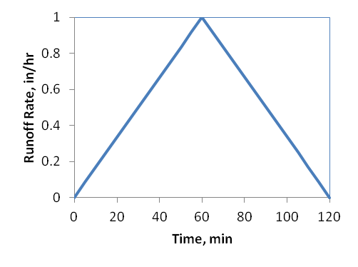   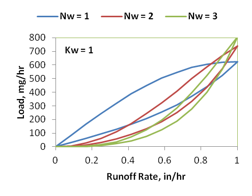

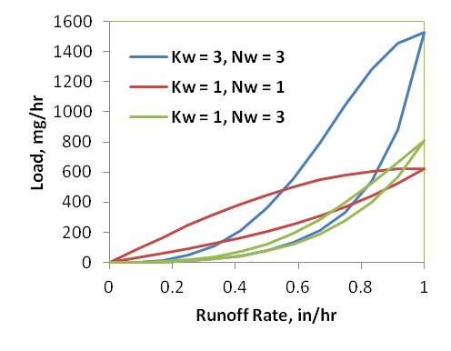 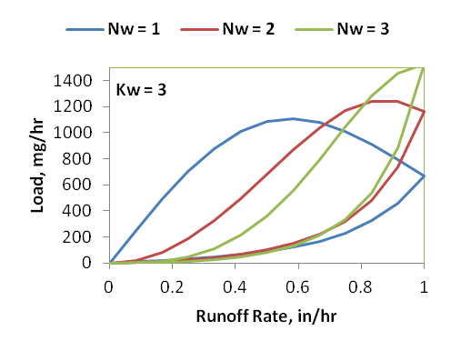

**Figure 4‑4 Simulated load variations within a storm as a function of runoff rate**

Procedures for calibrating SWMM's buildup and washoff parameters have
been developed by Jewell et al. (1978), Alley (1981), and Baffaut and
Delleur (1990). The challenge of calibrating the exponential washoff
parameters to individual storm events is that different events will
produce different parameter estimates. An example of this is the study
made by Avellaneda et al. (2009). Estimating washoff parameters by
minimizing the sum of squared differences between the observed and
predicted suspended solids concentrations for each of 22 different storm
events on a 7.4 acre parking lot resulted in a coefficient of variation
(CV or standard deviation / mean) for *KW* of 1.8. (The CV for *NW*
was only 0.2). Such variability presents problems in selecting a single
set of values that will generate reliable pollutographs in future
simulations.

Reproducing the time variation of washoff concentration within a storm
event may be too lofty a goal to achieve given the simplified
representation of the washoff process in SWMM. Instead, it might be more
realistic to calibrate against the total mass of washoff produced over a
number of storm events. This is the approach used by Behera et al.
(2006) using a probabilistic model and by Tetra Tech (2010) using SWMM
itself. In the latter case, the choice of parameter values was based on
achieving a target annual pollutant loading (lbs/ac-yr) for each
combination of pollutant and land use over a multi-year period of
rainfall record. Table 4-3 shows the results achieved for the power
buildup model and exponential washoff model for high-density residential
land use.

**Table 4‑3 Buildup/washoff calibration against annual loading rate for high-density residential land use  Source: Tetra Tech (2010).**

| Pollutant1 | Buildup | | | Washoff | | | Calibration Results (kg/ac/yr) | | |
|--------------|---------|---|---|---------|---|---|-------------------------------|---|---|
| | **Bmax** | **KB** | **NB** | **KW** | **NW** | | **Target** | **Calibrated** | **Error** |
| TP | 4.75 | 0.031 | 0.42 | 0.71 | 1.37 | | 0.45 | 0.449 | 0.2% |
| TSS | 28.12 | 0.76 | 1.26 | 5.91 | 1.46 | | 190.51 | 190.57 | 0% |
| TN | 18.94 | 0.027 | 0.88 | 4.31 | 0.57 | | 2.81 | 2.811 | 0.04% |
| Zn | 4.78 | 0.013 | 0.088 | 7.22 | 1.11 | | 0.32 | 0.322 | 0.6% |

1TP = total phosphorus, TSS = total suspended solids, TN = total
nitrogen and Zn = zinc.

The exponential washoff model is most suitable when the pollutant load
(mass/sec) versus runoff flow monitored during a storm event plot as a
loop, as in Figure 4-4, since it tends to produce lower loads at the end
of storm events as the buildup supply becomes depleted. The rating curve
washoff model will work better when the load versus flow data plot as a
straight line on log-log axes. On the basis of the previous discussion
of rating curves based on sediment data, it is expected that the
exponent, *NW*, would be in the range of 1.5 to 3.0 for constituents
that behave like particulates. For dissolved constituents, the exponent
will tend to be less than 1.0 since concentration often decreases as
flow increases, and concentration is proportional to flow to the power
*NW* - 1. (Constant concentration would use *NW* = 1.0.) Much more
variability is expected for *KW*. The rating curve method is generally
easiest to use when only total runoff volumes and pollutant loads are
available for calibration. In this case a pure regression approach
should suffice to determine parameters *KW* and *NW*.

As a part of the NPDES stormwater permitting program and as a result of
many special studies, there are numerous sources of local event mean
concentration (EMC) data available for stormwater. EMC values are
usually measured by laboratory analysis of flow- and time-weighted
composite samples. EMCs are often the only samples available, in order
to save on laboratory costs that would be involved in measurements of
several points along the storm hydrograph, although the latter,
intra-event samples are particularly valuable data. As a practical
matter, EMCs are the most common parameters used to estimate nonpoint
water quality loads in SWMM and in most other models.

A primary source of EMC data is the Nationwide Urban Runoff Program
(NURP), conducted by EPA in the early 1980s (US EPA, 1983). Sampling was
conducted for 28 NURP projects which included 81 specific sites and more
than 2,300 separate storm events. Table 2-3 presents a summary of the
EMCs found from that study. The Center for Watershed Protection has put
together a more comprehensive list of national EMCs that includes not
just the NURP results but also additional data obtained from the U.S.
Geological Survey (USGS), as well as stormwater monitoring conducted for
EPA's National Pollutant Discharge Elimination System (NPDES) stormwater
program. These are shown in Table 4-4.

When evaluating stormwater EMC data, it is important to keep in mind
that regional EMCs can differ sharply from the reported national
pollutant EMCs. Differences in EMCs between regions are often attributed
to the variation in the amount and frequency of rainfall and snowmelt.
Table 4-5 presents a breakdown of EMCs by different regions of the US
classified by rainfall amounts.

**Table 4‑4 National EMC's for stormwater  Source: CWP (2003).**

| **Pollutant** | **Mean EMC** | **Median EMC** | **Number of Events Sampled** |
|---------------|--------------|----------------|-------------------------------|
| **Sediment (mg/L)** | | | |
| TSS | 78.4 | 54.5 | 3047 |
| **Organic Carbon (mg/L)** | | | |
| TOC | 17 | 15.2 | 19 studies |
| BOD | 14.1 | 11.5 | 1035 |
| COD | 52.8 | 44.7 | 2639 |
| | | | |
| MTBE | N/R | 1.6 | 592 |
| **Nutrients (mg/L)** | | | |
| Total P | 0.32 | 0.26 | 3094 |
| Soluble P | 0.13 | 0.10 | 1091 |
| Total N | 2.39 | 2.00 | 2016 |
| Total Kjeldahl N | 1.73 | 1.47 | 2693 |
| Nitrite and Nitrate | 0.66 | 0.53 | 2016 |
| **Metals (ug/L)** | | | |
| Copper | 13.4 | 11.1 | 1657 |
| Lead | 67.5 | 50.7 | 2713 |
| Zinc | 162 | 129 | 2234 |
| Cadmium | 0.7 | 0.5 | 150 |
| Chromium | 4.0 | 7.0 | 164 |
| **Hydrocarbons (mg/L)** | | | |
| PAH | 3.5 | N/R | N/R |
| Oil & Grease | 3 | N/R | N/R |
| **Bacteria and Pathogens (colonies/100 mL)** | | | |
| Fecal Coliform | 15,038 | N/R | 34 |
| Fecal Streptococci | 35,351 | N/R | 17 |
| **Pesticides (ug/L)** | | | |
| Diazinon | N/R | 0.025 | 326 |
| Atrazine | N/R | 0.023 | 327 |
| Prometon | N/R | 0.031 | 327 |
| Simazine | N/R | 0.039 | 327 |
| **Chloride (mg/L)** | | | |
| Chloride | N/R | 397 | 282 |

**Table 4‑5 EMC's for different regions  Source: CWP (2003)**

(units are mg/L except for metals which are in ug/L)

| Pollutant / Metric | National | Phoenix, AZ | San Diego, CA | Boise, ID | Denver, CO | Dallas, TX | Marquette, MI | Austin, TX | MD | Louisville, KY | GA | FL | MN (Snow) |
|:---|:---:|:---:|:---:|:---:|:---:|:---:|:---:|:---:|:---:|:---:|:---:|:---:|:---:|
| **Annual Rainfall (in)** | N/A | 7.1 | 10 | 11 | 15 | 28 | 32 | 32 | 41 | 43 | 51 | 52 | N/R |
| **Number of Events** | 3000 | 40 | 36 | 15 | 35 | 32 | 12 | N/R | 107 | 21 | 81 | N/R | 49 |
| **TSS** | 78.4 | 227 | 330 | 116 | 242 | 663 | 159 | 190 | 67 | 98 | 258 | 43 | 112 |
| **Total N** | 2.39 | 3.26 | 4.55 | 4.13 | 4.06 | 2.7 | 1.87 | 2.35 | N/R | 2.37 | 2.52 | 1.74 | 4.30 |
| **Total P** | 0.32 | 0.41 | 0.7 | 0.75 | 0.65 | 0.78 | 0.29 | 0.32 | 0.33 | 0.32 | 0.33 | 0.38 | 0.70 |
| **Soluble P** | 0.13 | 0.17 | 0.4 | 0.47 | N/R | N/R | 0.04 | 0.24 | N/R | 0.21 | 0.14 | 0.23 | 0.18 |
| **Copper** | 14 | 47 | 25 | 34 | 60 | 40 | 22 | 16 | 18 | 15 | 32 | 1.4 | N/R |
| **Lead** | 68 | 72 | 44 | 46 | 250 | 330 | 49 | 38 | 12.5 | 60 | 28 | 8.5 | 100 |
| **Zinc** | 162 | 204 | 180 | 342 | 350 | 540 | 111 | 190 | 143 | 190 | 148 | 55 | N/R |
| **BOD** | 14.1 | 109 | 21 | 89 | N/R | 112 | 15.4 | 14 | 14.4 | 88 | 14 | 11 | N/R |
| **COD** | 52.8 | 239 | 105 | 261 | 227 | 106 | 66 | 98 | N/R | 38 | 73 | 64 | 112 |

N/R: Not Recorded

## Chapter 5: Transport and Treatment

### 5.1 Introduction

Water quality constituents in surface runoff and from other external
sources will typically be transported through a conveyance system until
they are discharged into a receiving water body, a treatment facility,
or some other type of destination (such as back to the land surface for
irrigation purposes). Figure 5-1 shows how SWMM represents this
conveyance system as a network of Nodes and Links. Nodes are points that
represent simple junctions, flow dividers, storage units, or outfalls.
Links connect nodes to one another with conduits (pipes and channels),
pumps, or flow regulators (orifices, weirs, or outlets). Inflows to
nodes can come from surface runoff, groundwater interflow, RDII
(rainfall dependent inflow/infiltration), sanitary dry weather flow, or
from user-defined time series. Pollutants can be removed by natural
decay processes as they flow through conduits and storage nodes, and
they can also be reduced by treatment processes applied at both
non-storage nodes (e.g., high-rate solids separators) and storage nodes
(e.g., physical sedimentation). This chapter describes how SWMM computes
pollutant concentrations within all conduits and nodes of the conveyance
network at each computational time step after its hydraulic state has
been determined. The latter consists of the flow rate and volume of
water in each link and the volume of water within each storage node. The
methods used to obtain this hydraulic solution are described in Volume
II of this manual.

<figure>

<figcaption>
<strong>Figure 5‑1 Representation of the
conveyance network in SWMM</strong>
</figcaption>
</figure>

### 5.2 Governing Equations

#### 5.2.1 The 1-D Advection Dispersion Equation

The one-dimensional transport of dissolved constituents along the length
of a conduit (a pipe or natural channel) is described by the following
conservation of mass equation (Martin and McCutcheon, 1999):

$$\frac{\partial c}{\partial t} = - \frac{\partial(uc)}{\partial x} + \frac{\partial}{\partial x}\left( D\frac{\partial c}{dx} \right) + r(c)$$   
(5-1)

where *c* = constituent concentration (ML-3), *u* = longitudinal
velocity (LT-1), *D* = longitudinal dispersion coefficient (L2/T),
*r(c)* = reaction rate term (ML-3T-1)), *x* = longitudinal distance
(L), and *t* = time (T). Note that *c* is a continuous function of both
distance *x* and time *t*. In general, c can be a vector of constituents
in which case a separate Equation 5-1 would apply for each constituent
and the reaction rate *r* could be a function of more than one
constituent. The first term on the right hand side of Equation 5-1
represents advective transport where the constituent mass within a
parcel of water moves along the conduit at the same velocity as the bulk
fluid. The second term represents longitudinal dispersion where, due to
velocity and concentration gradients, some portion of the mass inside a
parcel mixes with the contents of parcels on either side of it. The
final term represents any reactions that modify the concentration within
a parcel regardless of any fluid motion.

A set of boundary and initial conditions is needed to solve Equation
5-1. In a conveyance network of the type modeled by SWMM the boundary
conditions would be the concentrations at the nodes at either end of a
conduit. For a simple junction node that has no storage volume
associated with it the instantaneous concentration is simply the
instantaneous flow weighted average concentration of all inflows that
the junction receives:

$$c_{Nj} = \frac{\sum_{i \rightarrow j}^{}{c_{L2i}q_{2i} + W_{j}}}{\sum_{i \rightarrow j}^{}q_{2i} + Q_{j}}$$   
(5-2)

where *cNj* is the concentration at node *j*, *cL2i* is the
concentration at the end of link *i* that connects to node *j*, *q2i*
is the flow rate at the end of link *i*, *Wj* is the mass flow rate of
any direct external source of constituent to node *j*, *Qj* is the
flow rate of the external source, and the summations are over all links
that have flow directed into node *j*. For a storage node where it is
assumed that the contents of the stored volume are completely mixed, the
uniform concentration within the node is governed by the following
conservation of mass equation:

$$\frac{d(V_{Nj}c_{Nj})}{dt} = \sum_{i \rightarrow j}^{}{c_{L2i}q_{2i} - \sum_{j \rightarrow k}^{}{c_{Nj}q_{1k} + W_{j} - V_{Nj}r(c_{Nj})}}$$   
(5-3)

where *VNj* is the volume of water stored at node *j*, *q2i* is the
flow at the end of a link *i* directed into node *j*, *q1k* is the
flow at the start of a link *k* directed out of node *j*, *Wj* is the
mass flow rate of any direct external source into node *j*, and *r* is a
reaction rate term.

Formal numerical methods of solving the advection-dispersion equation
5-1 along a single conduit are discussed by Ewing and Wang (2001). The
solution process is made even more difficult because there is one such
equation for each pipe and channel in the conveyance network. These are
linked together by the boundary conditions 5-2 and 5-3. The result is a
large system of algebraic differential equations that must be solved
simultaneously.

#### 5.2.2 The Tanks in Series Model

SWMM uses a less rigorous but more pragmatic approach to solving
constituent transport where the conduits are represented as completely
mixed reactors connected together at junctions or at completely mixed
storage nodes. This "box model" or "tanks in series" approach is also
employed by the widely used EPA WASP model (Ambrose et al., 1988) and
the UK QUASAR model (Whitehead et al., 1997). It simplifies the problem
by eliminating the need to compute the spatial variation of
concentration along the length of a conduit. Equations 5-1 and 5-3 are
replaced with the conservation of mass equation for a completely mixed
reactor (either a conduit or storage node)

$$\frac{d(Vc)}{dt} = {C_{in}Q}_{in} - cQ_{out} - \ Vr(c)$$   
(5-4)

where *V* is the volume within the reactor, *c* is the concentration
within the reactor, *Cin* is the concentration of any inflow to the
reactor, *Qin* is the volumetric flow rate of this inflow, *Qout* is
the volumetric flow rate leaving the reactor, and *r(c)* is a function
that determines the rate of loss due to reaction.

Medina et al. (1981) present an analytical solution to Equation 5-4
under the assumptions that:

1.  *Cin, Qin,* and *Qout*, are constant over a solution time step
    *t* to *t* + ∆*t,*

2.  *V* is represented by an average value over the time step,

3.  $r(c) = K_{1}c$, where *K1* is a first-order reaction constant.

Under these conditions the concentration within the conduit or storage
node at the end of a time step *∆t* can be expressed as:

$$c(t + \mathrm{\Delta}t) = c(t)e^{- \propto \mathrm{\Delta}t} + \frac{{C_{in}Q}_{in}}{\propto \overline{V}}\left( 1 - e^{- \propto \mathrm{\Delta}t} \right)$$   
(5-5)

where
$\propto = K_{1} + \left( Q_{out} + \frac{\mathrm{\Delta}V}{\mathrm{\Delta}t} \right)/\overline{V}$,
$\mathrm{\Delta}V = V(t + \mathrm{\Delta}t) - \ V(t)$, and
$\overline{V} = 0.5\left\lbrack V(t + \mathrm{\Delta}t) + V(t) \right\rbrack$.
Note that values of *Qin*, *Q~ou~*~t~ and both the initial and final
volumes *V* are known from having already routed flow through the
conveyance network over the period *t* to *t +* *∆t*.

This equation was used in previous versions of SWMM (pre-SWMM 5) for
water quality routing. However it can exhibit numerical problems, such
as when conveyance elements dry up and their volume approaches 0 or when
a relatively large, rapid loss of volume causes α to become negative.

To avoid these issues, SWMM 5 uses a simpler form of the mixing equation
which looks as follows:

$$c(t + \mathrm{\Delta}t) = \left\lbrack c(t)V(t)e^{- K_{1}\mathrm{\Delta}t} + C_{in}Q_{in}\mathrm{\Delta}t \right\rbrack/(V(t) + Q_{in}\mathrm{\Delta}t)$$   
(5-6)

This equation makes the new concentration in the "reactor" equal the
original mass left after any reaction has occurred plus the mass
introduced by any inflow which is then divided by the original volume
plus the inflow volume. It can be shown that it approximates Equation
5-5 for small time steps where the change in reactor volume is not very
large. Because the time step used for quality routing is the same as for
flow routing and is typically quite small (e.g., less than a minute) to
avoid hydraulic instabilities, Equation 5-6 tends to produce quite
acceptable results.

Figure 5-2 compares the results obtained by the two equations (5-5 and
5-6) at the end of a 1-mile stretch of pipeline that receives time
varying runoff at its upstream end (*Qin* and *Cin* in the figure)
and has a decay coefficient of 10 days-1. The pipeline consists of
seven 800-foot sections of 18" pipe at a 0.5 percent slope. The routing
time step was 30 seconds. For this particular example the difference
between the equations is insignificant.

<figure>
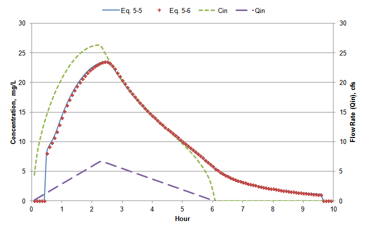
<figcaption>
<strong>Figure 5‑2 Comparison of completely mixed
reactor equations for time varying inflow</strong>
</figcaption>
</figure>

Figure 5-3 provides another comparison of Equations 5-5 and 5-6 at the
end of the same pipeline. This time the upstream inflow hydrograph is a
square pulse of 3 hour duration with a constant concentration of 100
mg/L and no reaction. Under these conditions the concentration in the
water carried by the pipeline must always be 100 mg/L since there are no
other sources or sinks and longitudinal dispersion is not explicitly
included in either Equation 5-5 or 5-6. Figure 5-3 shows that the simple
mixing equation 5-6 is able to achieve this result while the analytical
solution, Equation 5-5, cannot. In fact the latter shows concentrations
above 100 mg/L, which are not physically possible. These results support
using the simple mixing equation 5-6 in place of the analytical solution
for SWMM 5 as it provides accurate and robust water quality solutions.

<figure>
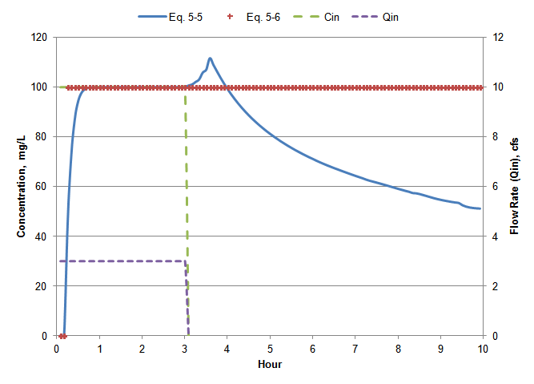
<figcaption>
<strong>Figure 5‑3 Comparison of completely mixed
reactor equations for a step inflow</strong>
</figcaption>
</figure>

### 5.3 Computational Steps

Water quality routing computations are implemented as part of SWMM's
conveyance system routing calculations. They are made at each flow
routing time step immediately after a new set of flow rates and volumes
has been computed for all elements of the conveyance network. Volume II
of this manual describes in detail the procedures used for hydraulic
routing.

The following quantities are therefore known for each pollutant and each
network link:

*QL1(t+∆t)*   =   flow rate entering the link at time *t+∆t* (cfs)

*QL2(t+∆t)*   =   flow rate exiting the link at time *t+∆t* (cfs)

*VL(t)*       =   the volume of water stored in the link at time t (ft3)

*cL(t)*       =   the concentration of the pollutant in the link at time t
                      (mass/ft3)

In addition, the following quantities are known for each pollutant at
each node of the network at time *t*:

*VN(t)*   =   the volume of water stored at the node (ft3)

*cN(t)*   =   the concentration of the pollutant at the node at time t
                  (mass/ft3)

Note that for computational purposes, concentration is expressed as
mass/ft3. After computations are completed, they are converted back to
mass/L for reporting purposes. The objective is to compute values of
*cL* for each link and *cN* for each node at time *t+∆t*.

Using Equation 5-6 as its mixing equation for both conduit links and
storage nodes, SWMM 5 carries out the following three step process to
update pollutant concentrations for each node and link in the conveyance
network at the end of each flow routing time step:

1.  First the cumulative mass flow rate of each pollutant into each node
    of the network at the current time step is found. It includes
    pollutant loads from subcatchment runoff, dry weather sanitary flow,
    user-defined external time series loads, and possible groundwater
    and RDII flows, all evaluated at time *t*. To this is added the mass
    loads from all links (pipes, channels, pumps, etc.) that flow into
    the node. These are computed by multiplying the current outflow rate
    of the inflowing link (*QL2(t+∆t))* by the link's current
    pollutant concentration (*cL(t))*.

2.  Then a new concentration is computed for each node in the network.
    If the node is a non-storage node, the concentration is simply the
    cumulative mass flow rate divided by the cumulative inflow rate
    (Equation 5-2 above). For a storage node, Equation 5-6 is used to
    compute a new mixture concentration *cN(t+∆t)* where *Qin* is the
    cumulative inflow rate from step 1 and *Cin* is step 1's cumulative
    mass inflow divided by *Qin*.

3.  Finally, Equation 5-6 is applied to determine a new concentration
    for each pollutant in each conduit, *cL(t+∆t)*. In this equation,
    *Qin* is the flow rate sent into conduit from its upstream node,
    *QL1(t+∆t),* and *Cin* is the newly updated concentration of this
    node, *cN(t+∆t),* found in step 2. For links that have no volume
    (pumps, regulators, and dummy conduits) *cL(t+∆t)* is set equal to
    the upstream node concentration *cN(t+∆t)*.

Certain modifications must be made to this basic procedure to handle the
following special conditions.

<u>Evaporation Losses</u>

Both open conduits and storage units can lose water through evaporation.
When water is evaporated, the pollutant mass stays behind (unless it
volatilizes, which is not explicitly modeled by SWMM, although it could
be approximated through the first order decay process). Thus when
evaporation occurs pollutant concentrations will increase. SWMM computes
this increase as a multiplier$f_{evap}$:

$$f_{evap} = 1 + V_{evap}(t)/V(t)$$                       
(5-7)

where $V_{evap}(t)$ is the volume lost to evaporation over the time step
and $V(t)$ is either *VN(t)* for a storage node at Step 2 or *VL(t)*
for a conduit link at Step 3. This multiplier is then used to adjust the
concentration *cN(t)* before Step 2 is carried out for a storage node
or *cL(t)* before Step 3 is carried out for a conduit link.

<u>Dynamic Wave Flow Routing</u>

When SWMM's Dynamic Wave flow routing option (see Volume II) is used
there is only one flow rate associated with each conduit, so that
*QL1* and *QL2* have the same values. This might suggest that there
would be no volume change within the conduit over a time step. However
the routing process actually does produce a change in volume due to
changes in flow depths at either end of the conduit. To make the flow
rates consistent with this volume change, the value of *QL1* is
adjusted by an amount ∆$Q_{L1}$ found from the following flow balance
equation:

$$\mathrm{\Delta}Q_{L1} = V_{L}(t + \mathrm{\Delta}t) + V_{losses}(t) - V_{L}(t)$$   
(5-8)

where $V_{losses}(t)$ is the volume of evaporation and seepage loss over
the time period $\mathrm{\Delta}t$.

<u>Steady Flow Routing</u>

SWMM's Steady Flow routing option (see Volume II) simply translates the
inflow to a conduit instantaneously to its outlet node. That is, the
inflow to the conduit completely replaces the previous contents over the
time step. So there is no mixing of the previous contents with new
inflow from the upstream node. Thus Step 3 of the basic water quality
routing procedure becomes:

$$c_{L}(t + \mathrm{\Delta}t) = f_{evap}c_{N}(t + \mathrm{\Delta}t)exp( - K_{1}\mathrm{\Delta}t)$$   
(5-9)

where $c_{N}(t + \mathrm{\Delta}t)$ is the newly computed concentration
at the conduit's upstream node.

### 5.4 Treatment

#### 5.4.1 Background

Management of stormwater quality is usually performed through a
combination of so-called "best management practices" (BMPs) and a form
of hydrologic source control popularly known as "low impact development"
(LID). Treatment of stormwater runoff, either by natural means or by
engineered devices, can occur at both the source of the generated runoff
or at locations within the conveyance network. Source treatment through
LID is discussed in the next chapter. This section describes how SWMM
models treatment applied to flows already captured and transported
within a conveyance system.

Table 5-1, adapted from Huber et al. (2006), categorizes the different
unit treatment processes used by various types of conveyance system
BMPs. Ideally one would like to model these processes at a fundamental
level, to be able to estimate pollutant removal based on physical design
parameters, hydraulic variables, and intrinsic chemical properties and
reaction rates. With a few exceptions, the state of our knowledge does
not permit this, at least within the scope of a general purpose
stormwater management model like SWMM. Instead one has to rely on
empirical relationships developed from site-specific monitoring data.

Strecker et al. (2001) discuss the challenges of using monitoring data
to develop consistent estimates of BMP effectiveness and pollutant
removal. The International Stormwater BMP Database
([www.bmpdatabase.org](http://www.bmpdatabase.org)) provides a
comprehensive compilation of BMP performance data from over 500 BMP
studies on 17 different categories of BMPs and LID practices. It is
continually updated with new data contributed by the stormwater
management community. Table 5-2 lists the median influent and effluent
event mean concentrations (EMCs) for a variety of BMP categories and
pollutants that were compiled from this database. The cells highlighted
in yellow indicate that a statistically significant removal of the
pollutant was achieved by the BMP category. A summary of the median
removal percentages of several common pollutants treated by filtration,
ponds, and wetlands published in the Minnesota Stormwater Manual is
listed in Table 5-3. Most of these percentages are consistent with those
inferred from median EMC numbers in the BMP database table 5-2.

**Table 5‑1 Treatment processes used by various types of BMPs**

| Process | Definition | Example BMPs |
|---------|------------|--------------|
| Sedimentation | Gravitational settling of suspended particles from the water column. | Ponds, wetlands, vaults, and tanks. |
| Flotation | Separation of particulates with a specific gravity less than water (e.g., trash, oil and grease). | Oil-water separators, density separators, dissolved-air flotation. |
| Filtration | Removal of particulates by passing water through a porous medium like sand, gravel, soil, etc. | Sand filters, screens, and bar racks. |
| Infiltration | Allowing captured runoff to infiltrate into the ground reducing both runoff volume and loadings of particulates and dissolved nutrients and heavy metals. | Infiltration basins, ponds, and constructed wetlands. |
| Adsorption | Binding of contaminants to clay particles, vegetation or certain filter media. | Infiltration systems, sand filters with iron oxide, constructed wetlands. |
| Biological Uptake and Conversion | Uptake of nutrients by aquatic plants and microorganisms; conversion of organics to less harmful compounds by bacteria and other organisms. | Ponds and wetlands. |
| Chemical Treatment | Chemicals used to promote settling and filtration. Disinfectants used to treat combined sewer overflows. | Ponds, wetlands, rapid mixing devices. |
| Natural Degradation (volatilization, hydrolysis, photolysis) | Chemical decomposition or conversion to a gaseous state by natural processes. | Ponds and wetlands. |
| Hydrodynamic Separation | Uses the physics of flowing water to create a swirling vortex to remove both settleable particulates and flotables. | Swirl concentrators, secondary current devices, oil-water separators. |

**Table 5‑2 Median inlet and outlet EMCs for selected stormwater treatment practices**

| Pollutant | Media Filtration | | Detention Basin | | Retention Pond | | Wetland Basin | | Manufactured Device | |
|-----------|------------------|---|-----------------|---|----------------|---|----------------|---|---------------------|---|
| | **In** | **Out** | **In** | **Out** | **In** | **Out** | **In** | **Out** | **In** | **Out** |
| TSS mg/L | 52.7 | 8.7 | 66.8 | 24.2 | 70.7 | 13.5 | 20.4 | 9.06 | 34.5 | 18.4 |
| F. Coliform, #/100mL | 1350 | 542 | 1480 | 1030 | 1920 | 707 | 13000 | 6140 | 2210 | 2750 |
| Cadmium, ug/L | 0.31 | 0.16 | 0.39 | 0.31 | 0.49 | 0.23 | 0.31 | 0.18 | 0.40 | 0.28 |
| Chromium, ug/L | 2.02 | 1.02 | 5.02 | 2.97 | 4.09 | 1.36 | | | 3.66 | 2.82 |
| Copper, ug/L | 11.28 | 6.01 | 10.62 | 5.67 | 9.57 | 4.99 | 5.61 | 3.57 | 13.42 | 10.16 |
| Lead, ug/L | 10.5 | 1.69 | 6.08 | 3.10 | 8.48 | 2.76 | 2.03 | 1.21 | 8.24 | 4.63 |
| Nickel, ug/L | 3.51 | 2.20 | 5.64 | 3.35 | 4.46 | 2.19 | | | 3.84 | 4.51 |
| Zinc, ug/L | 77.3 | 17.9 | 70.0 | 17.9 | 53.6 | 21.2 | 48.0 | 22.0 | 87.7 | 58.5 |
| Total P, mg/L | 0.18 | 0.09 | 0.28 | 0.22 | 0.30 | 0.13 | 0.13 | 0.08 | 0.19 | 0.12 |
| Orthophosphate, mg/L | 0.05 | 0.03 | 0.53 | 0.39 | 0.10 | 0.04 | 0.04 | 0.02 | 0.21 | 0.10 |
| Total N, mg/L | 1.06 | 0.82 | 1.40 | 2.37 | 1.83 | 1.28 | 1.14 | 1.19 | 2.27 | 2.22 |
| TKN, mg/L | 0.96 | 0.57 | 1.49 | 1.61 | 1.28 | 1.05 | 0.95 | 1.01 | 1.59 | 1.48 |
| NOX, mg/L | 0.33 | 0.51 | 0.55 | 0.36 | 0.43 | 0.18 | 0.24 | 0.08 | 0.41 | 0.41 |

Source: International Stormwater BMP Database, "International Stormwater
Best Management Practices (BMP) Database Pollutant Category Summary
Statistical Addendum: TSS, Bacteria, Nutrients, and Metals", July 2012
([www.bmpdatabase.org](http://www.bmpdatabase.org)).

**Table 5‑3 Median pollutant removal percentages for select stormwater BMPs**

| Pollutant | Sand Filter | Ponds | Wetlands |
|-----------|-------------|-------|----------|
| Total Suspended Solids | 85 | 84 | 73 |
| Total Phosphorus | 77 | 50 | 38 |
| Particulate Phosphorus | 91 | 91 | 69 |
| Dissolved Phosphorus | 60 | 0 | 0 |
| Total Nitrogen | 35 | 30 | 30 |
| Zinc and Copper | 50 | 70 | 70 |
| Bacteria | 80 | 60 | 60 |

Source: Minnesota Stormwater Manual (http://stormwater.pca.state.mn.us).

#### 5.4.2 Treatment Representation

SWMM 5 allows treatment to be applied to any water quality constituent
at any node of the conveyance network. Treatment will act to reduce the
nodal concentration of the constituent from the value it had after Step
2 of the water quality routing procedure described in section 5.3 (after
a new mixture concentration has been computed for the node but before
any outflow from the node is sent into any downstream links). The degree
of treatment for a constituent is prescribed by the user, either as a
concentration remaining after treatment or as the fractional removal
achieved. It can be a function of the current concentration or
fractional removal of any set of constituents as well as the current
flow rate. For storage nodes, it can also depend on water depth, surface
area, routing time step, and hydraulic residence time. Because treatment
is applied at every time step, the resulting pollutant concentrations
can vary throughout a storm event and will not necessarily represent an
event mean concentration (EMC). The exception, of course, would be if
treatment is specified as simply a constant concentration that is not
dependent on any other variables.

The effect of treatment for a particular pollutant at a particular node
can be expressed mathematically using one of the following general
expressions (some specific examples will be presented later on):

$$c(t + \mathrm{\Delta}t) = c(\mathbf{C},\ \mathbf{R},\ \mathbf{H})\ $$   
(5-10)

$$c(t + \mathrm{\Delta}t) = \left( 1 - r\left( \mathbf{C},\ \mathbf{R},\ \mathbf{H} \right) \right)C_{in}(t + \mathrm{\Delta}t)\ $$   
(5-11)

where:

$c$                          =   nodal pollutant concentration after treatment is applied

$C_{in}$                     =   pollutant concentration in the node's inflow stream

$c(\ldots)$                  =   concentration-based treatment function

$r(\ldots)$                  =   removal-based treatment function

$\mathbf{C}$                 =   vector of nodal pollutant concentrations before treatment is applied

$\mathbf{C}_{\mathbf{in}}$   =   vector of pollutant concentrations in the node's inflow stream

$\mathbf{R}$                 =   vector of fractional removals resulting from treatment

$\mathbf{H}$                 =   vector of hydraulic variables at the current time step.

Note that if treatment is made a function of pollutant concentrations,
then for concentration-based treatment these represent the
concentrations at the node prior to treatment while for removal-based
functions they are the concentrations in the node's combined influent
stream. If the node has no volume (e.g., is a non-storage node) then
these two types of concentrations are equivalent.

The hydraulic variables that can appear in a treatment expression
include the following:

***FLOW***    flow rate into the node in user defined flow units

***DEPTH***   average water depth in the node over the time step (ft or
                    m)

***AREA***    average surface area of the node over the time step (ft2
                    or m2)

***DT***      current routing time step (seconds)

***HRT***     hydraulic residence time of water in a storage node
                    (hours).

The hydraulic residence time is the average time that water has spent
within a completely mixed storage node. It is continuously updated for
each storage node as the simulation progresses by evaluating the
following expression:

$$\theta(t + \mathrm{\Delta}t) = (\theta(t) + \mathrm{\Delta}t)\frac{V(t)}{V(t) + Q_{in}\mathrm{\Delta}t}\ $$   
(5-12)

where $\theta(t)$ is the hydraulic residence time at time *t* in
seconds, $V(t)$ is the cubic feet of stored water at time t, $Q_{in}$ is
the inflow rate to the storage node in cfs, and $\mathrm{\Delta}t$ is
the current time step in seconds.

SWMM applies the following conditions when evaluating a treatment
expression:

1.  The concentration after treatment cannot be less than 0 or greater
    than the concentration prior to treatment.

2.  A fractional removal cannot be greater than 1.0.

3.  A removal-based treatment function evaluates to 0 if there is no
    inflow into the node in question.

4.  If a pollutant with a global first order decay coefficient is
    assigned a treatment expression at some storage node then the
    treatment expression takes precedence (i.e., the decay coefficient
    *K1* in Equation 5-6 is set to 0).

5.  Co-pollutants do not automatically receive an equivalent amount of
    co-treatment as their dependent pollutant receives.

The latter condition is necessary because co-pollutants only apply to
buildup/washoff processes -- not to the user-specified concentrations in
rainwater, groundwater, I/I, dry weather flow, and externally imposed
inflows.

#### 5.4.3 Example Treatment Expressions

Several concrete examples of treatment expressions, in the format used
by SWMM 5's input file, will be given to illustrate how different types
of treatment mechanisms can be modeled.

<u>EMC Treatment</u>

Treatment results in a constant concentration. As an example, if this
concentration were 10 mg/L then the treatment expression supplied to
SWMM would be:

***c = 10***

<u>Constant Removal Treatment</u>

Treatment results in a constant percent removal. For example, if this
removal was 85% then the treatment expression would be:

***r = 0.85***

<u>Co-Removal Treatment</u>

The removal of some pollutant is proportional to the removal of some
other pollutant. For example, if the removal of pollutant X was 75% of
the removal of suspended solids (TSS) then the treatment expression
would be:

***r = 0.75 \* R_TSS***

where ***R_TSS*** is the fractional removal computed for pollutant TSS.

<u>Concentration-Dependent Removal</u>

Some empirical performance data indicate higher pollutant removal
efficiencies with higher influent concentrations (Strecker et al.,
2001). Suppose that the removal of pollutant X is 50% for inflow
concentrations below 50 mg/L and 75% for concentrations above 50. The
resulting treatment expression would be:

***r = (1 - STEP(C_X -- 50)) \* 0.5 + STEP(C_X -- 50) \* 0.75***

where ***C_X*** is the influent concentration of pollutant X and
***STEP*** is the unit step function whose value is zero for negative
argument and one for positive argument.

<u>N-th Order Reaction Kinetics</u>

Suppose that during treatment pollutant X exhibits n-th order reaction
kinetics where the instantaneous reaction rate is $kC^{n}$ with *k*
being the rate constant and *n* the reaction order. This can be
represented as the following SWMM treatment expression for the specific
case where *k* = 0.02 and *n* = 1.5:

***c = C_X -- 0.02 \* (C_X\^1.5) \* DT***

<u>The k-C* Model</u>

This is a first-order model with background concentration made popular
by Kadlec and Knight (1996) for long-term treatment performance of
wetlands. The general model can be expressed as:

$$c - C^{*} = \left( C_{in} - C^{*} \right)exp( - \frac{k\theta}{d})$$   (5-13)

where $C^{*}$ is a constant residual concentration that always remains,
*k* is a rate coefficient with units of length/time, *θ* is the
hydraulic residence time, and *d* is water depth. This equation can be
re-arranged into a removal function as follows:

$$r = 1 - \frac{c}{C_{in}} = \left\lbrack 1 - \exp\left( - \frac{k\theta}{d} \right) \right\rbrack\left\lbrack 1 - \frac{C^{*}}{C_{in}} \right\rbrack$$   
(5-14)

The corresponding SWMM removal expression of some pollutant X with *k* =
0.02 (ft/hr) and $C^{*}$ = 20 would look as follows:

***r = STEP(C_X -- 20) \* ((1 -- exp(-0.02\*HRT/DEPTH)) \*
(1-20/C_X))***

The ***STEP(C_X -- 20)*** term insures that no removal occurs when the
inflow concentration is below the residual concentration.

<u>Gravity Settling</u>

Consider a size range of suspended particles with average settling
velocity *ui*. During a quiescent period of time *∆t* within a storage
volume the fraction of these particles that will settle out is
$u_{i}\mathrm{\Delta}t/d$ where *d* is the water depth. Summing over all
particle size ranges leads to the following expression for the change in
TSS concentration *ΔC* during a time step *Δt*:

$$\mathrm{\Delta}c = c(t)\sum_{i}^{}{f_{i}u_{i}}\left( \frac{\mathrm{\Delta}t}{d} \right)$$   
(5-15)

where $f_{i}$ is the fraction of particles with settling velocity
$u_{i}$. Because $\sum_{}^{}{f_{i}u_{i}}$ is generally not known, it can
be replaced with a fitting parameter *k* and in the limit Equation 5-15
becomes:

$$\frac{\partial c}{\partial t} = - \frac{k}{d}c(t)$$     
(5-16)

Note that *k* has units of velocity (length/time) and can be thought of
as a representative settling velocity for the particles that make up the
total suspended solids in solution. Integrating 5-16 between times *t*
*and t + ∆t*, and assuming there is some residual amount of suspended
solids *C\** that is non-settleable leads to the following expression
for $c(t + \mathrm{\Delta}t)$:

$$c(t + \mathrm{\Delta}t) = C^{*} + \left( c(t) - C^{*} \right)exp( - \frac{k\mathrm{\Delta}t}{d})$$   
(5-17)

For particular values of *C\** = 20 and *k* = 0.01 ft/hr this equation
would be represented by the following treatment expression for a
pollutant named TSS:

***C = STEP(0.1 - FLOW) \****

***(20 + (C_TSS -- 20) \* exp(-0.01/DEPTH\*DT/3600)) +***

***(1 -- STEP(0.1 - FLOW)) \* C_TSS***

Note that ***DT*** is converted from seconds to hours to be compatible
with the time units of *k* and that the ***STEP*** function is used to
define quiescent conditions by an inflow rate below 0.1 cfs.

Figure 5.4 shows the result of using this treatment expression when
routing a 6-hour runoff hydrograph with a peak flow of 20 cfs through a
half acre dry detention pond whose outlet is a 9" high by 18" wide
orifice. The TSS in the runoff has a constant EMC of 100 mg/L. The
resulting TSS concentration in the pond over both the filling and
emptying periods are plotted in the figure, as are the inflow hydrograph
and pond water depth. Note that during the inflow period the TSS remains
at 100 mg/L and begins to settle out once the inflow ceases. As the pond
depth decreases while it empties more solids settle out reducing the TSS
level until the residual concentration of 20 mg/L is reached.

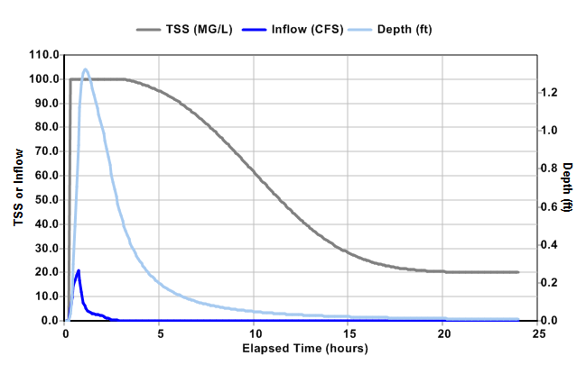

**Figure 5‑4 Gravity settling treatment of TSS within a detention pond**

## Chapter 6: Low Impact Development Controls

### 6.1 Introduction

Low impact development (LID) controls are landscaping practices designed
to capture and retain stormwater generated from impervious surfaces that
would otherwise run off of a site. They are also referred to as green
infrastructure (GI), integrated management practices (IMPs) sustainable
urban drainage systems (SUDS), and stormwater control measures (SCMs).
See Fletcher et al. (2015) for a review of this terminology. Prince
Georges County (1999a) describes the LID concept and its application to
stormwater management in more detail. Additional informational resources
are available from the following US EPA web sites:

- <http://water.epa.gov/polwaste/green/>

- <http://water.epa.gov/infrastructure/greeninfrastructure/index.cfm>

and from the Low Impact Development Center
(<http://lowimpactdevelopment.org>).

SWMM 5 can explicitly model the following types of LID practices:

| LID Control Type | Description | Image |
|---|---|---|
| **Bio-retention Cells** | Depressions that contain vegetation grown in an engineered soil mixture placed above a gravel storage bed. They provide storage, infiltration and evaporation of both direct rainfall and runoff captured from surrounding areas. Street planters and bio-swales are common examples of bio-retention cells. |  |
| **Rain Gardens** | A type of bio-retention cell consisting of just the engineered soil layer with no gravel bed below it. |  |
| **Green Roofs** | Another variation of a bio-retention cell that have a soil layer above a thin layer of synthetic drainage mat material or coarse aggregate that conveys excess water draining through the soil layer off of the roof. | 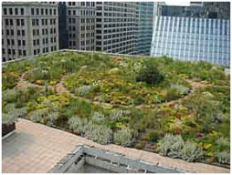 |
| **Infiltration Trenches** | Narrow ditches filled with gravel that intercept runoff from upslope impervious areas. They provide storage volume and additional time for captured runoff to infiltrate into the native soil below. |  |
| **Continuous Permeable Pavement** | Street or parking areas paved with a porous concrete or asphalt mix that sits above a gravel storage layer. Rainfall passes through the pavement into the storage layer where it can infiltrate into the site's native soil. | |
| **Block Paver** | Systems consist of impervious paver blocks placed on a sand or pea gravel bed with a gravel storage layer below. Rainfall is captured in the open spaces between the blocks and conveyed to the storage zone where it can infiltrate into the site's native soil. |  |
| **Rain Barrels** (or **Cisterns**) | Containers that collect roof runoff during storm events and can either release or re-use the rainwater during dry periods. | 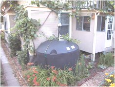 |
| **Rooftop Disconnection** | Has roof downspouts discharge to pervious landscaped areas and lawns instead of directly into storm drains. It can also model roofs with directly connected drains that overflow onto pervious areas. | 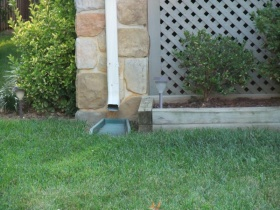 |
| **Vegetative Swales** | Channels or depressed areas with sloping sides covered with grass and other vegetation. They slow down the conveyance of collected runoff and allow it more time to infiltrate into the native soil. | 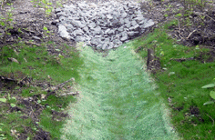|
                             

Bio-retention cells, infiltration trenches, and permeable pavement
systems can contain optional underdrain systems in their gravel storage
beds to convey excess captured runoff off of the site and prevent the
unit from flooding. They can also have an impermeable floor or liner
that prevents any infiltration into the native soil from occurring.
Infiltration trenches and permeable pavement systems can also be
subjected to a decrease in hydraulic conductivity over time due to
clogging. Other LID practices, such as preservation of natural areas,
reduction of impervious cover, and soil restoration, can be modeled by
using SWMM's conventional runoff elements.

LID is a distributed method of runoff source control, that uses surface
and landscape modifications located on or adjacent to impervious areas
that generate most of the runoff in urbanized areas. For this reason
SWMM considers LID controls to be part of its Subcatchment object, where
each control is assigned a fraction of the subcatchment's impervious
area whose runoff it captures. The design variables that affect the
hydrologic performance of LID controls include the properties of the
media (soil and gravel) contained within the unit, the vertical depth of
its media layers, the hydraulic capacity of any underdrain system used,
and the surface area of the unit itself. Although some LID practices can
also provide significant pollutant reduction benefits (Hunt et al.,
2006; Li and Davis, 2009), at this time SWMM only captures the reduction
in runoff mass load resulting from the reduction in runoff flow volume.

Several different approaches have been used in the past to model LID
hydrology. One simple scheme uses the void volume available in the LID
unit (Davis and McCuen, 2005), possibly combined with a modified Curve
Number for LID areas (Prince Georges County, 1999b), to determine what
depth of storm event will be captured. Although useful for initial
sizing, it ignores the effects that varying rainfall intensity and event
frequency have on surface infiltration, soil moisture retention, and
storage capacity. At the other end of the spectrum are detailed soil
physics models, typically based on the Richards equation, that estimate
the flows and moisture levels for a single LID unit over the course of a
rainfall event (see Dussaillant et al., (2004) and He and Davis,
(2011)). These approaches are too computationally intensive to be used
in a general purpose engineering model like SWMM, where hundreds of LID
units might be deployed throughout a large study area. A third approach,
suggested by Huber et al. (2006) is to utilize SWMM's conventional
elements and features, such as internal routing within subcatchments and
multiple storage units connected by flow regulator links, to approximate
the behavior of LID units. Unfortunately, an accurate representation of
LID behavior can require a very complex arrangement of SWMM elements
(see Zhang et al. (2006) and Lucas (2010) for examples). To circumvent
these issues, SWMM 5 treats LID controls as an additional type of
discrete element, using a unit process-based representation of their
behavior (Rossman, 2010) that provides a reasonable level of accuracy
for simulating dynamic rainfall events in a computationally efficient
manner.

###  6.2 Governing Equations

#### 6.2.1 Bio-Retention Cells

A typical bio-retention cell (see panel A of Figure 6-1) will serve as
an example for developing a generic LID performance model. This generic
model can then be customized as need be to describe the behavior of
other types of LID controls.

Conceptually a bio-retention cell can be represented by a number of
horizontal layers as shown in panel B of Figure 6-1. The surface layer
(layer 1) receives both direct rainfall and runoff captured from other
areas. It loses water through infiltration into the soil layer below it,
by evapotranspiration (ET) of any ponded surface water, and by any
surface runoff that might occur. The soil layer (layer 2) contains an
engineered soil mix that can support vegetative growth. It receives
infiltration from the surface layer and loses water through ET and by
percolation into the storage layer below it. The storage layer (layer 3)
consists of coarse crushed stone or gravel. It receives percolation from
the soil zone above it and loses water by infiltration into the
underlying natural soil and by outflow through a perforated pipe
underdrain system if present.

   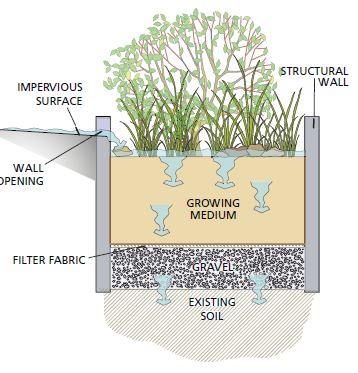    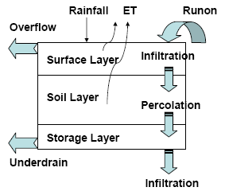
                                         
                  **(A)**                                              **(B)**

**Figure 6‑1 A typical bio-retention cell**

To model the hydrologic performance of this LID unit the following
simplifying assumptions are made:

1.  The cross-sectional area of the unit remains constant throughout its
    depth.

2.  Flow through the unit is one-dimensional in the vertical direction.

3.  Inflow to the unit is distributed uniformly over the top surface.

4.  Moisture content is uniformly distributed throughout the soil layer.

5.  Matric forces within the storage layer are negligible so that it
    acts as a simple reservoir that stores water from the bottom up.

Under these assumptions the LID unit can be modeled by solving a set of
simple flow continuity equations. Each equation describes the change in
water content in a particular layer over time as the difference between
the inflow and the outflow water flux rates that the layer sees,
expressed as volume per unit area per unit time. These equations can be
written as follows:

Surface Layer
$$\phi_{1}\frac{\partial d_{1}}{\partial t} = i + q_{0} - e_{1} - f_{1} - q_{1}$$                  
(6-1)

Soil Layer
$$D_{2}\frac{\partial\theta_{2}}{\partial t} = f_{1} - e_{2} - f_{2}$$                                
(6-2)

Storage Layer
$$\phi_{3}\frac{\partial d_{3}}{\partial t} = f_{2} - {e_{3} - f}_{3} - q_{3}$$                    
(6-3)

where:

  *d1*          =  depth of water stored on the surface (ft),

  *θ2*          =  soil layer moisture content (volume of water / total volume of soil),

  *d3*          =  depth of water in the storage layer (ft),   

  *i*             =  precipitation rate falling directly on the surface layer (ft/sec),

  *q0*          =  inflow to the surface layer from runoff captured from other areas (ft/sec),    

  *q1*          =  surface layer runoff or overflow rate (ft/sec),

  *q3*          =  storage layer underdrain outflow rate (ft/sec),

  *e1*          =  surface ET rate (ft/sec),

  *e2*          =  soil layer ET rate (ft/sec),

  *e3*          =  storage layer ET rate (ft/sec),

  *f1*          =  infiltration rate of surface water into the soil layer (ft/sec),

  *f2*          =  percolation rate of water through the soil layer into the storage layer (ft/sec),

  *f3*          =  exfiltration rate of water from the storage layer into native soil (ft/sec),

                     

  $\phi_{1}$    =  void fraction of any surface volume (i.e., the fraction of freeboard above the surface not filled with vegetation)

  $\phi_{2}$    =  porosity (void volume / total volume) of the soil layer (used later on),

  $\phi_{3}$    =  void fraction of the storage layer (void volume / total volume),

  *D1*          =  freeboard height for surface ponding (ft) (used later on),

  *D2*          =  thickness of the soil layer (ft),

  *D3*          =  thickness of the storage layer (ft) (used later on).
  

The flux terms (*q, e,* and *f*) in these equations are functions of the
current water content in the various layers (*d1, θ2,* and *d3*)
and specific site and soil characteristics. This set of coupled
equations can be solved numerically at each runoff time step to
determine how an inflow hydrograph to the LID unit (*i + q0*) is
converted into hydrographs for surface runoff (*q1*), underdrain
outflow (*q3*), and exfiltration into the surrounding native soil
(*f3*). As applied to a bio-retention cell, this generic model is
similar in spirit to the RECARGA model developed at the University of
Wisconsin -- Madison (Atchison and Severson, 2004) for rain gardens with
no gravel storage zone. How each of the flux terms in Equations 6-1 to
6-3 is computed will now be discussed.

<u>Surface Inflow (*i + q0*)</u>

Inflow to the surface layer comes from both direct rainfall (*i*) and
runoff from impervious areas captured by the bio-retention cell
(*q0*). Within each runoff time step these values are provided by
SWMM's runoff computation as described in Chapter 3 of Volume I of this
manual.

<u>Surface Infiltration (*f1*)</u>

The infiltration of surface water into the soil layer, *f1*, can be
modeled with the Green-Ampt equation:

$$f_{1} = K_{2S}\left( 1 + \frac{\left( \phi_{2} - \theta_{20} \right)(d_{1} + \psi_{2})}{F} \right)$$   
(6-4)

where

  *f1*     =  infiltration rate (ft/sec),
  *K2S*    =  soil's saturated hydraulic conductivity (ft/sec)

  *θ20*    =  moisture content at the top of the soil layer (fraction),

  *ψ2*     =  suction head at the infiltration wetting front formed in the
                soil (ft)

  *F*        =  cumulative infiltration volume per unit area over a storm
                event (ft)

This equation applies only after a saturated condition develops at the
top of the soil zone. Prior to this all inflow (*i + q0*) infiltrates.
The initial value of *θ20* for a dry soil would be its residual
moisture content or its wilting point. It increases after each rainfall
event, then decreases during dry periods. The details of implementing
the Green-Ampt model over successive time steps are described in Chapter
4 of Volume I of this manual. The properties *K2S*, *φ2*, and *ψ2*
for the bio-retention cell's amended soil can be different from those of
the site's natural soil. This can produce a different infiltration rate
into the LID unit when compared to that for rest of the subcatchment.

<u>Evapotranspiration (*e*)</u>

Evapotranspiration (ET) of water stored within the bio-retention cell is
computed from the same user-supplied time series of daily potential ET
rates that are used in SWMM's runoff module (see Chapter 2 of Volume I).
The calculation proceeds from the surface layer downwards, where any
un-used potential ET is made available to the next lower layer. So at
any time *t*:

$$e_{1} = min\left\lbrack E_{0}(t),\ \frac{d_{1}}{\Delta t} \right\rbrack$$                                                                  (6-5)
$$e_{2} = min\left\lbrack E_{0}(t) - e_{1}\ ,\frac{\left( \theta_{2} - \theta_{WP} \right)D_{2}}{\mathrm{\Delta}t} \right\rbrack$$           (6-6)

$$e_{3} = \left\{ \begin{aligned}                                                                                                            (6-7)
         \min\left\lbrack E_{0}(t) - e_{1} - e_{2}\ ,\ \frac{\phi_{3}d_{3}}{\mathrm{\Delta}t} \right\rbrack,\ \ \  & \theta_{2} < \phi_{2} \\   
         0,\ \  & \theta_{2} \geq \phi_{2}                                                                                                      
\end{aligned} \right.\ $$                                                                                                              

where $E_{0}(t)$ is the potential ET rate that applies for time *t*,
*∆t* is the time step used to numerically evaluate the governing flow
balance equations 6-1 to 6-3, and $\theta_{WP}$ is the user-supplied
wilting point soil moisture content. A soil's wilting point is the
moisture content below which plants can no longer extract water from the
soil. Thus when the soil moisture *θ2* reaches the wilting point there
is no contribution to ET from the soil layer.

Note how ET from each layer is limited by the amount of potential ET
remaining and the amount of water stored in the layer. In addition:

- *e3* is zero when the soil zone becomes saturated.

- *e2* and *e3* are zero during periods with surface infiltration
  ($f_{1} > 0$) since it is assumed that the resulting vapor pressure
  will be high enough to prevent any ET from occurring.

<u>Soil Percolation (*f2*)</u>

The rate of percolation of water through the soil layer into the storage
layer below it (*f2)* can be modeled using Darcy's Law in the same
manner used in SWMM's existing groundwater module (see Chapter 5 of
Volume I). The resulting equation for this flux is:

$$f_{2} = \left\{ \begin{aligned}                                                                         (6-8)
         K_{2S}\exp\left( - HCO\left( \phi_{2} - \theta_{2} \right) \right),\ \ \  & \theta_{2} > \theta_{FC} \\   
         0,\ \  & \theta_{2} \leq \theta_{FC}                                                                      
\end{aligned} \right.\ $$                                                                                 

where *K2S* is the soil's saturated hydraulic conductivity (ft/sec),
*HCO* is a decay constant derived from moisture retention curve data
that describes how conductivity decreases with decreasing moisture
content, and *θFC* is the soil's field capacity moisture content. The
same expression for unsaturated soil percolation is used in SWMM's
groundwater module. When the moisture content *θ2* drops below the
field capacity moisture level *θFC* then the percolation rate becomes
zero. This limit is in accordance with the concept of field capacity as
the drainable soil water that cannot be removed by gravity alone
(Hillel, 1982, p. 243).

<u>Bottom Exfiltration (*f3*)</u>

The exfiltration rate from the bottom of the storage zone into native
soil would normally depend on the depth of stored water and the moisture
profile of the soil beneath the LID unit. Since the latter is not known,
SWMM assumes that the exfiltration rate $f_{3}$ is simply the
user-supplied saturated hydraulic conductivity of the native soil
beneath the LID unit, *K3S*. Setting *K~3S\ ~*to zero indicates that
the bio-retention cell has an impermeable bottom.

<u>Underdrain Flow (*q3*)</u>

Because the hydraulics of perforated pipe underdrains can be complicated
(see van Schilfgaarde 1974) SWMM uses a simple empirical power law to
model underdrain outflow *q3*:

$$q_{3} = C_{3D}\left( h_{3} \right)^{\eta_{3D}}$$        
(6-9)

where

  *h3*     =  hydraulic head seen by underdrain, (ft)
    *C3D*    =  underdrain discharge coefficient
                ($\frac{{ft}^{- (\eta_{3D} - 1)}}{\sec}$)

  *η3D*    =  underdrain discharge exponent

The hydraulic head *h3* seen by the underdrain varies with the height
of water above it in the following fashion:

$$h_{3} = 0$$ for $d_{3} \leq D_{3D}$

$$h_{3} = d_{3} - D_{3D}$$ for $D_{3D} < d_{3} < D_{3}$

$$h_{3} = \left( D_{3} - D_{3D} \right) + \frac{\left( \theta_{2} - \theta_{FC} \right)}{\left( \phi_{2} - \theta_{FC} \right)D_{2}}$$ for $d_{3} = D_{3}$ and $\theta_{FC} < \theta_{2} < \phi_{2}$

$$h_{3} = \left( D_{3} - D_{3D} \right) + D_{2} + d_{1}$$ for $d_{3} = D_{3}$ and $\theta_{2} = \phi_{2}$

where *D3D* is the height of drain opening above bottom of storage
layer (ft) and $\theta_{FC}$ is the soil layer's field capacity moisture
content below which water does not drain freely from the soil.

Underdrains introduce three additional parameters *C3D, η3D,* and
*D3D*, into the description of a bio-retention cell. There is no
underdrain flow until the depth of water in the storage layer reaches
the drain offset height. Choosing a value of 0.5 for *η3D* makes the
drain flow formula equivalent to the standard orifice equation, where
*C3D* incorporates both the normal orifice discharge coefficient and
available flow area. Setting *C3D* to zero indicates that no
underdrain is present. The flow rate computed with Equation 6-9 should
be considered a maximum potential value. The actual underdrain flow at
any time step will be the smaller of this value and the amount of water
available to the underdrain.

<u>Surface Runoff (*q1*)</u>

It is assumed that any ponded surface water in excess of the maximum
freeboard (or depression storage) height *D1* becomes immediate
overflow. Therefore:

$$q_{1} = max\left\lbrack \frac{\left( d_{1} - D_{1} \right)}{\mathrm{\Delta}t},\ 0 \right\rbrack$$   
(6-10)

<u>Flux Limits</u>

Limits must be imposed on the various bio-retention cell flux rates to
insure that at any given time step the moisture levels in the soil and
storage layers do not go negative nor exceed the layer's capacity. These
limits are evaluated in the order listed below.

1.  The soil percolation rate *f2* is limited by the amount of
    drainable water currently in the soil layer plus the net amount of
    water added to it over the time step:

$$f_{2} = min\left\lbrack \frac{f_{2}\ ,\left( \theta_{2} - \theta_{FC} \right)D_{2}}{\mathrm{\Delta}t} + f_{1} - e_{2} \right\rbrack$$   
(6-11)

2.  The storage exfiltration rate *f3* is limited by the amount of
    water currently in the storage layer plus the net amount of water
    added to it over the time step:

$$f_{3} = min\left\lbrack \frac{f_{3}\ ,d_{3}\phi_{3}}{\mathrm{\Delta}t} + f_{2} - e_{3} \right\rbrack$$   
(6-12)

3.  When an underdrain is used, the drain flow *q3* is limited by the
    amount of water stored above the drain offset plus any excess inflow
    from the soil layer that remains after storage exfiltration is
    accounted for:

$$q_{3} = min\left\lbrack \frac{q_{3}\ ,{\left( d_{3} - D_{3D} \right)\phi}_{3}}{\mathrm{\Delta}t} + f_{2} - f_{3} - e_{3} \right\rbrack$$   
(6-13)

4.  The soil percolation rate is also limited by the amount of unused
    volume in the storage layer plus the net amount of water removed
    from storage over the time step.

$$f_{2} = min\left\lbrack \frac{f_{2}\ ,{\left( D_{3} - d_{3} \right)\phi}_{3}}{\mathrm{\Delta}t} + f_{3} + q_{3} + e_{3} \right\rbrack$$   
(6-14)

5.  The rate *f1* at which water can infiltrate into the soil layer is
    limited by the amount of empty pore space available plus the volume
    removed by drainage and evaporation over the time step.

$$f_{1} = min\left\lbrack \frac{f_{1}\ ,{\left( \phi_{2} - \theta_{2} \right)D}_{2}}{\mathrm{\Delta}t} + f_{2} + e_{2} \right\rbrack$$   
(6-15)

When the unit becomes completely saturated (i.e., *θ2 = φ2* and
*d3 = D3*) then the vertical flux of water through both the soil and
storage layers has to be the same since there is a common fully wetted
interface between them. For this special case, if
$f_{2} > f_{3} + q_{3}$ then $f_{2} = f_{3} + q_{3}$. Otherwise
$f_{3} = min\left\lbrack f_{3}\ ,f_{2} \right\rbrack$ and
$q_{3} = max\left\lbrack f_{3} - f_{2}\ ,0 \right\rbrack.$ In addition
the surface infiltration rate *f1* cannot exceed the adjusted soil
percolation rate: $f_{1} = min\left\lbrack f_{1},f_{2} \right\rbrack$.
(Note that because the unit is saturated no sub-surface ET occurs and
therefore does not influence these limits.)

It is worth noting that this simple representation of a bio-retention
cell uses a total of 15 user-supplied parameters in its description: two
surface layer parameters (*φ1, D1*) seven soil layer parameters
(*φ2, θFC, θWP, K2S, ψ2, HCO, D2*), three storage layer
parameters *(φ3, K3S*, *D3)* and three underdrain parameters
(*C3D, η3D*, *D3D*). The six constants that define the soil
layer's moisture limits
($\phi_{2},\ {\psi_{2},\ \theta}_{FC},\ \theta_{WP}$) and hydraulic
conductivity ($K_{2S},\ HCO$) are the same parameters used for
infiltration and groundwater flow in SWMM's hydrology module (see
Chapters 4 and 5 of Volume I). Because the soil used in a bio-retention
cell is an engineered mix chosen to provide good drainage and support
plant growth its properties will likely be different than those of the
site's native soil. Recommended values for the various parameters
associated with all types of LID controls will be presented later on in
Section 6.6.

The governing flow balance equations for the other LID controls modeled
by SWMM are similar in form to those for bio-retention cells. The
following sub-sections discuss the models for rain gardens, green roofs,
infiltration trenches, permeable pavement, rain barrels, rooftop
disconnection, and vegetative swales in that order.

#### 6.2.2 Rain Gardens

SWMM defines a rain garden as a bio-retention cell without a storage
layer. Its governing equations are therefore:

Surface Layer  
$$\phi_{1}\frac{\partial d_{1}}{\partial t} = i + q_{0} - e_{1} - f_{1} - q_{1}$$                
(6-16)

Soil Layer
$$D_{2}\frac{\partial\theta_{2}}{\partial t} = f_{1} - e_{2} - f_{2}$$                                
(6-17)

The nominal soil percolation rate *f2* is computed via Equation 6-8.
It is then limited to the smaller of this value, the amount of drainable
water available in the soil layer (Equation 6-11) and the saturated
hydraulic conductivity of the native soil beneath the rain garden
(*K3S*). The remaining flux rates are computed as described earlier.

#### 6.2.3 Green Roofs

SWMM's green roof is also similar to a bio-retention cell, except it
uses a drainage mat instead of gravel aggregate in its storage layer.
Drainage mats are thin, multi-layer fabric mats with ribbed undersides
that convey water. They have somewhat limited water storage and drainage
capacity and are therefore mostly used on sloped roofs. Another type of
roof drainage system also suitable for flatter roofs uses slotted pipes
placed in a gravel bed and is therefore functionally equivalent to a
bio-retention cell with an impermeable bottom ($K_{3S} = 0$) and an
underdrain.

The governing equations for a green roof with a drainage mat would be:

Surface Layer 
$$\phi_{1}\frac{\partial d_{1}}{\partial t} = i - e_{1} - f_{1} - q_{1}$$                 
(6-18)

Soil Layer
$$D_{2}\frac{\partial\theta_{2}}{\partial t} = f_{1} - e_{2} - f_{2}$$                        
(6-19)

Drainage Mat Layer
$$\phi_{3}\frac{\partial d_{3}}{\partial t} = f_{2} - e_{3} - q_{3}$$                 
(6-20)

Note the absence of the captured runoff term *q0* in Equation 6-18
since a green roof would only be capturing direct rainfall. There is
also no exfiltration term *f3* since the bottom of a green roof
consists of an impermeable membrane.

The runoff rate from the soil layer surface (*q1*) is computed using
the Manning equation for uniform overland flow. Under the assumption
that the width of the flow area is much greater than the depth of flow
the Manning equation becomes:

$$q_{1} = \frac{1.49}{n_{1}}\sqrt{S_{1}}(\frac{W_{1}}{A_{1})\phi_{1}\left( d_{1} - D_{1} \right)^{\frac{5}{3}}}$$   
(6-21)

where

  *n1*    =  surface roughness coefficient,

  *S1*    =  surface slope (ft/ft),

  *W1*    =  total length along edge of the roof where runoff is collected (ft),

  *D1*    =  surface depression storage depth (ft),

  *A1*    =  roof surface area (ft2).

All of these surface parameters are supplied by the user as part of the
green roof's design. The "surface" that these parameters describe is the
surface of the soil layer. The $\frac{W_{1}}{A_{1}}$ term represents the
length of the flow path that excess water takes before it enters the
roof's drain system (see Figure 6-2). When the depth of ponded water
*d1* is at or below the depression storage depth *D1* then no
surface outflow occurs.

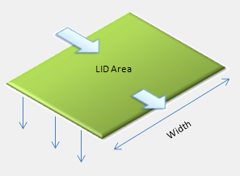

**Figure 6‑2 Flow path across the surface of a green roof**

Another option for surface outflow is to have any ponded surface water
in excess of the depression storage *D1* become instantaneous runoff
using Equation 6-10. This is done by setting either *n1*, *S1*, or
*W1* to zero. This may be a better choice for roofs with short flow
path lengths or flat roofs that use internal roof drains.

The drainage mat flow rate *q3*in Equation 6-20 is assumed to obey
uniform open channel flow within the channels of the mat. Thus it can be
expressed as:

$$q_{3} = \frac{1.49}{n_{3}}\sqrt{S_{1}}(\frac{W_{1}}{A_{1}){\phi_{3}\left( d_{3} \right)}^{\frac{5}{3}}}$$   
(6-22)

where *n3* is a roughness coefficient for the mat and *S1*, *W1*,
and *A1* are the same slope, outflow face width, and roof surface
area, respectively, used to evaluate surface overflow (*q1*).

The remaining flux rates in Equations 6-18 to 6-20 are evaluated in the
same fashion as for the bio-retention cell. In addition, the same flux
limiting conditions for the bio-retention cell (Equations 6-11 through
6-15) are applied to the green roof to insure that the values used for
*f1*, *f2*, and *q3* maintain feasible moisture levels for the
soil and drainage layers after each time step.

#### 6.2.4 Infiltration Trenches

An infiltration trench can be represented in the same fashion as a
bio-retention cell but having just a surface and a storage layer. The
governing equations are:

Surface Layer 
$$\frac{\partial d_{1}}{\partial t} = i + q_{0} - e_{1} - f_{1} - q_{1}$$                       
(6-23)

Storage Layer   
$$\phi_{3}\frac{\partial d_{3}}{\partial t} = f_{1} - {e_{3} - f}_{3} - q_{3}$$               
(6-24)

where now *f1* is the trench's external inflow plus any ponded surface
water that drains into the storage layer over the time step:

$$f_{1} = i + \ q_{0} + \frac{d_{1}}{\mathrm{\Delta}t}$$   
(6-25)

Nominal values for the remaining flux terms are evaluated in the same
fashion as for the bio-retention cell. The surface void fraction *φ1*
does not appear in the surface layer equation since a gravel-filled
trench would have no vegetative growth above it.

These nominal rates are subject to the following constraints:

1.  The storage exfiltration rate *f3* is limited by the amount of
    water currently in the storage layer plus the net amount of water
    added to it over the time step:

$$f_{3} = min\left\lbrack \frac{f_{3}\ ,d_{3}\phi_{3}}{\mathrm{\Delta}t} + f_{1} - e_{3} \right\rbrack$$   
(6-26)

2.  When an underdrain is used, the drain flow *q3* is limited by the
    amount of water stored above the drain offset plus any excess inflow
    from the surface that remains after storage exfiltration is
    accounted for:

$$q_{3} = min\left\lbrack \frac{q_{3}\ ,{\left( d_{3} - D_{3D} \right)\phi}_{3}}{\mathrm{\Delta}t} + f_{1} - f_{3} - e_{3} \right\rbrack$$   
(6-27)

3.  The surface inflow rate *f1* is limited by the amount of empty
    storage layer space available plus the volume removed by
    exfiltration, underdrain flow, and evaporation over the time step:

$$f_{1} = min\left\lbrack \frac{f_{1}\ ,\left( D_{3} - d_{3} \right)\phi_{3}}{\mathrm{\Delta}t} + f_{3} + q_{3} + e_{3} \right\rbrack$$   
(6-28)

#### 6.2.5 Permeable Pavement

Figure 6-3 illustrates a typical continuous permeable pavement system.
It consists of a pervious concrete or asphalt top layer, an optional
sand filter or bedding layer beneath that and a gravel storage layer on
the bottom which can contain an optional slotted pipe underdrain system.
It introduces a new type of layer, a pavement layer (layer 4), which is
characterized by its thickness (*D4*), porosity (*φ4*), and
permeability *K4*. A block paver system would look the same but with
an additional parameter (*F4*) representing the fraction of the
surface area taken up by the impermeable paver blocks and where the
porosity and permeability refer to the fine gravel used to fill the
seams between blocks. For continuous systems *F4* would be 0.

<figure>
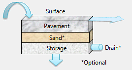
<figcaption>
<strong>Figure 6‑3 Representation of a permeable
pavement system</strong>
</figcaption>
</figure>

The governing equations for permeable pavement with a sand layer
included are:

Surface Layer 
$$\frac{\partial d_{1}}{\partial t} = i + q_{0} - e_{1} - f_{1} - q_{1}$$                                      
(6-29)

Pavement Layer
$$D_{4}\left( 1 - F_{4} \right)\frac{\partial\theta_{4}}{\partial t} = f_{1} - e_{4} - f_{4}$$                 
(6-30)

Sand Layer
$$D_{2}\frac{\partial\theta_{2}}{\partial t} = f_{4} - e_{2} - f_{2}$$
(6-31)                                             

Storage Layer 
$$\phi_{3}\frac{\partial d_{3}}{\partial t} = f_{2} - {e_{3} - f}_{3} - q_{3}$$                                
(6-32)

where $\theta_{4}$ is the moisture content of the permeable pavement
layer, $f_{4}$ is the rate at which water drains out of the pavement
layer, and all other terms have been defined previously. Note that when
no sand layer is present, Equation 6-31 is removed and $f_{4}$ replaces
$f_{2}$ in the storage layer Equation 6-32. Also, the surface void
fraction *φ1* does not appear in the surface layer equation since a
paved surface would have no vegetative growth above it.

The flux terms in these equations are evaluated in the same manner as
for the bio-retention cell with the following exceptions:

1.  Evaporation of any water stored in the pavement layer, *e4*, would
    proceed at the rate:

$$e_{4} = min\left\lbrack E_{0}(t) - e_{1}\ ,\frac{\theta_{4}D_{4}\left( 1 - F_{4} \right)}{\mathrm{\Delta}t} \right\rbrack$$   
(6-33)

with *E0(t)* subsequently reduced by *e4* when ET from the layers
below it is evaluated.

2.  The nominal flux rate from the surface layer into the pavement layer
    (*f1*) is the same as for an infiltration trench:

$$f_{1} = i + \ q_{0} + \frac{d_{1}}{\mathrm{\Delta}t}$$   
(6-34)

3.  The nominal flux rate leaving the pavement layer (*f4*) is equal
    to the pavement's permeability *K4*.

4.  When evaluating underdrain outflow *q3*, once both the storage
    layer and sand layer (if present) become saturated, the head on the
    underdrain becomes:

$$h_{3} = \left( D_{3} - D_{3D} \right) + D_{2} + \frac{\theta_{4}D_{4}}{\phi_{4}}$$   
(6-35)

5.  The flux rate from the surface into the pavement is limited by the
    rate at which the pavement can accept inflow:

The following adjustments are applied to the nominal flux rates in the
order listed so that feasible moisture levels are maintained:

1.  Pavement flux rate *f4* :

$$f_{4} = min\left\lbrack \frac{f_{4}\ ,\theta_{4}D_{4}}{\mathrm{\Delta}t} + f_{1} - e_{4} \right\rbrack$$   
(6-36)

2.  Soil percolation rate *f2* :

$$f_{2} = min\left\lbrack \frac{f_{2}\ ,\left( \theta_{2} - \theta_{FC} \right)D_{2}}{\mathrm{\Delta}t} + f_{4} - e_{4} \right\rbrack$$   
(6-37)

3.  Storage exfiltration rate *f3* :

$$f_{3} = min\left\lbrack \frac{f_{3}\ ,d_{3}\phi_{3}}{\mathrm{\Delta}t} + f_{2} - e_{3} \right\rbrack$$   
(6-38)

> where *f2 = f4* if there is no soil layer.

4.  Underdrain flow *q3* (when present):

$$q_{3} = min\left\lbrack \frac{q_{3}\ ,{\left( d_{3} - D_{3D} \right)\phi}_{3}}{\mathrm{\Delta}t} + f_{2} - f_{3} - e_{3} \right\rbrack$$   
(6-39)

> where again *f2 = f4* if there is no soil layer.

5.  Pavement flux rate *f4* :

with soil layer
$$\frac{f_{4} = min\lbrack f_{4}\ ,\left( \phi_{2} - \theta_{2} \right)D_{2}}{\mathrm{\Delta}t + f_{2} + e_{2}\rbrack}$$                
(6-40)
                                                                                                                                      
without soil layer
$$\frac{f_{4} = min\lbrack f_{4}\ ,\left( D_{3} - d_{3} \right)\phi_{3}}{\mathrm{\Delta}t + e_{3} + f_{3} + q_{3}\rbrack}$$        
(6-41)

6.  Soil percolation rate *f2* :

$$f_{2} = min\left\lbrack \frac{f_{2}\ ,{\left( D_{3} - d_{3} \right)\phi}_{3}}{\mathrm{\Delta}t} + f_{3} + q_{3} + e_{3} \right\rbrack$$   
(6-42)

7.  Pavement inflow rate *f1* :

$$f_{1} = min\left\lbrack f_{1}\ ,\ \frac{\left( \phi_{4} - \theta_{4} \right)D_{4}\left( 1 - F_{4} \right)}{\mathrm{\Delta}t} + f_{4} + e_{4} \right\rbrack$$   
(6-43)

The flux adjustments for fully saturated storage and sand layers follow
those used for a bio-retention cell. When all of the sub-surface layers
become saturated *(θ2* = *φ2*, *d3 = D3* and *θ4 = φ4*), and
the unit is still receiving rainfall/runon then all flux rates are set
equal to the limiting rate. The latter is the smaller of *f1, f4,
f2* (if a sand layer is present), and *f3 + q3*. If the storage
layer does not contain the limiting flux f\*, then its outflow streams
are adjusted as follows:
$q_{3} = min\left\lbrack q_{3}\ ,f^{*} \right\rbrack$ and
$f_{3} = f^{*} - q_{3}$.

#### 6.2.6 Rain Barrels

A rain barrel can be modeled as just a storage layer that is all void
space with a drain valve placed above an impermeable bottom. Only a
single continuity equation is required:

Storage Layer 
$$\frac{\partial d_{3}}{\partial t} = f_{1} - q_{1} - q_{3}$$               
(6-44)

where *f1* now represents the amount of surface inflow captured by the
barrel. Because the barrel is assumed to be covered there is no
precipitation input and no evaporation flux. The general underdrain
equation 6-7 would still be used to compute the barrel's drain flow
*q3*. If the standard orifice equation is used to compute the drain
outflow, then *η3D* in Equation 6-7 would be 0.5 and *C3D* would be:

$$C_{3D} = 0.6\left( \frac{A_{3}}{A_{1}} \right)\sqrt{2g}$$   
(6-45)

where *A1* is the surface area of the barrel, *A3* is the area of
the drain valve opening (ft2) and *g* is the acceleration of gravity
(i.e., 32.2 ft/sec2). The outflow over a time step *∆t* would be
limited by the volume of water stored in the barrel:

$$q_{3} = min\left\lbrack q_{3}\ ,\frac{d_{3}}{\mathrm{\Delta}t} \right\rbrack$$   
(6-46)

SWMM allows the drain valve to be closed prior to a rainfall event and
then opened at some stipulated number of hours after rainfall ceases. If
the valve is closed then *q3* would be 0.

The inflow to the barrel is the smaller of the external runoff *q0*
applied to the barrel and the amount of empty storage available over the
time step:

$$f_{1} = min\left\lbrack q_{0}\ ,\frac{\left( D_{3} - d_{3} \right)}{\mathrm{\Delta}t + q_{3}} \right\rbrack$$   
(6-47)

And finally the barrel overflows at a rate *q1* when the runoff
applied to the barrel exceeds its capacity to accept that amount of
inflow:

$$q_{1} = max\left\lbrack 0\ ,q_{0} - f_{1} \right\rbrack$$   
(6-48)

#### 6.2.7 Rooftop Disconnection

Rooftop areas contained within a SWMM subcatchment are normally treated
as impervious surfaces whose runoff is directly connected to the
subcatchment's storm drain outlet. By using SWMM's overland flow
re-routing option it is possible to disconnect the rooftop area and make
its runoff flow over the subcatchment's pervious area where it has the
opportunity to infiltrate into the soil (see Section 3.6 of Volume I).
The rooftop disconnection LID control provides another alternative to
model rooftop runoff that allows for a higher level of detail than
overland flow re-routing.

Figure 6-4 shows the physical configuration modeled by rooftop
disconnection. Runoff from the roof surface is collected in a drain
system of gutters, downspouts, and leaders. Any flow that exceeds the
capacity of the roof drain system becomes overflow that can be re-routed
onto pervious area. The roof drain flow can also be routed back onto
pervious area (to disconnect the roof) or be sent to a storm sewer to
keep the roof directly connected. Another option, used when modeling
dual drainage systems (both street flow and sewer flow), is to allow the
overflow to contribute to the major (street) system and the roof drain
flow to the minor (sewer) system.

<figure>
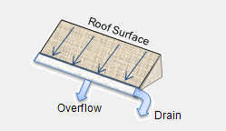
<figcaption>
<strong>Figure 6‑4 Representation of rooftop
disconnection</strong>
</figcaption>
</figure>

To model a rooftop in the same fashion as the other LID controls
requires a single flow continuity equation for the roof surface:

Surface Layer
$$\frac{\partial d_{1}}{\partial t} = i - e_{1} - q_{1} - q_{3}$$                
(6-49)

where now *q3* is interpreted as the flow rate per unit of roof area
through the roof drain system and *q1* is the overflow rate from that
system.

Evaporation from the roof surface (*e1*) is computed in the same
fashion as for the surface of a bio-retention cell (Equation 6-4). The
nominal runoff *q1* from the roof's surface, prior to entering the
roof gutter, is also computed the same as for a green roof. The Manning
equation 6-21 is used if information is provided on the roof's width,
slope, and surface roughness. However now the roughness is for the roof
surface itself and not the growth media found on a green roof. Otherwise
Equation 6-10 is used to convert all flow in excess of any rooftop
depression storage (*D1*) into immediate runoff. The amount of flow
through the roof drain, *q3*, is the smaller of the nominal *q1* and
the flow capacity of the roof drain system (*q3max*):

$$q_{3} = min\left\lbrack q_{1}\ ,q_{3max} \right\rbrack$$   
(6-50)

Note that *q3max* is a user-supplied parameter with units of cfs per
square foot of roof area. The actual overflow rate *q1* is simply the
difference between its nominal rate and *q3*.

#### 6.2.8 Vegetative Swale

As shown in Figure 6-5, SWMM considers a vegetative swale to be a
natural grass-lined trapezoidal channel that conveys captured runoff to
another location while allowing it to infiltrate into the soil beneath
it. It can be modeled with a single surface layer whose continuity
equation is:

Surface Layer
$$A_{1}\frac{\partial d_{1}}{\partial t} = \left( i + q_{0} \right)A - (e_{1} + f_{1})A_{1} - q_{1}A$$            
(6-51)

where *A1* is the surface area at water depth *d1* and *A* is the
user-supplied surface area occupied by the swale across its full height
*D1*. Unlike the other LID controls that were assumed to have a
constant surface area throughout all layers, this equation accounts for
a varying surface area as the depth of water in the swale changes.

<figure>
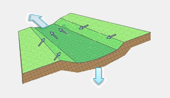
<figcaption>
<strong>Figure 6‑5 Representation of a vegetative
swale</strong>
</figcaption>
</figure>

From simple geometry, the relation between surface area *A1* and depth
of flow *d1* is:

$$A_{1} = \frac{A}{W_{1}}\left\lbrack W_{1} - 2S_{X}\left( D_{1} - d_{1} \right) \right\rbrack$$                             
(6-52)

where *W1* is the width of the swale at its full height *D1* and
*SX* is the slope (run over rise) of its trapezoidal side walls. The
volume of water contained in the swale, *V1*, is the longitudinal
length of the swale, $\frac{A}{W_{1}}$, multiplied by the area of the
wetted cross-section, *AX*:

$$V_{1} = \left( \frac{A}{W_{1}} \right)A_{X}$$           
(6-53)

The wetted cross-sectional area is:

$$A_{X} = d_{1}\left( W_{X} + d_{1}S_{X} \right)\phi_{1}$$   
(6-54)

where *WX* is the width across the bottom of the swale's cross section
(equal to $W_{1} - 2S_{X}D_{1}$) and *φ1* is the fraction of the
volume above the surface not occupied by vegetation.

The volumetric rate of evaporation of surface water in the swale,
$e_{1}A_{1}$, is the smaller of the external potential ET rate,
$E_{0}(t)A_{1}$ and the available volume of surface water over the time
step, $\frac{V_{1}}{\mathrm{\Delta}t}$. Because the swale is assumed to
sit on top of the subcatchment's native soil, the infiltration rate
*f1* is the same value computed for the pervious area of the
subcatchment by SWMM's runoff module (see Chapter 4 of Volume I for
details).

The swale's volumetric outflow rate, *q1A*, is computed using the
Manning equation:

$$q_{1}A = \frac{1.49}{n_{1}}\sqrt{S_{1}}\ A_{X}\ R_{X}^{\frac{2}{3}}$$                             
(6-55)

where *n1* is the roughness of the swale's surface, *S1* is its
slope in the direction of flow, and *RX* is its hydraulic radius (ft).
The latter quantity is given by:

$$R_{X} = \frac{A_{X}}{\left( W_{X} + 2d_{1}\sqrt{1 + S_{X}^{2}} \right)}$$   
(6-56)

To summarize, the parameters required to model a vegetative swale
include its total surface area *A*, its top width *W1*, its maximum
depth *D1*, its surface roughness *n1*, its longitudinal slope
*S1*, the slope of its side walls *S~x~*, and fraction of its volume
not occupied by vegetation *φ1*.

#### 6.2.9 Clogging

Clogging from fine sediment deposited within permeable pavement systems
degrades infiltration rates over time (Ferguson, 2005) and their
surfaces must be periodically vacuumed to maintain their performance
(PWD, 2014). Infiltration trenches are also susceptible to clogging (US
EPA, 1999) and typically require pretreatment with other BMPs, such as
vegetated buffer strips, to remove coarse sediments (MDE, 2009).

SWMM uses a simplified approach to determine how clogging will reduce
the hydraulic conductivity of permeable pavement and of the soil
underneath a gravel storage layer over time. It is based on the
empirically derived model proposed by Siriwardene et al. (2007) and its
linearized form used by Lee et al. (2015). In those models the hydraulic
conductivity of the media in question decreases over time as a
continuous function of the cumulative sediment mass load passing through
it. Because clogging is a long-term phenomenon, cumulative sediment mass
load can be replaced by cumulative inflow volume by assuming a constant
long-term average sediment inflow concentration. This inflow volume can
be adjusted for the amount of void space in the relevant LID layer so
that hydraulic conductivity reduction becomes a function of the number
of the layer's void volumes processed by the LID unit.

If one defines a clogging factor *CF* as the number of layer void
volumes treated to completely clog the layer and assumes a linear loss
of conductivity with number of void volumes treated, then the
conductivity *K* at some time *t* can be estimated as:

$$K(t) = K(0)\left( 1 - \frac{Q(t)V_{void}}{CF} \right)$$   
(6-57)

where *K(0)* is the initial conductivity, *V~void~* is the volume of
void space per unit area in the LID layer, and *Q(t)* is the cumulative
inflow volume (per unit area) to the LID unit up through time *t*. The
latter quantity can be evaluated as:

$$Q(t) = \int_{0}^{t}{\left( i(\tau) + q_{0}(\tau) \right)d\tau}$$   
(6-58)

where $i(\tau) + q_{0}(\tau)$ is the rainfall plus captured runoff
inflow seen by the LID unit at time *τ*.

Applying Equation 6-57 to the storage layer of an infiltration trench
results in using the following value of *K3S* to evaluate the
exfiltration rate from the bottom of the unit at time *t* (via Equation
6-9):

$$K_{3S}(t) = K_{3S}(0)\left( 1 - \frac{Q(t)D_{3}\phi_{3}}{{CF}_{3}} \right)$$   
(6-59)

where *K3S(0)* is the initial saturated hydraulic conductivity of the
soil beneath the bottom of the trench and *CF3* is the clogging factor
for the trench.

Doing the same for the pavement layer of a permeable pavement unit, the
pavement's permeability *K4* at time *t* would be:

$$K_{4}(t) = K_{4}(0)\left( 1 - \frac{Q(t)D_{4}\phi_{4}\left( 1 - F_{4} \right)}{{CF}_{4}} \right)$$   
(6-60)

where *K4(0)* is the pavement's permeability at time 0 and *CF4* is
the pavement's clogging factor.

This simple clogging model requires only a single user-supplied
parameter for each LID control that is subject to clogging, namely its
clogging factor CF. If no value is provided (or its value is set to 0)
then clogging is ignored.

### 6.3 LID Deployment

Before discussing the computational steps used to solve the governing
LID equations it will be useful to describe the various options
available for deploying LID controls within a SWMM project. Utilizing
LID controls is a two phase process that first creates a set of
scale-independent LID designs and then assigns any desired mix and
sizing of these designs to selected subcatchments. Because all
calculations are made on a per unit area basis, this approach also
allows one to treat replicate units of a given design (e.g., forty
50-gallon rain barrels) as if it were one larger LID unit.

There are two different approaches for placing LID controls within the
subcatchments of a SWMM model:

1.  One or more controls are assigned to an existing subcatchment. Each
    control receives some specified fraction of the runoff generated by
    the subcatchment's impervious area.

2.  A single LID control (or replicate units of the same design)
    occupies the full area of a subcatchment. Its inflow consists of
    direct rainfall plus runoff from any upstream subcatchments
    connected to the subcatchment containing the LID unit.

The first approach would typically be used in larger, area-wide studies
where a mix of controls would be deployed over many different
subcatchments. The second approach might apply to smaller study areas
where detailed analysis of a particular LID treatment train would be
desired.

If a subcatchment with multiple LID units receives runoff from upstream
subcatchments then that flow is first distributed uniformly over the
pervious and impervious areas. The resulting impervious area runoff is
then routed onto the various LID units. The options for routing any
surface overflow and underdrain flow generated by an LID unit can be
summarized as follows:

1.  The default is to send these flows to the parent subcatchment's
    outlet destination.

2.  If so desired, underdrain flow from each unit can be routed to a
    separate destination.

3.  Another option, particularly appropriate for rain barrels, is to
    route the unit's entire outflow back onto the subcatchment's
    pervious area.

Figure 6-6 illustrates some the options available for placing LID
controls. Panel A of the figure shows a subcatchment containing two
different types of controls, each receiving a different fraction of the
subcatchment's impervious area runoff. LID1 contains an underdrain while
LID2 does not. Any surface or underdrain flows from the units are sent
to the same outlet node that was designated for the subcatchment as a
whole. Panel B is similar to Panel A except that LID1 sends its
underdrain flow to a different outlet than the subcatchment as a whole.
In Panel C of the figure, LID1 now sends its surface overflow and
underdrain flow back to the subcatchment's pervious area. Finally Panel
D illustrates the case of two LID units in series, where each unit
occupies its entire subcatchment. The inflow to LID1 comes from an
upstream subcatchment and its surface overflow is routed to LID2. Its
underdrain flow is sent to the same outlet location used by LID2.

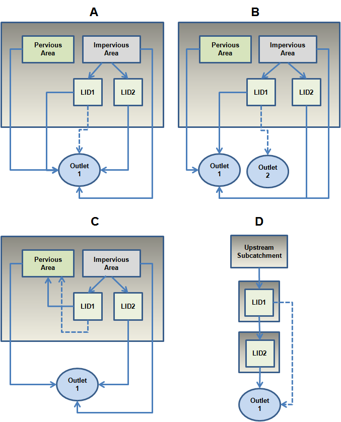

**Figure 6‑6 Different options for placing LID controls**

### 6.4 Computational Steps

LID computations are a sub-procedure of SWMM's runoff calculations. They
are made at each runoff time step, for each subcatchment that contains
LID controls, immediately after the runoff from the non-LID portions
(both pervious and impervious) of the subcatchment have been found and
before any groundwater calculations are made (see Section 3.4 of Volume
I). The computations for an individual LID unit include the following
four steps:

1.  Determine the amount of inflow ($i + q_{0}$) treated by the LID
    unit.

2.  Evaluate the various flux terms (*e, f* and *q*) on the right-hand
    side of the applicable flow continuity equations.

3.  Solve the continuity equations for the new value of each layer's
    moisture level at the end of the time step.

4.  Add the unit's surface runoff (*q1*), infiltration (*f3*), and
    underdrain flow (*q3*) to the subcatchment's totals.

The process of determining the inflow to the LID unit in step 1 depends
on whether the unit comprises only a portion of its subcatchment's area
or if it occupies the entire subcatchment. In the former case the runoff
rate *q0* treated by the unit can be computed as:

$$q_{0} = q_{imp}F_{out}R_{LID}$$                         
(6-61)

where

  *qimp*    =  total impervious area runoff rate (ft/sec),

  *Fout*    =  fraction of impervious area runoff routed to the subcatchment's outlet,

  *RLID*    =  capture ratio of the LID unit.

Note that *Fout* accounts for the possibility that the user has
assigned some portion of the subcatchment's impervious area runoff to be
re-routed onto its pervious area using SWMM's overland flow re-routing
option (explained in Section 3.6 of Volume I). When there is no internal
re-routing (or disconnecting) of impervious area *Fout* is equal to
1.0. Also introduced is a new parameter, the LID unit's capture ratio
*RLID*. It is defined as the amount of the subcatchment's impervious
area that is directly connected to the LID unit divided by the area of
the LID unit itself.

When a single LID unit occupies the entire subcatchment *q0* is
comprised of any external overland flow routed onto the subcatchment.
Such flow can consist of runoff originating from other upstream
subcatchments as well as any underdrain flow from other LID units routed
onto the subcatchment.

Step 2 of the computational procedure evaluates the flux terms on the
right hand side of the governing continuity equation for each layer of
the LID unit being analyzed. These terms depend on the current moisture
level stored in each layer. Section 6.2 has discussed in detail how each
flux term is computed. Recall that evapotranspiration is evaluated
first, moving from the top to the bottom of the LID unit. The remaining
flux terms are then evaluated in the opposite direction, moving from the
bottom to the topmost layer of the unit.

Step 3 integrates the governing continuity equations over a single time
step to find new values for the moisture content in each of the LID
unit's layers. Let ***x*** be the vector of the layer moisture contents,
where ***x*** = \[*φ1d1, D2θ2, φ3d3, D4(1-F4)θ4*\],
and let ***Γ*** = \[*Γ1, Γ2, Γ3, Γ4*\] be the vector of the net
flux (inflow minus outflow) of water through each layer (i.e., the right
hand side value of each layer's continuity equation). If a particular
layer *i* does not apply to a given LID unit, such as the soil layer for
a rain barrel, then both *xi* and *Γi*would be zero. Now the flow
continuity equations can be written more compactly as:

$$\frac{\partial\mathbf{x}}{\partial t} = \mathbf{\Gamma}(\mathbf{x(}t\mathbf{)})$$   
(6-62)

where in general ***Γ*** is a nonlinear function of ***x***.

This system of equations can be solved numerically by using the
trapezoidal method (Ascher and Petzold, 1998) to discretize them in time
as follows:

$$\mathbf{x}(t + \mathrm{\Delta}t) = \mathbf{x}(t)\mathbf{+}\left\lbrack \Omega\mathbf{\Gamma}(\mathbf{x}(t + \mathrm{\Delta}t)\mathbf{+ (}1 - \Omega\mathbf{)\Gamma}(\mathbf{x}(t)\mathbf{)} \right\rbrack\mathbf{\mathrm{\Delta}}t$$   
(6-63)

where *Ω =* 0.5 and ∆t is the wet hydrologic time step used for
computing runoff. (See Section 3.5 of Volume I for a discussion of
SWMM's runoff time steps.) This equation makes the new moisture content
in the LID unit equal to the previous moisture content plus the average
net flow volume occurring over the time step. At time 0 the moisture
content in the LID unit's soil and storage layers is set to a
user-supplied percent of saturation while the other layer moisture
levels 00start at 0.

Because ***Γ**(**x**(t+∆t))* appearing on the right hand side of
Equation 6-55 depends on the unknown new moisture content, an iterative
method must be used to solve the equation. Let ***x**(t+∆t)ν* be the
estimate of ***x**(t+∆t)* at iteration *ν*, where initially
***x**(t+∆t)0 = **x**(t)*. (Note that *ν* is an iteration counter, not
a power.) Then for iteration *ν+1* the new estimate of ***x**(t+∆t)* is:

$$\mathbf{x}{(t + \mathrm{\Delta}t)}^{\nu + 1}\mathbf{= x}(t)\mathbf{+}\left\lbrack \Omega\mathbf{\Gamma}(\mathbf{x}(t + \mathrm{\Delta}t)^{\nu}\mathbf{+ (}1 - \Omega\mathbf{)\Gamma}(\mathbf{x}(t)\mathbf{)} \right\rbrack\mathbf{\mathrm{\Delta}}t$$   
(6-64)

with the iterations stopping when the change in ***x**(t+∆t)* is
sufficiently small. SWMM uses a tolerance of 0.00328 feet (or 1.0
millimeter) as a stopping tolerance.

If *Ω* is chosen as 0, then Equation 6-64 becomes equivalent to the
Euler method and thus:

$$\mathbf{x}(t + \mathrm{\Delta}t) = \mathbf{x}(t)\mathbf{+ \Gamma}(\mathbf{x}(t))\mathbf{\mathrm{\Delta}}t$$   
(6-65)

which can be solved directly without resorting to any iterative scheme.
Numerical testing has shown that the simpler Euler method works well
with all types of controls except for vegetative swales. The latter
requires the iterative trapezoidal method with a *Ω* of 0.5 to produce
results with acceptable continuity errors.

When using either Equation 6-64 or 6-65 to update the LID unit's
moisture state at each time step, the following lower and upper physical
limits on moisture levels must be enforced:

$$0 \leq d_{1} \leq D_{1}$$                                

$$\theta_{WP} \leq \theta_{2} \leq \phi_{2}$$              

$$0 \leq d_{3} \leq D_{3}$$                                

$$0 \leq \theta_{4} \leq \phi_{4}$$                        

Finally, Step 4 merges the outflows from the LID unit with those of the
subcatchment as a whole. Any infiltration into the native soil produced
by the LID unit is added onto the total infiltration for the
subcatchment, which is eventually passed onto SWMM's groundwater module.
Any underdrain flow from the LID unit is kept track of separately, so
that it can be routed to its designated destination (either another
subcatchment or some location in the conveyance system). It is not
included as part of the subcatchment's reported surface runoff. Any
surface runoff or overflow from the unit $\left( q_{1}A \right)$ is
added to the subcatchment's total runoff flow rate, except if the unit's
outflow has been designated for return to the subcatchment's pervious
area. In the latter case a separate account is kept of the total return
flow and the LID surface flow is added to it.

As regards to water quality, no explicit changes in constituent
concentrations are computed as runoff passes through or over an LID
control. A subcatchment's pollutant washoff concentration is computed as
described in Section 4.3, as if no LID controls existed. Any surface
outflow or underdrain flow from each of the subcatchment's LID controls
is assigned this concentration.

There are two exceptions to this convention. One applies when the LID
units take up less than the full area of the subcatchment and a
pollutant has a non-zero rainfall concentration. In that case the
washoff load from the non-LID portion of the subcatchment (which already
accounts for any wet deposition) is combined with the direct rainfall
load from the LID areas to arrive at a modified outflow concentration:

$$C_{out} = \frac{\left\lbrack \left( C_{out}Q_{out} \right)_{non - LID} + C_{ppt}iA_{LID} \right\rbrack}{Q_{out,non - LID} + iA_{LID}}$$   
(6-66)

where

  *Cout*            =  concentration of a pollutant in the subcatchment's outflow streams after LID treatment (mass/L),

  *Cout,non-LID*    =  concentration of a pollutant in the subcatchment's outflow streams prior to LID treatment (mass/L),

  *Qout,non-LID*    =  surface runoff flow rate leaving the subcatchment prior to any LID treatment (cfs),

  *Cppt*            =  concentration of the pollutant in rainfall (mass/L),

  *i*                 =  rainfall rate (ft/sec),

  *ALID*            =  total surface area of all LID units in the subcatchment (ft2).

The second exception is when a single LID unit occupies its entire
subcatchment. In that case there would be no washoff load generated by
any non-LID surfaces and the pollutant concentration in the unit's
outflow streams would equal that of its inflow stream. Thus for any
particular pollutant,

$$C_{out} = \frac{\left( \left( \frac{W_{runon}}{28.3} \right) + C_{ppt}iA_{LID} \right)}{Q_{runon} + iA_{LID}}$$   
(6-67)

where *Qrunon* is the combined runoff flow rate (cfs) of all upstream
subcatchments routed onto the LID subcatchment, *W~runon~* is the total
pollutant load (mass/sec) contained in this runoff inflow, and the
factor 28.3 converts from cubic feet to liters.

Thus although an LID control does not modify the concentration of a
water quality constituent it sees in its inflow stream, it does reduce
the total pollutant load passed on to downstream locations in direct
proportion to the reduction in runoff it produces. When a storm is
completely captured by an LID unit its effective pollutant removal
efficiency is 100 percent.

### 6.5 Parameter Estimates

The variety of LID controls modeled by SWMM introduces a significant
number of design variables and parameters that must be assigned values
by the user. These include sizing parameters (surface area, layer
depths, and capture ratio), surface parameters (freeboard depth, outflow
face width, slope, and roughness), soil parameters (moisture limits and
hydraulic conductivity), pavement parameters (void ratio and
permeability), storage parameters (void ratio and native soil
conductivity), drain parameters (discharge coefficient and exponent,
roof drain capacity, and drain mat roughness), and clogging parameter.
Because of the high interest and acceptance of LID, many local and state
agencies have prepared design manuals that recommend ranges for many key
parameters. Table 6-1 lists a selection of these manuals, all available
online. Unless otherwise noted, these manuals served as the source of
the LID parameter values described in the sub-sections that follow.

#### 6.5.1 Bio-Retention Cells and Rain Gardens

Table 6-2 lists ranges of parameter values for bio-retention cells and
rain gardens, expressed in their typical US units of inches and hours.
They are internally converted to feet and seconds for use in the
governing conservation equations.

The soil moisture limits in the table are based on ranges computed for
sand, loamy sand, and sandy loam textures using the SPAW model (Saxton
and Rawls, 2006) with organic contents ranging between 2.5 and 8%. The
model can be used to estimate specific limits from knowledge of a soil's
sand, clay and organic content. For example, a typical engineered soil
might consist of 85% sand, 5% clay and 5% organic matter by weight.
Using the SPAW calculator for this soil produces the characteristics
listed in Table 6-3. The percolation decay constant *HCO* was estimated
by using the calculator to compute hydraulic conductivity *K2* for a
range of moisture contents *θ* and then regressing
$- ln\left( \frac{K_{2}}{K_{2S}} \right)$ against $\phi_{2} - \theta$ to
find a best-fit value for *HCO*. The equation used to estimate suction
head was introduced in Section 4.4 of Volume I.

**Table 6-1 Design manuals used as sources for LID parameter values**

| Organization | Manual Title | Year | URL |
|---|---|---|---|
| Prince Georges County Maryland | Low-Impact Development Design: An Integrated Design Approach | 1999 | <http://water.epa.gov/polwaste/green/upload/lidnatl.pdf> |
| Denver Urban Drainage and Flood Control District | Urban Storm Drainage Criteria Manual, Volume 3 Best Management Practices | 2010 | <http://udfcd.org/wp-content/uploads/uploads/vol3%20criteria%20manual/USDCM%20Volume%203.pdf> |
| Toronto and Region Conservation Authority | Low Impact Development Stormwater Management Planning and Design Guide | 2010 | <http://www.creditvalleyca.ca/wp-content/uploads/2014/04/LID-SWM-Guide-v1.0_2010_1_no-appendices.pdf> |
| Washington State University Extension | Low Impact Development Technical Guidance Manual for Puget Sound | 2012 | <http://www.psp.wa.gov/downloads/LID/20121221_LIDmanual_FINAL_secure.pdf> |
| District of Columbia | Stormwater Management Guidebook | 2013 | <http://doee.dc.gov/swguidebook> |
| Philadelphia Water Department | Stormwater Management Guidance Manual, Version 2.1 | 2014 | <http://www.pwdplanreview.org/upload/pdf/Full%20Manual%20%28Manual%20Version%202.1%29.pdf> |
| University of New Hampshire Stormwater Center | UNHSC Design Specifications for Porous Asphalt Pavement and Infiltration Beds | 2014 | <http://www.unh.edu/unhsc/sites/unh.edu.unhsc/files/pubs_specs_info/unhsc_pa_spec_10_09.pdf> |
| NY State Department of Environmental Conservation | Stormwater Management Design Manual | 2015 | <http://www.dec.ny.gov/docs/water_pdf/swdm2015entire.pdf> |

**Table 6-2 Typical ranges for bio-retention cell parameters**

| **Parameter** | **Range** |
|-|-|
| Maximum Freeboard, inches (*D1*) | 6 -- 12 |
| Surface Void Fraction (*φ1*) | 0.8 -- 1.0 |
| Soil Layer Thickness, inches (*D2*) | 24 -- 48 |
| **Soil Properties:** | |
| > Porosity (*φ2*) | 0.45 -- 0.6 |
| > Field Capacity (*θFC*) | 0.15 -- 0.25 |
| > Wilting Point *(θWP*) | 0.05 -- 0.15 |
| > Saturated Hydraulic Conductivity, in/hr (*K2S*) | 2.0 -- 5.5 |
| > Wetting Front Suction Head, inches (*ψ2*) | 2 -- 4 |
| > Percolation Decay Constant (*HCO*) | 30 -- 55 |
| Storage Layer Thickness, inches (*D3*) | 6 -- 36 |
| Storage Void Fraction (*φ3*) | 0.2 -- 0.4 |
| Capture Ratio (*RLID*) | 5 -- 15 |

**Table 6-3 Soil characteristics for a typical bio-retention cell soil**

| **Soil Property** | **Value** |
|-----|-|
| Porosity (*φ2*) | 0.52 |
| Field Capacity (*θFC*) | 0.15 |
| Wilting Point *(θWP*) | 0.08 |
| Saturated Hydraulic Conductivity, in/hr (*K2S*) | 4.7 |
| Percolation Decay Constant (*HCO*) | 39.3 |
| Wetting Front Suction Head, inches (*ψ2 = 3.23(K2S*)-0.328) | 1.9 |

#### 6.5.2 Green Roofs

Typical ranges of parameter values for Green Roofs are listed in Table
6-4. These are for extensive green roofs of relatively shallow
thickness.

**Table 6-4 Typical ranges for green roof parameters**

| **Parameter** | **Range** |
|-|-|
| Maximum Freeboard, inches (*D1*) | 0 -- 3 |
| Surface Void Fraction (*φ1*) | 0.8 -- 1.0 |
| Soil Layer Thickness, inches (*D2*) | 2 -- 6 |
| **Soil Parameters:** | |
| > Porosity (*φ2*) | 0.45 -- 0.6 |
| > Field Capacity (*θFC*) | 0.3 -- 0.5 |
| > Wilting Point (*θWP*) | 0.05 -- 0.2 |
| > Plant Available Water (*θFC* - *θWP*) | 0.25 -- 0.3 |
| > Saturated Hydraulic Conductivity, in/hr (*K2S*) | 40 -- 140 |
| > Wetting Front Suction Head, inches (*ψ2*) | 2 -- 4 |
| > Percolation Parameter (*HCO*) | 30 -- 55 |
| Drainage Layer Thickness, inches (*D3*) | 0.5 -- 2 |
| Drainage Layer Void Fraction (*φ3*) | 0.2 -- 0.4 |
| Drainage Layer Roughness (*n3*) | 0.01 -- 0.03 |
| Capture Ratio (*RLID*) | 0 |

The "soil" used as a growth media for green roofs is very different from
naturally occurring soils. It is an engineered mixture of aggregate
(such as expanded slate or shale, pumice, or zeolite), sand, and organic
matter producing a light weight product with high porosity and water
holding capacity. There is a limited amount of information on the
standard agronomic properties of such mixtures. The moisture limits and
conductivity values listed in Table 6-4 are based on a literature review
provided by Perelli (2014). When compared to the properties for
bio-retention cell media, the green roof media's hydraulic conductivity
is much higher. The ranges for suction head and the percolation
parameter were defaulted to those typical of loam and sandy loam soils.
The capture ratio for a green roof should be 0 since its only inflow is
direct rainfall.

#### 6.5.3 Infiltration Trenches

Suggested ranges for the parameters associated with infiltration
trenches are listed in Table 6-5. Because there is no soil layer to slow
down and retain water in excess of gravity drainage, the trench acts as
a simple "storage pit" whose change in stored volume over a given time
step is simply the difference between the captured runoff/rainfall rate
entering through its surface and the rate of exfiltration leaving
through its bottom (assuming no underdrain).

**Table 6-5 Typical ranges for infiltration trench parameters**

| **Parameter** | **Range** |
|-|-|
| Maximum Freeboard, inches (*D1*) | 0 -- 12 |
| Surface Void Fraction (*φ1*) | 1.0 |
| Storage Layer Thickness, inches (*D3*) | 36 -- 144 |
| Storage Void Fraction (*φ3*) | 0.2 -- 0.4 |
| Contributing Area, acres | 1 -- 5 |
| Capture Ratio (*RLID*) | 5 -- 20 |

#### 6.5.4 Permeable Pavement

Table 6-6 lists typical parameter ranges for permeable pavement
installations. The maximum storage height on the surface layer, *D1*,
now represents the depth of depression storage on the pavement surface.
Its suggested range is characteristic of impervious surfaces in general
(ASCE, 1992). The pavement layer properties in the table distinguish
between continuous concrete or asphalt pavement systems and block paver
systems.

UNHSC (2009) recommends that the optional sand filter layer be composed
of coarse sand/fine gravel (bank run gravel). It aids in pollutant
removal and in slowing down the movement of water through the unit.
Because of the very high conductivity of permeable pavement, with no
sand layer present the unit acts in the same manner as an infiltration
trench whose change in water level over each time step is simply the
difference between the applied surface inflow rate and the exfiltration
rate out of the bottom (assuming no underdrain).

**Table 6-6 Typical ranges for permeable pavement parameters**

| **Parameter** | **Range** |
|-|-|
| Surface Depression Storage, inches (*D1*) | 0 -- 0.1 |
| Surface Void Fraction (*φ1*) | 1.0 |
| Pavement Thickness, inches (*D4*) | 3 -- 8 |
| **Continuous Pavement:** | |
| > Porosity (*φ4*) | 0.15 -- 0.25 |
| > Permeability, in/hr (*K4*) | 28 -- 1750 |
| > Surface Opening Fraction (*1 -- F4*) | 0 |
| **Block Pavers:** | |
| > Porosity (*φ4*) | 0.1 -- 0.4 |
| > Permeability, in/hr (*K4*) | 5 -- 150 |
| > Surface Opening Fraction (*1 -- F4*) | 0.08 -- 0.10 |
| **Sand Filter Layer:** | |
| > Thickness, inches (*D2*) | 8 -- 12 |
| > Porosity (*φ2*) | 0.25 -- 0.35 |
| > Field Capacity (*θFC*) | 0.15 -- 0.25 |
| > Wilting Point *(θWP*) | 0.05 -- 0.10 |
| > Saturated Hydraulic Conductivity, in/hr (*K2S*) | 5 -- 30 |
| > Wetting Front Suction Head, inches (*ψ2*) | 2 -- 4 |
| > Percolation Parameter (*HCO*) | 30 -- 55 |
| Storage Layer Thickness, inches (*D3*) | 6 -- 36 |
| Storage Void Fraction (*φ3*) | 0.2 -- 0.4 |
| Capture Ratio (*RLID*) | 0 -- 5 |

#### 6.5.5 Rain Barrels

The Rain Barrel LID control can be used to model both rain barrels and
cisterns. Rain barrels are typically 50 to 100 gallons in capacity and
are used at individual home lots to collect roof runoff for possible
landscape irrigation. Cisterns have much larger capacity, typically from
250 to 30,000 gallons, used to harvest rainwater from both homes and
commercial facilities for non-potable indoor use. The parameters
required for Rain Barrels/Cisterns are the height of the storage vessel
(*D3*), its volume (from which its surface area *A~LID~* can be
derived), its drain parameters, and possibly its drain delay time.

The height and volume of the rain barrel/cistern would be determined by
commercially available sizes. The drain offset is typically 6 inches
from the bottom (to trap sediment). Alternatively, one could use an
offset of 0 and reduce the vessel height accordingly.

The drain flow parameters can be established from the orifice equation
(Equation 6-38). The flow exponent would be 0.5 and the flow coefficient
would be 4.8 times the ratio of the drain diameter to the barrel
diameter squared. The latter quantity has units of ft0.5/sec. To
convert to the in0.5/hr (or mm0.5/hr) used in SWMM's input data set
multiply by 12,471 (or 62,768).

As an example, a 2-foot diameter rain barrel with a 3/4 inch spigot
would have a drain flow coefficient of 4.8 × (0.75 / (2×12))2 × 12,471
= 58.5 in0.5/hr. This is high enough to drain 4 feet of captured water
(94 gallons) in less than 15 minutes. A slower release rate for
landscape irrigation can be achieved by leaving the spigot valve only
partially open or by using a soaker hose. This action can be simulated
by using a reduced drain diameter when computing a drain flow
coefficient.

The drain delay time is the period of time after rainfall ceases until
the rain barrel is allowed to drain. If the delay time is set to 0 then
the drain line is considered to be always open. This option might be
appropriate for modeling rainwater harvesting with larger cisterns.
Otherwise a choice of delay time will depend on what assumptions one
makes about homeowner behavior.

#### 6.5.6 Rooftop Disconnection

The parameters required for rooftop disconnection are the length of the
flow path for roof runoff (the inverse of the W1/A1 term in Equation
6-21), the roof slope, the roughness coefficient for the roof surface,
the depression storage depth of the roof's surface, and the flow
capacity of the roof drain system (*q3max*).

The flow path length and its slope are obtained directly from the roof's
dimensions. Roughness coefficients for roofing material would be similar
to those for asphalt and clay tile, 0.013 to 0.016. Depression storage
would range from 0.05 to 0.1 inches with sloped roofs at the low end of
this range and flat roofs having possibly higher values. The flow
capacity of the roof's gutters in ft/sec can be estimated from the
following equations (Beij, 1934):

for semicircular gutters 
$$q_{3max} = 0.52\frac{w_{g}^{2.5}}{A_{r}}$$                                                    
(6-68)

for rectangular gutters                                                                                                                           
$$q_{3max} = 7.75\left( \frac{d_{g}}{w_{g}} \right)^{1.6}\left( \frac{w_{g}}{L_{g}} \right)^{0.3}w_{g}^{2.5}/A_{r}$$     
(6-69)                                                                                              

where *wg* is the gutter width in feet, *d~g~* is the gutter depth in
feet, *Ar* is the area of the roof serviced by the gutter in square
feet, and *Lg* is the length of the gutter in feet. To convert
*q3max* to the in/hr or mm/hr required by the SWMM 5 input format,
multiply by 43,200 or 1,097,280, respectively.

#### 6.5.7 Vegetative Swales

Typical values for the parameters associated with vegetative swales are
listed in table 6-7. The top width of the swale at full depth (*W1*)
equals $W_{X} + 2D_{1}S_{X}$. The maximum surface area covered by the
swale (*A~LID~*) can be found by multiplying *W1* by the length of the
swale.

**Table 6-7 Typical ranges for vegetative swale parameters**

| **Parameter** | **Range** |
|-|-|
| Maximum Depth, feet (*D1*) | 0.5 -- 2.0 |
| Surface Void Fraction (*φ1*) | 0.8 - 1.0 |
| Bottom Width, feet (*WX*) | 2.0 -- 8.0 |
| Surface Slope, percent (*S1*) | 0.5 -- 3.0 |
| Side Slope, horizontal : vertical (*SX*) | 2.5 : 1 -- 4 : 1 |
| Surface Roughness (*n1*) | 0.03 -- 0.2 |
| Capture Ratio (*RLID*) | 5 -- 10 |

#### 6.5.8 Underdrains

Underdrains are either recommended or required when the natural soil
infiltration rate is insufficient to prevent the LID unit from flooding.
There are three user-supplied parameters that describe underdrain flow:
a discharge coefficient (*C3D*), a discharge exponent (*η3D*), and a
drain offset height (*DD3*). While the drain offset is part of the
cell's physical design, the discharge coefficient and exponent must be
inferred from the hydraulics of underdrain flow. There are several
approaches that can be used for this:

1.  Assume the flow rate is limited by the flow capacity of the slotted
    pipe used as the underdrain.

2.  Assume the flow rate is limited by the rate at which water can enter
    the slots in the drain pipes.

3.  Assume the flow rate is limited by a flow restriction (such as a
    throttling valve or cap orifice) on the drain's discharge line.

To use option 1, the full flow capacity of the drain pipe can be
computed from the Manning equation as follows:

$$Q_{full} = \left( \frac{0.464}{n_{pipe}} \right)S_{pipe}^{0.5}D_{pipe}^{2.67}$$   
(6-70)

where *Qfull* is the flow rate (cfs), *npipe* is the roughness
coefficient for the pipe's material, *Spipe* is the slope at which the
pipe is laid (ft/ft), and *Dpipe* is the pipe's diameter (ft). To
convert this value into a set of underdrain discharge parameters, set
the drain exponent *η3D* to zero and the drain coefficient *C3D* to

$$C_{3D} = \frac{N_{pipe}Q_{full}}{A_{LID}}$$             
(6-71)

where *Npipe* is the number of drain pipes in the unit and *ALID* is
the area (ft2) of the unit. Because *η3D* is zero, the units of
*C3D* are ft/sec. To convert these to the in/hr or mm/hr required by
the SWMM 5 input format, multiply by 43,200 or 1,097,280, respectively.

As an example, using this method to specify the underdrain parameters
for two 4-inch diameter plastic drain lines with roughness of 0.01
placed at a 0.5% slope in a 1,000 sq. ft. bio-retention cell would
produce a drain coefficient equal to

$$C_{3D} = \frac{2\left( \frac{0.464}{0.01} \right){(0.005)}^{0.5}{(\frac{4}{12)}}^{2.67}}{1000} = 0.00035\ \frac{ft}{\sec} = 15\ \frac{in}{hr}$$

Once the water height in the storage layer reaches the drain's offset
height, any inflow from percolation out of the soil layer will
immediately flow out of the underdrain as long as its flow rate is below
15 in/hr (as per Equation 6-8) and the storage volume above the offset
height will never be used.

For option 2, one can assume that the standard orifice equation can
replace the underdrain flow expression Equation 6-7 so that:

$$q_{3} = C_{3D}\left( h_{3} \right)^{0.5}$$              
(6-72)

where the discharge exponent *η3D* has been set to 0.5 and the
discharge coefficient now becomes:

$$C_{3D} = 0.6\sqrt{2g}\left( \frac{A_{slot}}{A_{LID}} \right)$$   
(6-73)

with *Aslot* being the total area (ft2) of the slots in the drain
pipe and *g* the acceleration of gravity (32.2 ft/sec2). Note that the
units of *C3D* are ft0.5/sec so when used in Equation 6-63 the
resulting underdrain flux has units of ft/sec (or cfs/ft2). To convert
*C3D* to in0.5/hr, which are the US units used in the program's
input, one would multiply by 12,471. To convert to mm0.5/hr for SI
units, multiply by 62,852.

The ratio of the total slot area to LID area can be determined from the
dimensions of a slot, the spacing between slots along the drain pipe,
and the spacing between individual drain pipes:

$$\frac{A_{slot}}{A_{LID} =}\frac{N_{pipe}{N_{slot}A}_{slot}}{\left( N_{pipe} + 1 \right)\Delta_{pipe}}$$   
(6-74)

where

  *Npipe*    =  number of underdrain pipes

  *Nslot*    =  number of slots per length of pipe (ft-1)

  *Aslot*    =  area of a single slot (ft2)

  *∆pipe*    =  spacing between pipes (ft)

As an example, consider an underdrain system consisting of two slotted
pipes with inlet area of 1 in2 per foot of pipe spaced 50 ft apart.
The area ratio used to compute *C3D* would be:

$$\frac{A_{slot}}{A_{LID} = \frac{2 \times \left( \frac{1}{144} \right)}{(3 \times 50) = 0.0000926}}$$   

Using this value in Equation 6-64 to compute *C3D* produces:

$$C_{3D} = 0.6 \times \sqrt{64.4} \times 0.0000926 = 0.00045\ \frac{{ft}^{0.5}}{\sec} = 5.5\ \frac{{in}^{0.5}}{hr}$$   

Regarding the third option for underdrain parameters, the underdrain
flow expression can again be replaced by the standard orifice equation,
this time applied to the discharge point of the underdrain system (such
as the outlet of a pipe manifold fitted with a cap orifice):

$$C_{3D} = 0.6\sqrt{2g}\left( \frac{A_{out}}{A_{LID}} \right)$$   
(6-75)

where Aout is the cross-sectional area (ft2) of the outlet fitting.
The same conversion factors described previously would be used to
convert *C3D*from ft0.5/sec to either in0.5/hr or mm0.5/hr.

Applying this approach to the previously mentioned pair of 4-inch
diameter drain pipes servicing a 1,000 ft2 cell without any flow
restriction would result in a *C3D* value of 10.5 in0.5/hr. This is
much higher than the 5.5 in0.5/hr based on inlet control. Hence the
latter number would be used for *C3D* under these particular
circumstances. If the two underdrain pipes were connected by a tee
fitting to a single 4-inch diameter outflow then the discharge
coefficient would be 5.25 in0.5/hr and the drain would operate under
outlet control.

#### 6.5.9 Clogging

Because clogging is a long-term process, it would only apply to
simulations of several months or more duration. SWMM assumes that
clogging (i.e., reduction of infiltration rates for permeable pavement
systems and infiltration trenches) proceeds at a constant rate
proportional to the number of void volumes that the LID unit treats over
time. The clogging rate constant (or clogging factor *CF*) can be
computed from the number of years *Tclog* it takes to fractionally
reduce an infiltration rate to a degree *Fclog*. For example, a CF for
permeable pavement can be estimated from:

$${CF}_{4} = \frac{I_{a}\left( 1 + R_{LID} \right)T_{clog}}{\phi_{4}D_{4}\left( 1 - F_{4} \right)F_{clog}}$$   
(6-76)

where *Ia* is the annual volume of rainfall in inches, *RLID* is the
unit's capture ratio, *φ4* is the porosity of the pavement layer,
*D4* is the thickness of the pavement layer, and *F4* is the
fraction of the surface area covered by impermeable pavers. A similar
expression would apply to the CF of an infiltration trench's storage
layer using the layer's porosity and thickness in the expression with
*F4* set to 0.

For permeable pavement, the rate at which clogging proceeds depends on
many factors, such as the type of permeable pavement system employed,
the pore sizes in the pavement or in the fill material between paver
blocks, the amount and size of the particulate matter in the runoff it
treats, and the amount of vehicular traffic passing over it. Perhaps the
most important factor for both permeable pavement and infiltration
trenches is the capture ratio since that will affect how much solids
loading the unit receives over a given span of years. That is, with all
other factors being equal, an LID unit with a higher capture ratio will
clog in less time than one with a lower capture ratio.

Kumar et al. (2016) measured reductions in infiltration rates of 71 to
85 % after 3 years for a permeable pavement parking lot. Pitt and
Voorhees (2000) quote a possible 50 % drop in permeable pavement
permeability in 3 years. In simulated loading conditions, Yong et al.
(2013) found that permeable asphalt pavement became completely clogged
in 8 to 12 years. Bergman et al. (2011) found a 74 % drop in
infiltration rate over 15 years for a pair of infiltration trenches in
Copenhagen.

### 6.6 Numerical Example

A numerical example will help demonstrate how SWMM is able to model the
dynamic behavior that LID controls exhibit during a rainfall event.
Consider a bio-retention cell that captures all of the runoff from a
parking lot. It consists of a 24 inch soil layer above a 12 inch gravel
reservoir and has a 6-inch high berm surrounding it. The growth medium
in the soil layer is the same 85% sand, 5% clay and 5% organic matter
blend whose properties were listed previously in Table 6-3 (porosity of
0.52, field capacity of 0.15, wilting point of 0.08, saturated hydraulic
conductivity of 4.7 in/hr, suction head of 1.9 inches, and percolation
decay constant of 39.3). The void fraction of the gravel storage layer
is 0.4 and the exfiltration rate out of this layer into the native soil
is 0.4 in/hr. Initially it is assumed that the bio-retention cell is not
equipped with an underdrain.

The parking lot is completely impervious and is modeled so that all
rainfall becomes immediate runoff. The bio-retention cell takes up 5 %
of the total catchment area. Thus its Capture Ratio is (1 -- 0.05) /
0.05 = 19. The total storage volume contained in the bio-retention cell
is 6 inches of above ground surface storage plus 24 × (0.52 -- 0.08)
inches of soil pore volume plus 12 × 0.4 inches of gravel volume for a
total of 21.36 inches. Considering the unit's capture ratio of 19 plus
the area of the unit itself translates into a capacity of 21.36 /
(19 + 1) = 1.07 inches for the entire catchment area. Thus it should be
capable of completely capturing and infiltrating all storms at or below
this depth. This is just an estimate since it ignores the effect that
the 0.4 in/hr exfiltration rate out of the bottom of the unit has in
making more storage available as an event unfolds.

The parking lot and bio-retention cell were subjected to the 1 inch
storm event depicted in Figure 6-7. This is an actual event recorded at
a rain gage in Philadelphia, PA during the month of May. The potential
evaporation rate for that time of year was 0.18 in/day. SWMM 5 was used
to compute the hydrologic response of the parking lot and its LID
control to this storm event over a 48-hour period starting with
completely dry conditions. Results for the bio-retention cell are shown
in Figures 6-8 and 6-9. Figure 6-8 shows the variation over time of the
surface inflow, soil layer percolation, and storage layer exfiltration.
Figure 6-9 shows how the moisture level within each layer, as a
percentage of its full storage capacity, varies with time.

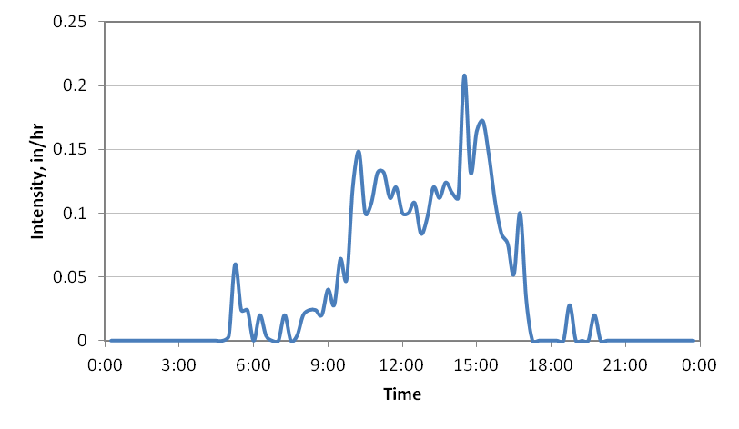

**Figure 6‑7 Storm event used for the LID example**

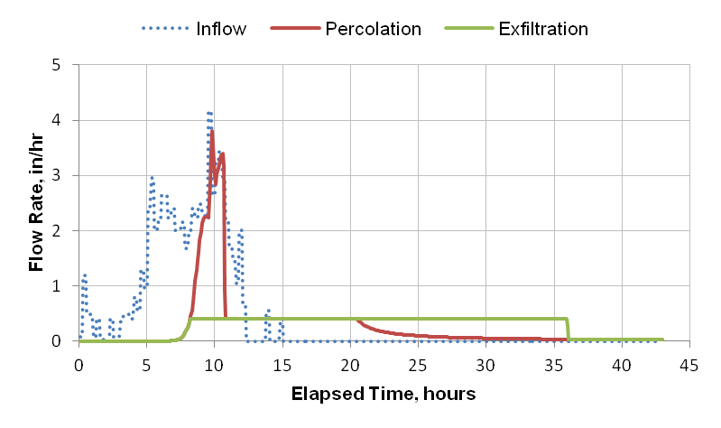

**Figure 6‑8 Flux rates through the bio-retention cell with no underdrain**

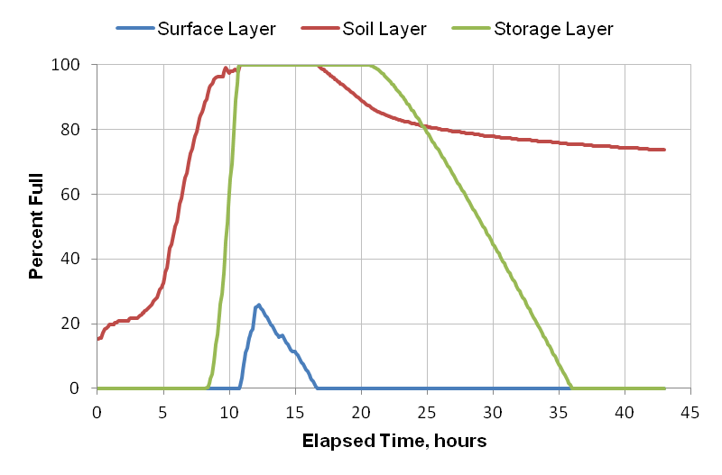

**Figure 6‑9 Moisture levels in the bio-retention cell with no underdrain**

The bio-retention cell is able to completely capture this 1-inch storm.
Although both the storage and soil zones become saturated and some
surface ponding occurs (up to a maximum 0.25 × 6 = 1.5 inches), no
runoff is produced. The dynamics of flow through the unit can be broken
up into five distinct phases:

1.  Wetting Phase:

For the first 5 hours of the storm event the soil fills with water up to
its field capacity of 0.15 (29% of saturation). During this time the
soil layer accepts all inflow to the unit without sending any outflow to
the storage layer.

2.  Filling Phase:

During the next 6 hours as the unit continues to receive inflow, water
begins to percolate out of the soil layer and into the storage layer at
an increasing rate. For the first 3 hours of this period, while the
percolation rate is below the bottom exfiltration rate, all of this
water leaves the unit and keeps the storage layer dry. Eventually the
soil moisture content becomes high enough so that the percolation rate
exceeds the exfiltration rate and the storage layer fills in a matter of
3 hours. During this entire phase the unit is still able to accept all
of the inflow as shown by the absence of any ponded surface water.

3.  Saturation Phase:

After approximately 11 hours both the soil and storage layers have
become full. At this point even though the soil conductivity has risen
above 4 in/hr, it cannot transmit water any faster than the full storage
layer can exfiltrate it at only 0.4 in/hr. During the next 4 hours as
the unit continues to receive inflow while full, the excess ponds atop
the surface.

4.  Draining Phase:

Once inflow to the unit ceases at about 15 hours it begins to drain and
water levels recede from the top on down. Surface ponding is gone by
16.5 hours. Then the soil begins to drain down at a rate still limited
by the slower bottom exfiltration rate since the storage layer remains
full. At about hour 21 the soil percolation rate becomes less than the
exfiltration rate and the storage layer begins to empty. It then takes
another 15 hours for the storage layer to drain down completely.

5.  Drying Phase:

After the storage layer has completely drained, water continues to drain
out of the soil layer at a rate lower than the bottom exfiltration rate,
so all of it infiltrates into the native soil. This continues until the
soil's field capacity moisture is reached. After that, the soil will
continue to dry by evapotranspiration until its wilting point is
reached.

Now consider what happens when an underdrain is added to the
bio-retention cell. The drain is placed at the top of the storage layer
so that the layer's full storage capacity can be utilized. It is assumed
to be over-designed so its discharge coefficient is assigned a very
large value. The resulting time history of moisture content throughout
the cell with the underdrain is shown in Figure 6-10. The drain has
prevented any inflow from ponding on top of the unit. As shown in Figure
6-11, the drain carries flow only during the period of time that the
storage layer is full. Because it is oversized, it can accept the full
amount of water remaining from soil percolation after the bottom
exfiltration is accounted for. Compare this with the case of no drain in
Figure 6-8, where the soil percolation rate is limited by the
exfiltration rate during the time that the storage layer is full.

The total volume of flow carried away by the underdrain is about 14 % of
the total storm volume. If this flow is sent to a storm sewer which is
typically the case, then the bio-retention cell can no longer be said to
have fully captured and eliminated runoff from this 1-inch storm.

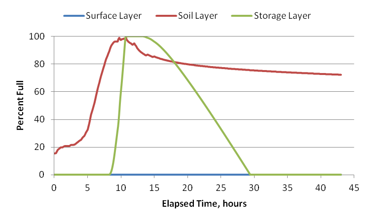

**Figure 6‑10 Moisture levels in the bio-retention cell with underdrain**

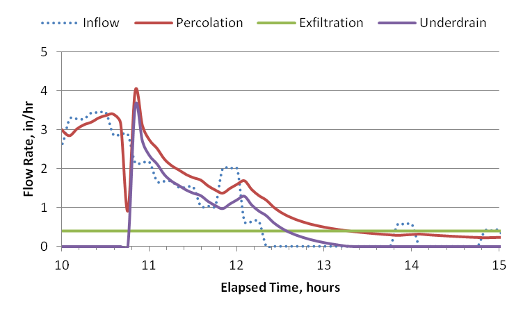

**Figure 6‑11 Flux rates through the bio-retention cell with underdrain**

## Glossary

\_\_\_\_\_\_\_\_\_\_\_\_\_\_\_\_\_\_\_\_\_\_\_\_\_\_\_\_\_\_\_\_\_\_\_\_\_\_\_\_\_\_\_\_\_\_\_\_\_\_\_\_\_\_\_\_\_\_\_\_\_\_\_\_\_\_\_\_\_\_\_\_\_\_\_\_\_

**A**

**Advection-Dispersion Equation** -- the partial differential equation
that expresses conservation of mass for a water quality constituent with
respect to time and space across an element of fluid.

**Aquifer --** as defined in SWMM, it is the underground water bearing
layer below a land surface, containing both an upper unsaturated zone
and a lower saturated zone.

**Availability Factor** -- the fraction of buildup on a land use that is
available for removal by street sweeping.

**B**

**Best Management Practice** - structural or engineered control devices
and systems (e.g. retention ponds) as well as operational or procedural
practices used to treat polluted stormwater.

**Bio-Retention Cell** -- a LID control that contains vegetation grown
in an engineered soil mixture placed above a gravel storage bed
providing storage, infiltration and evaporation of both direct rainfall
and runoff captured from surrounding areas.

**BMP Removal Factor** -- the fractional reduction in runoff pollutant
load achieved by implementing a specific BMP.

**C**

**Capillary Suction Head -** the soil water tension at the interface
between a fully saturated and partly saturated soil.

**Capture Ratio** -- the amount of the subcatchment's impervious area
that is directly connected to an LID unit divided by the area of the LID
unit itself.

**Completely Mixed Reactor** -- a reactor where the concentration of all
water quality constituents are uniform throughout the reactor's volume.

**Continuous Simulation -** refers to a simulation run that extends over
more than just a single rainfall event.

**Co-Pollutant** -- a pollutant whose runoff concentration is a fixed
fraction of some other pollutant (e.g., phosphorus adsorbed onto
suspended solids).

**Curve Number -** a factor, dependent on land cover, used to compute a
soil's maximum moisture storage capacity.

**Curve Number Method -** a method that uses a soil's maximum moisture
storage capacity as derived from its curve number to determine how
cumulative infiltration changes with cumulative rainfall during a
rainfall event. Not to be confused with the NRCS (formerly SCS) Curve
Number runoff method as embodied in TR-55.

**D**

**Darcy's Law -** states that flow velocity of water through a porous
media equals the hydraulic conductivity of the media times the gradient
of the hydraulic head it experiences.

**Depression Storage --** the volume over a surface that must be filled
prior to the occurrence of runoff. It represents such initial
abstractions as surface ponding, interception by flat roofs and
vegetation, and surface wetting.

**Design Storm -** a rainfall hyetograph of a specific duration whose
total depth corresponds to a particular return period (or recurrence
interval), usually chosen from an IDF curve.

**Directly Connected Impervious Area -** impervious area whose runoff
flows directly into the collection system without the opportunity to run
onto pervious areas such as lawns.

**Drainage Mat** - thin, multi-layer fabric mats with ribbed undersides
that carries away any water that drains through the soil layer of a
green roof.

**Dry Deposition** -- pollutants deposited on land surfaces, typically
in the form of particles, during periods of dry weather.

**Dry Weather Flow** - the continuous discharge of sanitary or
industrial wastewater directly into a sewer system.

**Dust and Dirt** -- street surface accumulation that passes through a
quarter-inch mesh screen.

**Dynamic Wave Flow Routing** -- a method of modeling non-uniform
unsteady open channel flow that solves the full Saint Venant equations
for both continuity and momentum. It can account for channel storage,
backwater effects, and flow reversals.

**E**

**Event Mean Concentration** -- the average concentration of a pollutant
in the runoff produced by a single storm event.

**F**

**Field Capacity -** the amount of water a well-drained soil holds after
free water has drained off, or the maximum soil moisture held against
gravity. Usually defined as the moisture content at a tension of 1/3
atmospheres.

**First Order Decay** -- a pollutant decay reaction whose rate is
proportional to the concentration of pollutant remaining.

**G**

**Green-Ampt Method -** a method for computing infiltration of rainfall
into soil that is based on Darcy's Law and assumes there is a sharp
wetting front that moves downward from the surface, separating saturated
soil above from drier soil below.

**Green Roof** -- a type of bio-retention cell used on a roof that has a
soil layer above a thin layer of synthetic drainage mat material that
conveys excess water draining through the soil layer off of the roof.

**H**

**Hydraulic Conductivity -** the rate of water movement through soil
under a unit gradient of hydraulic head. Its value increases with
increasing soil moisture, up to a maximum for a completely saturated
soil (known as the saturated hydraulic conductivity or K~sat~).

**Hydraulic Residence Time -** the average time that water has spent
within a completely mixed reactor.

**I**

**Impervious Surface** -- a surface that does not allow infiltration of
rain water, such as a roof, roadway or parking lot.

**Infiltration** -- the process by which rainfall penetrates the ground
surface and fills the pores of the underlying soil.

**Infiltration Trench** -- a narrow ditch filled with gravel that
intercepts runoff from upslope impervious areas and provides storage
volume and additional time for captured runoff to infiltrate into the
native soil.

**Initial Abstraction** -- precipitation that is captured on vegetative
cover or within surface depressions that is not available to become
runoff and is removed by either infiltration or evaporation.

**L**

**Land Use Object** - categories of development activities or land
surface characteristics used to account for spatial variation in
pollutant buildup and washoff rates.

**LID Control** -- a low impact development practice that provides
detention storage, enhanced infiltration and evapotranspiration of
runoff from localized surrounding areas. Examples include rain gardens,
rain barrels, green roofs, vegetative swales, and bio-retention cells.

**Link** -- a connection between two nodes of a SWMM conveyance network
that transports water. Channels, pipes, pumps, and regulators (weirs and
orifices) are all represented as links in a SWMM model.

**Longitudinal Dispersion** -- the process whereby a portion of a
constituent's mass inside a parcel of water mixes with the contents of
parcels on either side of it due to velocity and concentration
gradients.

**M**

**Manning Equation** -- the equation that relates flow rate to the slope
of the hydraulic grade line for gravity flow in open channels.

**Manning Roughness** -- a coefficient that accounts for friction losses
in the Manning flow equation.

**Moisture Deficit** -- the difference between a soil's current moisture
content and its moisture content at saturation.

**N**

**Node** -- a point in a runoff conveyance system that receives runoff
and other inflows, that connects conveyance links together, or that
discharges water out of the system. Nodes can be simple junctions, flow
dividers, storage units, or outfalls. Every conveyance system link is
attached to both an upstream and downstream node.

**O**

**Overland Flow Path** -- the path that runoff follows as it flows over
a surface until it reaches a collection channel or drain.

**P**

**Permeable Pavement** - street or parking areas paved with a porous
concrete or asphalt mix that sits above a gravel storage layer allowing
rainfall to pass through it into the storage layer where it can
infiltrate into the site\'s native soil.

**Pervious Surface** -- a surface that allows water to infiltrate into
the soil below it, such as a natural undeveloped area, a lawn or a
gravel roadway.

**Pollutant Object** -- the representation of a water quality
constituent within SWMM.

**Pollutograph** -- a plot of the concentration of a pollutant in runoff
versus time.

**Porosity** - the fraction of void (or air) space in a volume of soil.

**Potency Factor** -- relates the concentration of the particulate form
of a pollutant (such as phosphorous or heavy metals) to the
concentration of total suspended solids.

**R**

**Rainfall Dependent Inflow and Infiltration** - stormwater flows that
enter sanitary or combined sewers due to \"inflow\" from direct
connections of downspouts, sump pumps, foundation drains, etc. as well
as \"infiltration\" of subsurface water through cracked pipes, leaky
joints, poor manhole connections, etc.

**Rain Barrel** -- a container that collects roof runoff during storm
events and can either release or re-use the rainwater during dry
periods.

**Rain Garden** - a type of bio-retention cell consisting of just an
engineered soil layer with no gravel bed below it.

**Richards Equation** -- the nonlinear partial differential equation
that describes the physics of water flow in unsaturated soil as a
function of moisture content and moisture tension.

**Rooftop Disconnection** -- the practice of directing roof downspouts
onto pervious landscaped areas and lawns instead of directly into storm
drains.

**S**

**Steady Flow Routing** -- a method of modeling uniform steady open
channel flow that translates inflow hydrographs at the upstream end of
the channel to the downstream end, with no delay or change in shape.

**Subcatchment** -- a sub-area of a larger catchment area whose runoff
flows into a single drainage pipe or channel (or onto another
subcatchment).

**T**

**Tanks in Series Model** -- an approach to solving constituent
transport where conduits are represented as completely mixed reactors
connected together at junctions or at completely mixed storage nodes.

**U**

**Underdrain** -- slotted pipes placed in the storage layer of an LID
unit that conveys excess captured runoff off of the site and prevents
the unit from flooding.

**V**

**Vegetative Swale** - channels or depressed areas with sloping sides
covered with grass and other vegetation that slows down the conveyance
of collected runoff and allows it more time to infiltrate into the
native soil.

**W**

**Wet Deposition** - pollutant loads contributed by direct rainfall on a
catchment.

**Wilting Point** - the soil moisture content at which plants can no
longer extract moisture to meet their transpiration requirements. It is
usually defined as the moisture content at a tension of 15 atmospheres.

## References

\_\_\_\_\_\_\_\_\_\_\_\_\_\_\_\_\_\_\_\_\_\_\_\_\_\_\_\_\_\_\_\_\_\_\_\_\_\_\_\_\_\_\_\_\_\_\_\_\_\_\_\_\_\_\_\_\_\_\_\_\_\_\_\_\_\_\_\_\_\_\_\_\_\_\_\_\_\_

Adams, B.J. and Papa, F., *Urban Stormwater Management Planning, with
Analytical Probabilistic Models*, John Wiley and Sons, New York, 2000.

Ascher, U.M. and Petzold, L.R., *Computer Methods for Ordinary
Differential Equations and Differential-Algebraic Equations*, SIAM,
Philadelphia, 1998.

Avellaneda, P., Ballestero, T.P., Roseen, R.M., and Houle, J.J., "On
Parameter Estimation of Urban Storm-Water Runoff Model", *Journal of
Environmental Engineering*, Vol. 135, No. 8, August 2009, pp. 595-608.

Alley, W.M., "Estimation of impervious area washoff parameters", *Water
Resources Research*, Vol. 17, No. 4, 1981, pp. 1161--1166.

Ambrose, R.B. Jr., Wool, T.A., Connolly, J.P, and Schanz, R.W., \"WASP4,
A Hydrodynamic and Water Quality Model - Model Theory, User\'s Manual,
and Programmer\'s Guide\", EPA/600/3-87/039, U.S. Environmental
Protection Agency, Athens, GA 1988.

American Public Works Association, "Water Pollution Aspects of Urban
Runoff," Federal Water Pollution Control Administration, Contract
WP-20-15, Washington, DC, 1969.

American Society of Civil Engineers (ASCE) and Water Pollution Control
Federation (WPCF), *Design and Construction of Sanitary and Storm
Sewers*, Water Pollution Control Federation, Washington, DC, 1969.

American Society of Civil Engineers (ASCE), "Guide for Best Management
Practice (BMP) Selection in Urban Developed Areas", Urban Water
Infrastructure Management Committee's Task Committee for Evaluating Best
Management Practices, ASCE, Reston, VA, 2001.

American Society of Civil Engineers (ASCE), "Design and Construction of
Urban Stormwater Management Systems." American Society of Civil
Engineers, New York, NY, 1992.

Ammon, D.C., "Urban Stormwater Pollutant Buildup and Washoff
Relationships," Master of Engineering Thesis, Dept. of Environmental
Engineering Sciences, University of Florida, Gainesville, FL, 1979.

Amy, G., Pitt, R., Singh, R., Bradford, W.L. and LaGraff, M.B., \"Water
Quality Management Planning for Urban Runoff," EPA-440/9-75-004 (NTIS
PB-241689), U.S. Environmental Protection Agency, Washington, DC,
December 1974.

Atchison, D. and Severson, L., "RECARGA User's Manual, Version 2.3",
University of Wisconsin -- Madison, Civil & Environmental Engineering
Department, October, 2004.

AQUA TERRA Consultants, "Patuxent River Basin Watershed Model", U.S.
Geological Survey, Towson, MD, 1994.

AVCO Economic Systems Corporation, "Storm Water Pollution from Urban
Land Activity," EPA 111034FKL07/70 (NTIS PB-19528l), Environmental
Protection Agency, Washington, DC, July 1970.

Baffaut, C. and Delleur, J.W., "Calibration of SWMM Runoff Quality Model
with Expert System", *Journal of Water Resources Planning and
Management*, Vol. 116, No. 2, March/April, 1990, pp. 247-261.

Bear, J. and Cheng, A. H.-D., *Modeling Groundwater Flow and Contaminant
Transport*, Springer, Dordrecht, 2010.

Behera, P.K., Adams, B.J, and Li, J.Y., "Runoff quality analysis of
urban catchments with analytical probabilistic models", *Journal of
Water Resources Planning and Management,* Vol. 132, No. 1, 2006, pp
4--14.

Beij, K.H., "Flow in Roof Gutters", Research Paper RP644, *Bureau of
Standards Journal of Research*, Vol. 12, February 1934, pp. 193-213.

Bergman, M., Hedegaard, M.R., Petersen, M.F., Binning, P., Mark, O., and
Mikkelsen, P.S., "Evaluation of two stormwater infiltration trenches in
central Copenhagen after 15 years of operation", *Water Science and
Technology*, Vol. 63, No. 10, 2011, pp. 2279-2286.

Betson, R.P., "Bulk Precipitation and Streamflow Quality Relationships
in an Urban Area," *Water Resources Research*, Vol. 14, No. 6, December
1978, pp. 1165-1169.

Bicknell, B.R., Imhoff, J.C., Kittle, J.L., Jr., Donigian, A.S., Jr. and
R.C. Johanson, *Hydrologic Simulation Program -- Fortran: User's Manual
for Release 11*, U.S. Environmental Protection Agency, Office of
Research and Development, Athens, GA, 1997.

Brezonik, P.L., "Nutrients and Other Biologically Active Substances in
Atmo­spheric Precipitation," Proceedings Symposium on Atmospheric
Contribution to the Chemistry of Lake Waters, International Association
Great Lakes Research, September 1975, pp. 166-186.

Burton, G.A. and Pitt, R.E., *Stormwater Effects Handbook*. Lewis
Publishers, CRC Press, Boca Raton, FL, 2002.

Center for Watershed Protection (CWP), *Impacts of Impervious Cover on
Aquatic Systems*, Watershed Protection Research Monograph No.1, Center
for Watershed Protection, Ellicott City, MD, March 2003.

Davis, A.P. and McCuen, R.H., *Stormwater Management for Smart Growth*,
Springer, 2005.

Di Toro, D.M., "Probability Model of Stream Quality Due to Runoff*,"
Journal of Environmental Engineering, ASCE*, Vol. 110, No. 3, June 1984,
pp. 607-628.

Donigian, A.S., Jr. and W.C. Huber, *Modeling of Nonpoint Source Water
Quality in Urban and Non‑Urban Areas*, EPA/600/3‑91/039 (NTIS
PB92-109115), U.S. Environmental Protec­tion Agency, Athens, GA, 1991.

Donigian, A.S., Jr., W.C. Huber and T.O. Barnwell, Jr., "Modeling of
Nonpoint Source Water Quality in Urban and Nonurban Areas," Chapter 7 in
*Nonpoint Pollution and Urban Stormwater Management*, V. Novotny, ed.,
Technomic Publishing Co., Inc., Lancaster, PA, 1995, pp. 293-345.

Driscoll, E.D., in "Benefit Analysis for Combined Sewer Overflow
Control," Seminar Publication, EPA-652/4-79-013, U.S. Environmental
Protection Agency, Cin­cinnati, OH, April 1979.

Driscoll, E.D., "Lognormality of Point and Non-Point Source Pollutant
Concentrations," in *Proc. Stormwater and Water Quality Users Group
Meeting*, T.O. Barnwell and W.C. Huber, eds., Orlando, FL,
EPA/600/9-86/023 (NTIS PB87-117438/AS), Environmental Protection Agency,
Athens, GA, September 1986.

Driscoll, E.D. and Assoc., "Combined Sewer Overflow Analysis Handbook
for Use in 201 Facility Planning," Report to Environmental Protection
Agency, Facility Requirements Division, Washington, DC, July 1981.

Dussaillant, A.R., Wu, C.H., and Potter, K.W., "Richards Equation Model
of a Rain Garden", *Journal of Hydrologic Engineering*, Vol. 9, No. 3,
May, 2004, pp. 219-225.

Ewing, R.E. and Wang, H., "A summary of numerical methods for
time-dependent advection-dominated partial differential equations",
*Journal of Computational and Applied Mathematics*, Vol. 128., 2001, pp.
423-445.

Ferguson, B., *Porous Pavements*, CRC Press, Boca Raton, 2005.

Fletcher, T.D., Shuster, W., Hunt, W.F., Ashley, R., Butler, D., Arthur,
S., Trowsdale, S., Barraud, S., Semadeni-Davies, A., Bertrand-Krajewski,
J-L., Mikkelsen, P.S., Rivard, G., Uhl, M., Dagenais, D., and Viklander,
M., "SUDS, LID, BMPs, WSUD and more -- The evolution and application of
terminology surrounding urban drainage", *Urban Water Journal*, Vol. 12,
Issue 7, 2015, pp. 525-542.

Graf, W.H., *Hydraulics of Sediment Transport*, McGraw-Hill, New York,
1971.

Haan, C.T., Barfield, B.J. and J.C. Hayes, *Design Hydrology and
Sedimentology for Small Catchments*, Academic Press, New York, 1994.

Haseltine, T.R., "Addition of Garbage to Sewage," *Water and Sewage
Works*, 1950.

He, Z., and Davis, A.P., "Process Modeling of Storm-Water Flow in a
Bioretention Cell", Journal of Irrigation and Drainage Engineering, Vol.
137, No. 3, March, 2011, pp. 121-131.

Heaney, J.P., Huber, W.C., Sheikhv, H., Medina, M.A., Doyle, J.R.,
Peltz, W.A., and Darling, J.E., "Urban Stormwater Management Modeling
and Decision Making", EPA-670/2-75-022 (NTIS PB-242290), U.S.
Environmental Protection Agency, Cincinnati, OH, 1975.

Heaney, J.P., Huber, W.C., Medina, M.A., Jr., Murphy, M.P., Nix, S.J.
and Haasan, S.M., "Nationwide Evaluation of Combined Sewer Overflows and
Urban Stormwater Discharges ­ Vol. II: Cost Assessment and Impacts,"
EPA-600/2-77-064b (NTIS PB-266005), U.S. Environmental Protection
Agency, Cincinnati, OH, March 1977.

Hendry, C.D. and Brezonik, P.L., "Chemistry of Precipitation at
Gainesville, Florida," *Environmental Science and Technology*, Vol. 14,
No. 7, July 1980, pp. 843-849.

Hillel, D., *Introduction to Soil Physics*, Academic Press, Orlando, FL,
1982.

Huber, W.C., "Deterministic Modeling of Urban Runoff Quality," *Urban
Runoff Pollution*, H. Torno, J. Marsalek and M. Desbordes, eds., NATO
ASI Series, Series G: Ecological Sciences, Vol. 10, Springer-Verlag, New
York, 1985, pp. 166-242.

Huber, W.C., "Modeling Urban Runoff Quality: State-of-the-Art," *Urban
Runoff Quality-Impact and Quality Enhancement Technology*, B. Urbonas
and L.A. Roes­ner, eds., Proceedings of an Engineering Foundation
Conference, American Soci­ety of Civil Engineers, New York, June 1986,
pp. 34-48.

Huber, W.C., J.P. Heaney, M.A. Medina, W.A. Peltz, H. Sheikh, and G.F.
Smith, "Storm Water Management Model User's Manual ­ Version II,"
EPA-670/2-75-01· (NTIS PB-257809), U.S. Environmental Protection Agency,
Cincinnati, OH, March 1975.

Huber, W.C., Heaney, J.P., Aggidis, D.A., Dickinson, R.E. and Wallace,
R.W., "Urban Rainfall-Runoff-Quality Data Base," EPA-600/2-81-238¸ (NTIS
PB82-221094), Environmental Protection Agency, Cincinnati, OH, October
1981a.

Huber, W.C., J.P. Heaney, S.J. Nix, R.E. Dickinson, and D.J. Polmann,
"Storm Water Management Model User's Manual, Version III,"
EPA-600/2-84-109a (NTIS PB84-198423), U.S. Environmental Protection
Agency, Cincinnati, OH, November 1981b.

Huber, W.C., and R.E. Dickinson, *Storm Water Management Model, Version
4, User\'s Manual,* EPA/600/3-88/001a (NTIS PB88-236641/AS), U.S.
Environmental Protection Agency, Athens, GA, 1988.

Huber, W.C., L. Cannon, and M. Stouder, "BMP Modeling Concepts and
Simulation", EPA/600/R-06/033, U.S. Environmental Protection Agency,
Cincinnati, OH, July 2006.

Huber, W.C. and L. Roesner, \"The History and Evolution of the EPA
SWMM\" in Fifty Years of Watershed Modeling - Past, Present And Future,
A.S. Donigian and R. Field, eds., ECI Symposium Series, Volume P20,
2013. <http://dc.engconfintl.org/watershed/29>

Hunt, W.F., A.R. Jarrett, J.T. Smith, and L.J. Sharkey, "Evaluating
Bioretention Hydrology and Nutrient Removal at Three Field Sites in
North Carolina", *ASCE Journal of Irrigation and Drainage Engineering*,
Vol. 132, No.6, 2006, pp. 600-608.

Hydroscience, Inc., "A Statistical Method for the Assessment of Urban
Storm­water," EPA-440/3-79-023, U.S. Environmental Protection Agency,
Washington, DC, May 1979.

James, W. and Boregowda, S., "Continuous Mass-Balance of Pollutant
Build-up Processes," *Urban Runoff Pollution*, H.C. Torno, J. Marsalek
and M. Desbordes, eds., NATO ASI Series, Series G: Ecological Sciences,
Vol. 10, Springer-Verlag, New York, 1985, pp. 243-271.

Jewell, T.K., Nunno, T.J. and Adrian, D.D., "Methodology for Calibrating
Stormwater Models," *Journal of the Environmental Engineering Division,
ASCE*, Vol. 104, No. EE5, June 1978, pp. 485-501.

Jewell, T.K., Adrian, D.D, and DiGiano, F.A., "Urban Stormwater
Pollutant Loadings," Water Resources Research Center Publication No.
113, University of Massachusetts, Amherst, MA, May 1980.

Johansen, N.B., Linde-Jensen, J.J. and P. Harremoes, "Computing Combined
System Overflow Based on Historical Rain Series," Proc. Third
International Conference on Urban Storm Drainage, Chalmers University,
Goteborg, Sweden, June 1984, Vol. 3, pp. 909-918.

Kluesener, J.W. and Lee, G.F., "Nutrient Loading from a Separate Storm
Sewer in Madison, Wisconsin," *Journal Water Pollution Control
Federation*, Vol. 46, No. 5, May 1974, pp. 920-936.

Kadlec, R.H. and Knight, R.L., *Treatment Wetlands*, Lewis Publishers,
Boca Raton, F, 1996.

Kumar, K., Kozak, J., Hundal, L., Cox, A., Zhang, H., and Granato, T.,
\"In-situ infiltration performance of different permeable pavements in a
employee used parking lot - A four-year study\", Journal of
Environmental Management 167:8-14, 2016.

Lager, J.A., Smith, W.G., Lynard, W.G., Finn, R.F. and Finnemore, E.J.,
"Urban Stormwater Management and Technology: Update and User's Guide,"
EPA-600/8-77-014 (NTIS PB-275264), U.S. Environmental Protection Agency,
Cincinnati, OH, Septem­ber 1977.

Lee, J., Borst, M., Brown, R., Rossman, L., and Simon, M., "Modeling the
Hydrologic Processes of a Permeable Pavement System", Journal of
Hydrologic Engineering, Vol. 20, No. 5, 2015.

Li, H. and Davis, A.P., "Water Quality Improvement through Reductions of
Pollutant Loads using Bioretention", *Journal of Environmental
Engineering*, Vol.135, No.8, 2009, pp. 567-576.

Lucas, W. C., "Design of integrated bioinfiltration-detention urban
retrofits with design storm and continuous simulation methods", *Journal
of Hydrologic Engineering*, Vol. 15, No. 6, 2010, pp. 486-498.

Manning, M.J., Sullivan, R.H. and Kipp, T.M., "Nationwide Evaluation of
Com­bined Sewer Overflows and Urban Stormwater Discharges ­ Vol. III:
Character­ization of Discharges," EPA-600/2-77-064c (NTIS PB-272107),
U.S. Environmental Protection Agency, Cincinnati, OH, August 1977.

Martin, J.L, and McCutcheon, S.C., *Hydrodynamics and Transport for
Water Quality Modeling*, Lewis Publishers, Boca Raton, FL, 1999.

Maryland Department of the Environment (MDE), *Maryland Stormwater
Design Manual, Chapter 3 -- Performance Criteria for Urban BMP Design*,
2009.

Mattraw, H.C., Jr., and Sherwood, C.B., "Quality of Storm Water Runoff
From a Residential Area, Broward County, Florida," *Journal Research
U.S. Geological Survey*, Vol. 5, No. 6, November-December 1977, pp.
823-834.

McElroy, A.D., Chiu, S.Y., Nebgen, J.W., Aleti, A. and Bennett, F.W.,
"Loading Functions for Assessment of Water Pollution from Non-point
Sources, EPA-600/2-76-151 (NTIS PB-253325), U.S. Environmental
Protection Agency, Washington, DC, May 1976.

Medina, M.A., Huber, W.C., and Heaney, J.P., "Modeling Stormwater
Storage/Treatment Transients: Theory", *Journal of the Environmental
Engineering Division*, ASCE, Vol. 107, No. EE4, August 1981, pp.
787-797.

Metcalf & Eddy, Inc., *Wastewater Engineering: Treatment and Reuse*,
Revised by G. Tchobanoglous, F.L. Burton, and H.D. Stensel,
Mc-Graw-Hill, New York, Fourth Edition, 2003.

Metcalf and Eddy, Inc., University of Florida, and Water Resources
Engineers, Inc., "Storm Water Management Model, Volume I ­ Final Report,"
EPA Report 11024 DOC 07/71 (NTIS PB-203289), U.S. Environmental
Protection Agency, Washington, DC, July 1971a.

Metcalf and Eddy, Inc., University of Florida, and Water Resources
Engineers, Inc., "Storm Water Management Model, Volume II ­ Verification
and Testing," EPA Report 11024 DOC 08/71 (NTIS PB-203290), U.S.
Environmental Protection Agency, Washington, DC, August 1971b.

Metcalf and Eddy, Inc., University of Florida, and Water Resources
Engineers, Inc., "Storm Water Management Model, Volume III ­ User's
Manual," EPA-11024 DOC 09/71 (NTIS PB-203291), U.S. Environmental
Protection Agency, Washington, DC, September 1971c.

Metcalf and Eddy, Inc., University of Florida, and Water Resources
Engineers, Inc., "Storm Water Management Model, Volume IV ­ Program
Listing," EPA Report 11024 DOC 10/71 (NTIS PB-203292), U.S.
Environmental Protection Agency, Washington, DC, October 1971d.

Miller, R.A., Mattraw, H.C., Jr. and Jennings, M.E., "Statistical
Modeling of Urban Storm Water Processes, Broward County, Florida,"
Proceedings Interna­tional Symposium on Urban Storm Water Management,
University of Kentucky, Lexington, July 1978, pp. 269-273.

Mills, W.B., Porcella, D.B., Ungs, M.J., Gherini, S.A., Summers, K.V.,
Mok, L., Rupp, G.L., Bowie, G.L. and D.A. Haith, *Water Quality
Assessment: A Screening Procedure for Toxic and Conventional Pollutants
in Surface and Ground Water (Revised 1985)*, Parts 1 and 2,
EPA/600/6-85/002a (NTIS PB86-122496) and EPA/600/6-85/002b (NTIS
PB86-122504), Environmental Protection Agency, Athens, GA, September
1985.

Nakamura, E., "Factors Affecting Stormwater Quality Decay Coefficient,"
Pro­ceedings of the Third International Conference on Urban Storm
Drainage, Chal­mers University, Goteborg, Sweden, June 1984a, Vol. 3, pp.
979-988.

Nakamura, E., "Factors Affecting the Removal Rate of Street Surface
Contami­nants by Overland Flow," *Journal of Research*, Public Works
Research Institute, Ministry of Construction, Japan, November 1984b.

National Research Council (NRC), *Clean Coastal Waters, Understanding
and Reducing the Effects of Nutrient Pollution*, National Academy Press,
Washington, DC, 2000.

Novotny, V., ed., *Nonpoint Pollution and Urban Stormwater Management*,
Water Quality Management Library Volume 9, Technomic Publishing Co.,
Inc., Lancaster, PA, 1995.

Novotny, V. and Kincaid, B.W., "Acidity of Urban Precipitation and its
Buffer­ing During Overland Flow," in *Urban Stormwater Quality,
Management and Plan­ning*, B.C. Yen, ed., Proceedings of the Second
International Conference on Urban Storm Drainage, Urbana, IL, Water
Resources Publications, Littleton, CO, June 1981, pp. 1-9.

Novotny, V. and H. Olem, *Water Quality: Prevention, Identification, and
Management of Diffuse Pollution*, van Nostrand Reinhold, New York, 1994.

Perelli, G.A., \"Characterization of the Green Roof Growth Media\",
University of Western Ontario, Electronic Thesis and Dissertation
Repository, Paper 2205, 2014.

Philadelphia Water Department, *Stormwater Management Guidance Manual,
Version 2.1*, City of Philadelphia, February, 2014.

Pitt, R., "Demonstration of Non-point Pollution Abatement Through
Improved Street Cleaning Practices," EPA-600/279-161 (NTIS PB80-108988),
U.S. Environ­mental Protection Agency, Cincinnati, OH, August 1979.

Pitt, R., "Characterizing and Controlling Urban Runoff through Street
and Sewerage Cleaning", EPA/600/2-85/038, (NTIS PB85-186500), U.S.
Environmental Protection Agency, Cincinnati, OH, April 1985.

Pitt, R. and Amy, G., "Toxic Materials Analysis of Street Surface
Contami­nants," EPA-R2-73-283 (NTIS PB-224677), U.S. Environmental
Protection Agency, Wash­ington, DC, August 1973.

Pitt, R. and Voorhees, J., *The Source Loading and Management Model
(SLAMM): A Water Quality Management Planning Model for Urban Stormwater
Runoff*,
<http://rpitt.eng.ua.edu/SLAMMDETPOND/WinSlamm/MainWINSLAMM_book.html>,
2000.

Prince Georges County (PGC), "Low-Impact Development Design: An
Integrated Design Approach" Prince George\'s County, Maryland,
Department of Environmental Resources, June 1999a.

Prince Georges County (PGC), "Low-Impact Development Hydrologic
Analysis" Prince George\'s County, Maryland, Department of Environmental
Resources, July 1999b.

Randall,C.W., Grizzard, T.J., Helsel, D.R. and Griffin, D.M., Jr.,
"Comparison of Pollutant Mass Loads in Precipitation and Runoff in Urban
Areas," in *Urban Stormwater Quality, Management and Planning*, B.C.
Yen, ed., Proceedings of the Second International Conference on Urban
Storm Drainage, Urbana, IL, Water Resources Publications, Littleton, CO,
June 1981, pp. 29-38.

Roesner, L.A., "Quality of Urban Runoff" in *Urban Stormwater
Hydrology*, edited by D.F. Kibler, American Geophysical Union,
Washington DC, 1982.

Roesner, L.A., Aldrich, J.A. and R.E. Dickinson, *Storm Water Management
Model, Version 4, User\'s Manual: Extran Addendum,* EPA/600/3-88/001b
(NTIS PB88-236658/AS), Environmental Protection Agency, Athens, GA,
1988.

Rossman, L.A., "Modeling Low Impact Development Alternatives with SWMM"
in *Dynamic Modeling of Urban Systems, Monograph 18* (W. James, editor),
CHI, Guelph, Ontario, 2010.

Sartor, J.D. and Boyd, G.B., "Water Pollution Aspects of Street Surface
Con­taminants," EPA-R2-72-081 (NTIS PB-214408), U.S. Environmental
Protection Agency, Washington, DC, November 1972.

Saxton, K.E. and Rawls, W.J., "Soil Water Characteristic Estimates by
Texture and Organic Matter for Hydrologic Solutions", Soil Science
American Journal, 70:1569-1578, 2006.

Shaheen, D.G., "Contributions of Urban Roadway Usage to Water
Pollution," EPA-600/2-75-004 (NTIS PB-245854), U.S. Environmental
Protection Agency, Washington, DC, April l975.

Simons, D.B. and Senturk, F., *Sediment Transport Technology*, Water
Resources Publications, Ft. Collins, CO, 1977.

Singh, V.P., ed., *Computer Models of Watershed Hydrology*, Water
Resources Publications, Highlands Ranch, CO, 1995.

Siriwardene, N. R., Deletic, A., and Fletcher, T. D. "Clogging of
stormwater gravel infiltration systems and filters: Insights from a
laboratory study." *Water Research*, Vol. 41, No. 7, 2007, pp.
1433--1440.

Smolenyak, K.J., "Urban Wet-Weather Pollutant Loadings," M.E. Thesis,
Dept. of Environmental Engineering Sciences, University of Florida,
Gainesville, 1979.

Sonnen, M.B., "Urban Runoff Quality: Information Needs," *Journal of the
Tech­nical Councils, ASCE*, Vol. 106, No. TC1, August 1980, pp. 29-40.

Sutherland, R.C. and Jelen, S.J., "Contrary to Conventional Wisdom,
Street Sweeping Can Be an Effective BMP," Chapter 9 in *Advances in
Modeling the Management of Stormwater Impacts*, W. James, ed., Proc. of
the Stormwater and Water Quality Modeling Conference, Toronto, February
1996, Computational Hydraulics International, Guelph, ON, 1997, pp.
179-190.

Strecker, E.W., Quigley, M.M., Urbonas, B.R., Jones, J.E. and Clary,
J.K., "Determining Urban Storm Water BMP Effectiveness," *Journal of
Water Resources Planning and Management*, 127(3), 2001, pp.144-149.

Tchobanoglous, G. and Burton, F., *Wastewater Engineering, Treatment,
Disposal, Reuse*, Third Edition, Metcalf & Eddy, Inc., Boston, MA, 1991.

Tetra Tech, Inc., "Stormwater Best Management Practices (BMP)
Performance Analysis", Report prepared for U.S. Environmental Protection
Agency -- Region 1, Fairfax, VA, March, 2010.

Tucker, L.S., "Sewage Flow Variations in Individual Homes," ASCE
Combined Sewer Separation Project Tech. Memo No. 2, ASCE, New York,
1967, p. 8.

U.S. Environmental Protection Agency (US EPA), "Results of the
Nationwide Urban Runoff Pro­gram, Volume I Final Report," NTIS
PB84-185552, Environmental Protection Agency, Washington, DC, December
1983.

U.S. Environmental Protection Agency (US EPA), "Mercury Study Report to
Congress: Volume III: Fate and Transport of Mercury in the Environment",
EPA-452/R-97-005, Office of Air Quality Planning & Standards and Office
of Research and Development, U.S. Environmental Protection Agency,
Washington, DC, 1997.

U. S. Environmental Protection Agency (US EPA), "Storm Water Technology
Fact Sheet: Infiltration Trench", EPA-832-F-99-019, Office of Water,
Washington, D.C., September 1999.

U.S. Environmental Protection Agency (US EPA), "SWMM 5 Applications
Manual", EPA/600/R-09/000, National Risk Management Research Laboratory,
Office of Research and Development, Cincinnati, OH, 2009.

U.S. Environmental Protection Agency (US EPA), "SWMM 5 User's Manual",
EPA/600/R-05/040, National Risk Management Research Laboratory, Office
of Research and Development, Cincinnati, OH, 2010.

University of New Hampshire Stormwater Center (UNHSC), Design
Specifications for Porous Asphalt Pavement and Infiltration Beds,
University of New Hampshire Stormwater Center (UNHSC), Durham, NH 2009.

Uttormark, P.D., Chaplin, J.D. and Green, K.M., "Estimating Nutrient
Loadings of Lakes from Non-point Sources," EPA-660/3-74-020,
Environmental Protection Agency, Washington, DC, August 1974.

Vanoni, V.A., ed., *Sedimentation Engineering*, ASCE, New York, 1975.

van Schilfgaarde, J., ed., *Drainage for Agriculture*, Agronomy Series
No. 17, American Society of Agronomy, Madison, WI, 1974.

Wallace, R.W., "Statistical Modeling of Water Quality Parameters in
Urban Runoff," Master of Engineering Technical Report (unpublished),
Department of Environmental Engineering Sciences, University of Florida,
Gainesville, 1980.

Weibel, S.R. Anderson, R.J. and Woodward, R.L., "Urban Land Runoff as a
Factor in Stream Pollution," *Journal Water Pollution Control
Federation*, Vol. 36. No. 7, July 1964, pp. 914-924.

Weibel, S.R., Weidner, R.B., Cohen, J.M. and Christianson, A.G.,
"Pesticides and Other Contaminants in Rainfall and Runoff," *Journal
American Water Works Association*, Vol. 58, No. 8, August 1966, pp.
1075-1084.

Whitehead, P.G., Williams, R.J., and Lewis, D.R., "Quality simulation
along river systems (QUASAR): model theory and development", *Sci. Tot.
Environ*., Vol. 194/195, pp. 447-456, 1997.

Wilber, W. G., and Hunter, J.V., "The Influence of Urbanization on the
Transport of Heavy Metals in New Jersey Streams", Water Resources
Research Institute, Rutgers University, New Brunswick, NJ. 1980.

Wischmeier, W.H. and Smith, D.D., "Rainfall Energy and Its Relationship
to Soil Loss," *Transactions American Geophysical Union*, Vol. 39, No.
2, April 1958, pp. 285-291.

Zhang, G., Hamlett, J.M., and Saravanapavan, T., "Representation of Low
Impact Development (LID) Scenarios in SWMM", *Intelligent Modeling of
Urban Water Systems - Monograph 14*, W. James (editor), CHI, Guelph, ON,
Canada, 2006.

