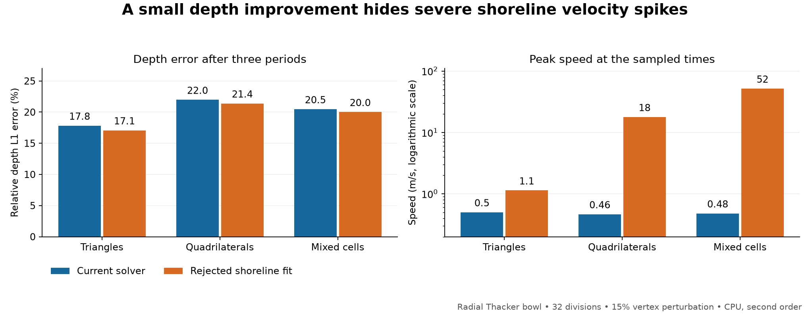

# Phase 8 — shoreline damping and correctness investigation

## Decision

**Reject all solver prototypes. Retain two regression protections.** The phase-7 production solver is unchanged by this phase. The most promising shoreline fit slightly improved every regular-grid bowl comparison, but distorted quadrilaterals and mixed cells exposed 18–52 m/s thin-film speeds. The corresponding current-solver speeds stayed below 0.5 m/s. Good depth error, nonnegative water and roundoff-level conservation did not detect the failure.

The retained changes extend the three-period planar Thacker test to check velocity and add a distorted-mesh radial Thacker test. Work is **not committed**. Existing phase-7 changes and the unrelated pending rain-activation hunk remain intact.

## Fresh baseline and scope

Baseline: current phase-7 working-tree solver, recorded by `baseline_manifest.json`, `baseline.diff` and `baseline_commit.txt`. It includes earlier accepted CPU work and the phase-7 reconstruction correction; none of the earlier performance conclusions was used to accept a phase-8 change. This phase compiled a fresh component baseline and directly compared all variants against it.

CPU only, double precision, no fast-math, one thread unless explicitly comparing one and four threads. SWASHES radial and planar Thacker equations use gravity 9.80665 m/s², a 4 m square bowl with depth scale 0.1 m, zero friction, and default FLAT storage. Radial initial parameter is 0.8; planar displacement is 0.5 m. Also evaluated Ritter, Stoker, fully wet and emerged-bump resting lakes. The analytical harness samples 64 times per oscillation period. It uses cell-center analytical depth and the engine's vertex-derived bed; reported error includes spatial representation error.

## What causes the remaining damping?

1. **The positivity limiter is essentially inactive in these bowl runs.** Raising the exchange fraction from 0.8 to 1 changes no displayed error metric. In the triangular planar case its removed export is only about 5.2e-10 of the integrated raw absolute export; the other three default bowls never hit the cap.
2. **Reducing CFL from 0.4 to 0.1 does not resolve it.** Endpoint relative depth errors differ by less than 0.02 percentage points across these four comparisons. This supports a spatial-reconstruction limitation rather than a timestep solution.
3. **Removing the slope limiter is not a general solution.** It helps planar triangles but worsens planar quadrilaterals and both Ritter/Stoker shapes. It is a diagnostic variant only.
4. **Dry-sill fallback is consequential but necessary in the current formulation.** Ignoring blocked wet neighbors markedly improves bowl depth and phase, but creates excessive film velocity. Moving fallback from the whole cell to the blocked face also fails. This is evidence for coupling shoreline reconstruction and the bed-pressure treatment, not permission to remove the guard.

The instrumentation counts the first fallback encountered for each cell gradient evaluation. The following fractions sum cell volume over evaluations, without timestep weighting; they are not physical volume losses or fractions of elapsed time.

| Bowl | Cells | All fallback / sampled water | Dry-sill fallback / sampled water | Removed / raw absolute export |
|---|---|---:|---:|---:|
| radial | triangles | 0.89% | 0.78% | 0 |
| radial | quads | 1.79% | 1.48% | 0 |
| planar | triangles | 1.94% | 1.86% | 5.2e-10 |
| planar | quads | 3.61% | 3.33% | 0 |

## Total energy obscures the damping

Compute discrete mechanical energy E = Σ A[½h(u²+v²) + g(½h²+hz)], with bowl-bottom datum zero. Solve for a constant equilibrium surface containing the same discrete water volume, then compute its energy Eeq on the same mesh. The ratio (Efinal−Eeq)/(Einitial−Eeq) exposes loss of the energy associated with motion. This is a diagnostic based on the FLAT cell representation, not a proof of an energy-stable scheme or a direct amplitude ratio.

Current solver, 64 divisions, three periods:

| Bowl | Cells | Total energy remaining | Energy above equilibrium remaining |
|---|---|---:|---:|
| radial | triangles | 98.50% | 38.41% |
| radial | quads | 97.97% | 16.32% |
| planar | triangles | 84.43% | 63.61% |
| planar | quads | 79.60% | 52.31% |

For example, the radial quad case retains about 98% of total energy but only 16% of energy above equilibrium. The modest shoreline fit improves the latter to about 19%, before its distorted-mesh instability disqualifies it.

## Prototype matrix and rejection evidence

All variants live only in local review snapshots. No runtime switch or experimental algorithm was added to production.

| Variant | Change | Finding |
|---|---|---|
| `unlimited` | Remove BJ limiting where the original reconstruction is admissible | Uneven bowl gains; both dam-break errors worsen |
| `shore_ls` | Skip dry neighbors, use weighted least squares near shore, limit on all faces; retain dry-sill fallback | Modest gains; not selected over the wet-face-limited variant |
| `shore_wetlimit` | Same fit; impose neighbor bounds only on wet faces | Better regular-grid depth errors; rejected by distorted radial velocity |
| `all_ls` | Least squares in the interior as well | No consistent advantage; planar triangular error worsens |
| `connected` | Also omit dry-sill neighbors from the fit | Better phase/depth; spurious speeds up to 16.7 m/s in regular bowls |
| `connected_face` | Additionally use first order at each blocked face | Spurious speeds up to 40.7 m/s in regular bowls |

`src_selected` is the optimized **rejected** `shore_wetlimit` prototype: least-squares arithmetic is confined to shoreline cells. Its historical folder name does not indicate acceptance. `src_fastshore` is a further unretained interior-loop refactor; its follow-up timing launch failed to link because the script substituted the wrong performance object path. No result or performance claim relies on that unrun refactor.

Regular-grid confirmation of `shore_wetlimit`: both bowl families, triangles and quadrilaterals, 32/64/128 divisions for three periods, and 64 divisions for ten periods. Endpoint and time-mean depth errors improved in all 16 paired configurations. At 64 divisions and three periods:

| Bowl | Cells | Current depth L1 | Rejected fit depth L1 |
|---|---|---:|---:|
| radial | triangles | 9.24% | 8.86% |
| radial | quads | 14.51% | 13.84% |
| planar | triangles | 19.91% | 19.73% |
| planar | quads | 28.19% | 27.00% |

But on the radial bowl with 32 divisions and deterministic interior vertex perturbations of amplitude 0.15 cell widths:

| Cells | Current peak speed | Rejected fit peak speed | Current depth L1 | Rejected fit depth L1 |
|---|---:|---:|---:|---:|
| triangles | 0.500 m/s | 1.135 m/s | 17.82% | 17.08% |
| quads | 0.465 m/s | 17.804 m/s | 21.97% | 21.39% |
| mixed | 0.479 m/s | 51.664 m/s | 20.46% | 20.01% |

These are peaks at output samples for cells deeper than the configured 1e-7 m dry threshold; intervening timestep maxima may be larger. Conservation, positivity and thread reproducibility passed even in these rejected cases. The mesh-check script's `PASS` refers to those explicit checks, not acceptable velocity accuracy.

## Retained tests and validation

- Extend `SecondOrderPlanarThackerRetainsRotationPhase`: check finite cell momentum-derived speed at all 192 samples, bounded by five times the exact uniform speed. This catches the `connected_face` prototype, which otherwise improves depth/phase.
- Add `SecondOrderDistortedThackerKeepsShorelineVelocityBounded`: radial bowl on perturbed triangles, quads and mixed cells, three periods. Check finite speed, nonnegative storage, conserved water and a speed bound of five times the analytical maximum over the wet disk and period. This catches the rejected conservative fit. The generous bound is a gross-instability regression, not a precise velocity-accuracy acceptance criterion.
- A temporary connected-wet-face flux test verified the fit's linear consistency and failed against the baseline. It remains in `prototype_correctness.cpp` only because the fit was rejected.

**167 passed, 1 skipped, 0 failures across 15 CPU suites (168 tests).** Both negative-control runs fail the intended new/extended regression.

There were 204 principal analytical/diagnostic executions: 84 prototype screens, 24 additional regular-grid confirmations, 12 instrumented attribution runs, and 84 distorted/mixed/thread checks. The accepted code is unchanged except for tests. First-order baseline/candidate fields and histories matched exactly in all 18 distorted/mixed paired controls; selected-prototype fields and histories also matched exactly between one and four threads in six bowl cases. Resting-lake depths remained within 1e-12 m and speed within 1e-9 m/s in the mesh matrix; the regression suite also covers FLAT and VFR resting lakes.

The full-engine regression libraries reuse the phase-7 **matched, frozen support build**, replacing only the solver object for negative-control prototypes. Library loading was checked. This isolates the 2D review from unrelated concurrent 1D work; it does not validate those unrelated current edits. Component harnesses use the fresh phase-8 source snapshot. No GPU validation is claimed.

## CPU measurements

Five randomized pairs per case after a discarded warm-up pair; 50 recorded runs. Diagnostics were removed from timed advancement; child CPU includes initialization. Host load was high and variable (recorded with every run), so wall-time estimates are especially noisy. These measurements describe a rejected candidate, not a shipped speedup.

| Case | Median child CPU change | Median advancement wall-time change |
|---|---:|---:|
| radial 64, order 2, quad | +6.6% | +11.1% |
| planar 64, order 2, quad | +10.6% | +34.3% |
| planar 64, order 2, tri | +0.8% | -1.1% |
| planar 64, order 1, quad | -0.2% | -0.8% |
| ritter 256, order 2, tri | +1.4% | +1.0% |

No repeat timing was needed after distorted-mesh instability rejected the candidate. Production runtime and storage costs are unchanged in phase 8.

## Next phase

1. Derive a consistent partially wet cell reconstruction and bed-pressure source treatment. Track the momentum budget in trapped films and at the first wet/dry transition. Do not mask the instability with an arbitrary velocity cap or relaxed regression threshold.
2. Require regular **and distorted/mixed** bowl tests, velocity/energy/phase histories, emerged-lake balance, positive water, and dam-break checks before promoting a prototype. Re-run the new negative controls against any proposed change.
3. Only then optimize and measure the accepted CPU path. Preserve first-order and transport behavior. GPU execution remains deferred until suitable hardware is available.

The current dry-sill safeguard stays in place. The remaining damping is quantified but **not fixed** by phase 8.

## Reproduction and evidence

`prepare.py`, `prototypes.py`, `connected.py`, `optimize_candidate.py`, `build.py`/`build_variant.py`, and `build_engine.py` describe isolated builds. `screen.py`, `screen_connected.py`, `confirm.py`, `diagnose.py`, `mesh_checks.py`, `performance.py`, and `energy_analysis.py` produced their corresponding JSON/log/history artifacts. `final_tests.py` and `validate_final.py` produce and verify the retained tests plus negative controls. `baseline_manifest.json`, `retained.patch`, and `final_verification.json` record the production delta. Build/snapshot/history directories are excluded by this review folder's local ignore file.
