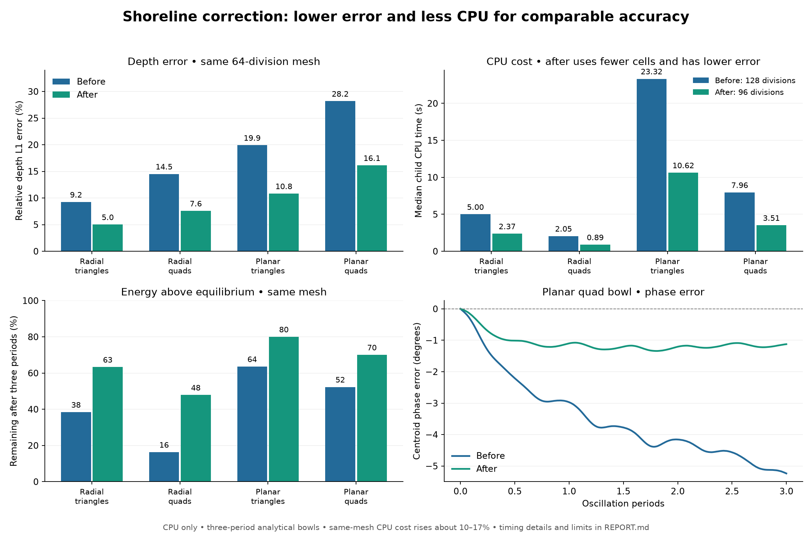

# Phase 9 — consistent shoreline reconstruction and bed pressure

## Outcome

**Retain the combined correction and its regression tests. Not committed.** On the same 64-division analytical bowl meshes, three-period endpoint depth errors fall by roughly 43–48%. The distorted-mesh velocity failures from phase 8 are eliminated in the evaluated cases. This is an accuracy improvement with a per-mesh CPU cost: median paired CPU time increases about 10–17% in the bowl controls. However, the new solver at 96 divisions gives lower endpoint and time-mean depth errors than the baseline at 128 divisions in all four bowl comparisons, with substantially less CPU time.

The retained implementation changes second-order FULL_SWE only. First-order numerical outputs remain bitwise identical in the comparison matrix. There are no new runtime options, persistent buffers, or per-step heap allocations. Existing phase-7/8 work and the unrelated rain-activation hunk are preserved.

## Diagnosis: a coupled problem

The phase-8 experiments were unstable despite good water conservation and depth error. This phase separated pressure, depth and velocity reconstruction, then traced an unstable cell's face-by-face water and momentum budget.

In a representative Euler stage of the rejected variant, a film lost **27.58% of its water but only 14.80% of its momentum magnitude**. Its depth fell from 10.44 to 7.56 micrometres, while its speed rose from 4.33 to 5.09 m/s. The reconstructed surface gradient was only about 5.1e-5 m/m. Extrapolating shoreline velocity from the remaining wet neighbors therefore mattered independently of the pressure correction. The trace records cell 596 in the perturbed mixed-cell planar bowl; later sampled spikes in that rejected run reached 382 m/s.

Simply correcting pressure, enforcing positive face depth, or improving the conditioning of a shoreline fit was insufficient by itself. The combined fix preserves cell velocity on shoreline faces, limits the depth polynomial before it reaches the face flux, and uses a consistent cell-to-face bed-pressure contribution. It does **not** clip the cell's computed velocity or weaken the velocity regression thresholds.

## Retained numerical changes

1. **Connected wet reconstruction.** Retain the interior Green–Gauss path. At a shoreline, exclude dry/inactive neighbors and wet neighbors separated by a dry sill, then fit eta and depth to the remaining wet cells. A face's hydrostatic reconstruction still handles its bed jump. The whole cell remains first order if too thin, if fewer than two wet neighbors remain, or if their directions poorly constrain a 2D slope.
2. **Condition the wet stencil.** Use inverse-squared-distance weights and require det(G) > 0.01 trace(G)² for the 2-by-2 geometry matrix. This dimensionless quality guard limits its spectral condition number to less than 98; it is a numerical stencil criterion, not a velocity cap. The lower threshold used only to reject singular matrices admitted unreliable near-opposite wet directions on perturbed quads.
3. **Keep shoreline velocity cell-centered.** Eta and depth can retain a spatial slope, but the shoreline cell exports its own velocity. This avoids the diagnosed disparity between mass and momentum removal. It does not introduce a momentum sink; internal faces still book one shared conservative flux.
4. **Nonnegative face-midpoint depths.** Rescale the depth slope when any face midpoint would be negative, including omitted dry and physical-boundary faces. Apply the same factor to the eta slope to preserve a flat reconstructed bed. The existing face and volume positivity safeguards remain in place.
5. **Centered bed pressure.** For each side, add the hydrostatic correction and the integral of a linear depth along the cell-center-to-face bed segment:

   c = g/2 × [h_star² − h_face² − (h_cell + h_face)(z_face − z_cell)].

   The former reference, max(eta_face−z_cell,0)², includes an extra cross term when the reconstructed surface varies. Without clipping, its force difference from the centered expression is −g/2 × delta_eta × delta_z. In a bounded positive depth polynomial, the new source divided by cell depth stays bounded as the cell dries; the former expression need not.

For a lake at rest, z_face−z_cell = h_cell−h_face, so the new correction reduces exactly in algebra to g/2 × (h_star²−h_cell²). This is the original hydrostatic balance, including a first-order neighbor. On a flat bed the within-cell bed contribution is zero. The cell-equivalent bed remains eta−depth, including for VFR storage.

The separation of hydrostatic face corrections and a centered within-cell source follows the consistency requirement discussed in [Delestre et al., section 2.1, equations 3–7](https://arxiv.org/pdf/1206.4986). The 2D cell-to-face construction and wet-stencil rules here are implementation choices evaluated by the tests below; this review does not claim a general nonlinear stability proof.

## Analytical results

Fresh phase-9 baseline source hashes are recorded in `baseline_manifest.json`; commit and working-tree differences are recorded separately. All analytical runs use CPU, double precision, gravity 9.80665 m/s², and zero bowl friction. Default bowls use a 4 m square, depth scale 0.1 m, planar displacement 0.5 m, and radial parameter 0.8. The reference is evaluated at cell centers against the engine's vertex-derived bed, so reported error includes geometric representation error. Histories have 64 samples per period.

Three periods, 64 divisions, default FLAT storage:

| Bowl | Mesh | Before depth L1 | After depth L1 | Relative reduction | Before peak speed | After peak speed |
|---|---|---:|---:|---:|---:|---:|
| radial | triangles | 9.24% | 5.02% | 45.7% | 0.480 m/s | 0.446 m/s |
| radial | quads | 14.51% | 7.58% | 47.8% | 0.471 m/s | 0.435 m/s |
| planar | triangles | 19.91% | 10.82% | 45.7% | 1.407 m/s | 1.344 m/s |
| planar | quads | 28.19% | 16.12% | 42.8% | 1.237 m/s | 1.130 m/s |

Both endpoint and time-mean depth error improve in every regular-grid convergence/long-run pair (32/64/128 divisions at three periods and 64 divisions at ten periods), and every 32/64-division perturbed triangular, quad and mixed-cell comparison. The selected implementation's optimized arithmetic reproduces the prototype's histories and all non-timing metrics **exactly** in all 36 repeated screen/confirmation cases.

Ten periods, 64 divisions:

| Bowl | Mesh | Before depth L1 | After depth L1 | Before planar phase error | After planar phase error |
|---|---|---:|---:|---:|---:|
| radial | triangles | 18.55% | 12.96% | — | — |
| radial | quads | 21.70% | 16.70% | — | — |
| planar | triangles | 43.73% | 29.39% | -14.78° | -0.29° |
| planar | quads | 59.21% | 39.82% | -12.91° | -0.38° |

Mechanical energy above a same-volume discrete resting lake also improves. Use E = Σ A[½h(u²+v²)+g(½h²+hz)], solve the equilibrium surface from the discrete water volume, and report (Efinal−Eeq)/(Einitial−Eeq). This removes the large equilibrium energy that obscured damping in total-energy ratios; it is not directly an amplitude ratio.

| Bowl | Mesh | Before energy above equilibrium retained | After |
|---|---|---:|---:|
| radial | triangles | 38.41% | 63.31% |
| radial | quads | 16.32% | 47.90% |
| planar | triangles | 63.61% | 80.02% |
| planar | quads | 52.31% | 70.06% |

Additional stress cases use 30% cell-width vertex perturbations, radial amplitude 0.45, or planar displacement 0.8 m at initial angles 0.7 and 2.1 radians, on triangles, quads and mixed cells. Water stays nonnegative and conserved, and sampled velocities remain bounded. Errors are still large on those coarse, strongly driven meshes: the change is an improvement, not a cure for under-resolution. The dynamic analytical matrix uses FLAT storage; VFR lake balance is covered, but general dynamic VFR accuracy is not established here.

## CPU results

The optimized implementation limits least-squares arithmetic to shoreline cells, reuses a four-face connectivity mask across passes, avoids unused shoreline velocity fits, and skips redundant positivity checks in fully connected interiors. No numerical field/history changes were found relative to the prototype.

Timings use separate executables without history/energy diagnostics. Each case has a discarded warm-up pair and randomized before/after order: five measured pairs for same-mesh controls, three for different-resolution accuracy comparisons, **74 measured executions plus 18 warm-ups**. No other builds or tests from this review ran during timing. Host load remained uncontrolled and is recorded per execution. Child CPU time includes initialization and final diagnostics; reported wall time brackets advancement only. Ratios below are medians of paired ratios, not a claim of universal production-engine speedup.

Same mesh:

| Case | Paired CPU change | Paired wall-time change |
|---|---:|---:|
| radial, 64 divisions, quad, order 2 | +17.0% | +17.4% |
| planar, 64 divisions, quad, order 2 | +12.5% | +11.4% |
| planar, 64 divisions, tri, order 2 | +9.9% | +11.3% |
| planar, 64 divisions, quad, order 1 | +1.0% | +1.1% |
| ritter, 256 divisions, tri, order 2 | +5.9% | +6.4% |

Better depth accuracy with fewer cells: after at 96 divisions versus before at 128 divisions. Both endpoint and time-mean depth error are lower in every pair; resolution is deliberately different in this comparison.

| Bowl | Mesh | Before depth L1 (128) | After depth L1 (96) | Before median CPU | After median CPU | Paired CPU reduction |
|---|---|---:|---:|---:|---:|---:|
| radial | triangles | 3.88% | 2.97% | 4.995 s | 2.371 s | 54.2% |
| radial | quads | 7.29% | 4.90% | 2.050 s | 0.887 s | 57.2% |
| planar | triangles | 7.84% | 6.30% | 23.324 s | 10.624 s | 53.7% |
| planar | quads | 10.70% | 9.51% | 7.957 s | 3.512 s | 56.1% |

The computational benefit is **accuracy per CPU time**, not faster per-cell stepping. Same-mesh cost still needs optimization. These are standalone 2D analytical workloads on this Mac, not timings of a production coupled catchment. No GPU execution was attempted or validated.

## Correctness and regression evidence

**169 passed, 1 skipped, zero failures across 15 CPU suites (170 tests).**

- Add a cell-to-face bed-force integration test, including the vanishing-depth bounded-force limit.
- Add the connected-wet-face linear mass-flux test developed during phase 8.
- Strengthen the three-period planar Thacker test with an 18% depth-L1 bound, retaining its phase, speed, positivity and conservation checks.
- All three new/strengthened tests fail when compiled and run against the baseline's matching headers/library. The retained solver passes them and both phase-8 velocity protections.
- First-order fields and histories are bitwise identical for 18 distorted/mixed paired controls. One- versus four-thread selected histories and fields are bitwise identical for six default bowl cases, including perturbed mixed meshes.
- Fully wet and emerged resting lakes stay within 1e-12 m depth drift and 1e-9 m/s velocity in the mesh matrix; the suite also checks FLAT and VFR lake balance. Ritter improves in the regular screening cases; Stoker remains unchanged to the shown precision. Existing transport, groundwater, source, coupling and local-time-stepping suites pass.

There are **448 principal analytical, diagnostic, equivalence and stress executions**, plus the timing runs and targeted momentum traces. Larger values of velocity in rejected-prototype JSON files are deliberate negative evidence, not results of the retained solver. `screen`, `joint`, `stencil`, and `ablation` results preserve those experiments. In particular, preserving cell velocity does not make negative face depths acceptable: removing the depth limiter reintroduces speeds above 30 m/s. Removing only the centered source does not fail these same bowl velocity checks, but it fails the independent bed-force consistency and vanishing-depth tests.

Full-engine regressions use phase-7's internally consistent frozen support build, with the new solver object and matching kernel header, plus a freshly compiled correctness suite. Loaded library paths were checked. Non-solver 2D code is unchanged from the fresh baseline. This does not validate unrelated concurrent 1D edits. The component analytical harness was rebuilt against the fresh phase-9 baseline and isolated candidates.

## Remaining work

1. Profile the retained shoreline fit, face extrapolation and pressure path to reduce the measured same-mesh CPU overhead without changing results.
2. Confirm the accuracy-per-cost advantage on representative rain, spill, barrier and coupled 1D/2D production cases, including dynamic VFR storage, with meaningful accuracy references.
3. GPU validation remains deferred until hardware is available. The additional numerical rules must eventually be tested there rather than assumed equivalent.

Long-period damping remains, especially on coarse meshes. The present evidence supports this bounded change and the stated workloads, not arbitrary-mesh nonlinear stability or universally second-order convergence.

## Reproduction and provenance

- `prepare.py`, `baseline_manifest.json`, `baseline.diff`, `baseline_commit.txt`: fresh source baseline.
- `prototypes.py`, `joint_variants.py`, `stencil_variants.py`, `ablation.py`: isolated experimental variants.
- `trace_peak.py`, `trace_budget.py`, `analyze_budget.py`: momentum diagnosis in the rejected variant.
- `optimized_gradient.cpp`, `optimize.py`, `polish_comments.py`: retained implementation; `comment_verification.json` confirms final comment-only polish preserves compiled tokens.
- `screen.py`, `confirm.py`, `equivalence.py`, `confirm_optimized.py`, `mesh_checks.py`, `stress.py`, `accuracy_cost.py`: analytical and compatibility evidence.
- `build_engine.py`, `check_suites.py`, `check_baseline.py`: matched full-engine tests and negative controls. An initial candidate test required exact zero for a floating-point pressure component; its −1.7e-16 residual was corrected to a 1e-14 absolute test tolerance before the final successful run.
- `performance.py`, `performance_results.json`, `performance_summary.json`: timings and their full pairing/load data.
- `retained.patch`, `final_verification.json`: production delta and hashes. Review snapshots, builds, histories and fields are locally ignored. No commit was made.
